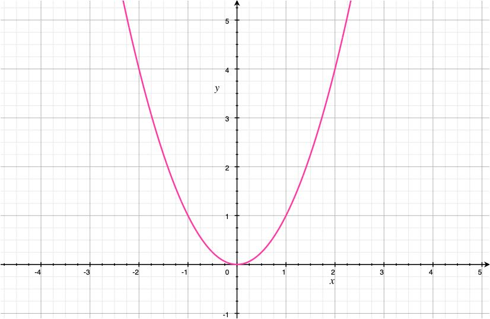
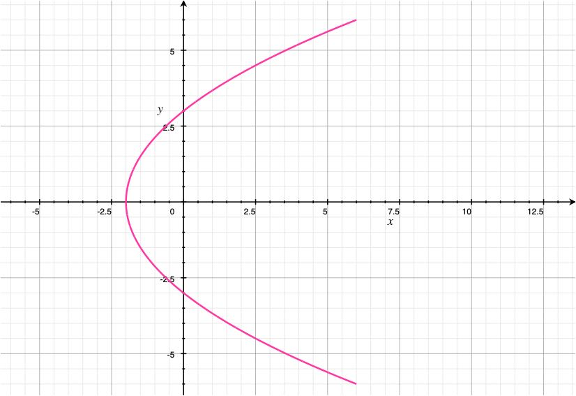
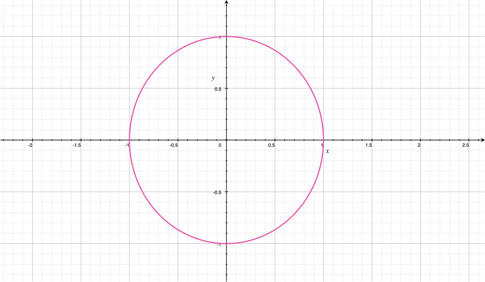
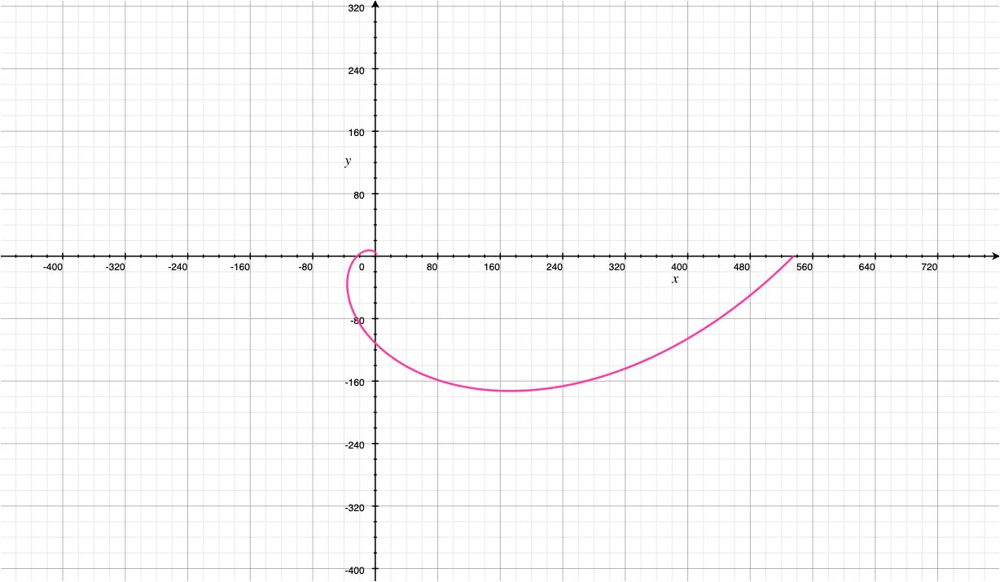
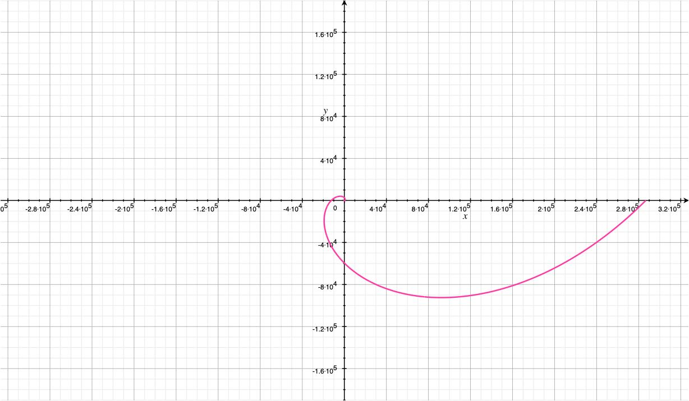
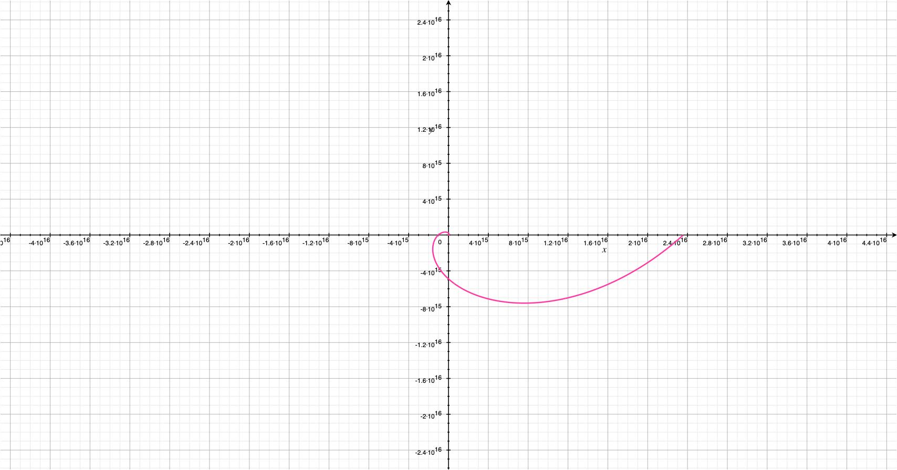
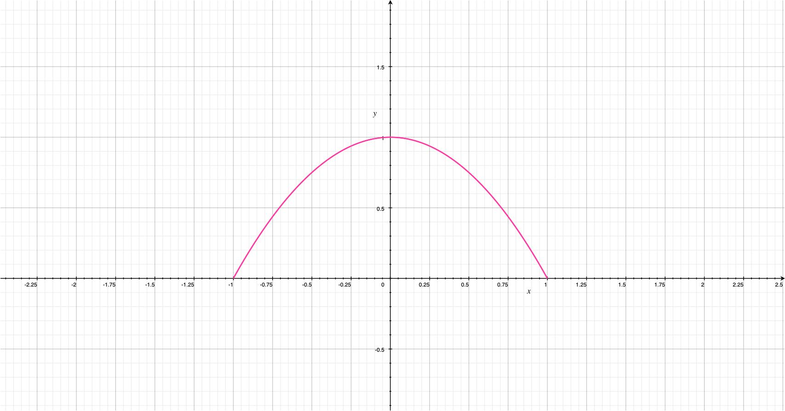
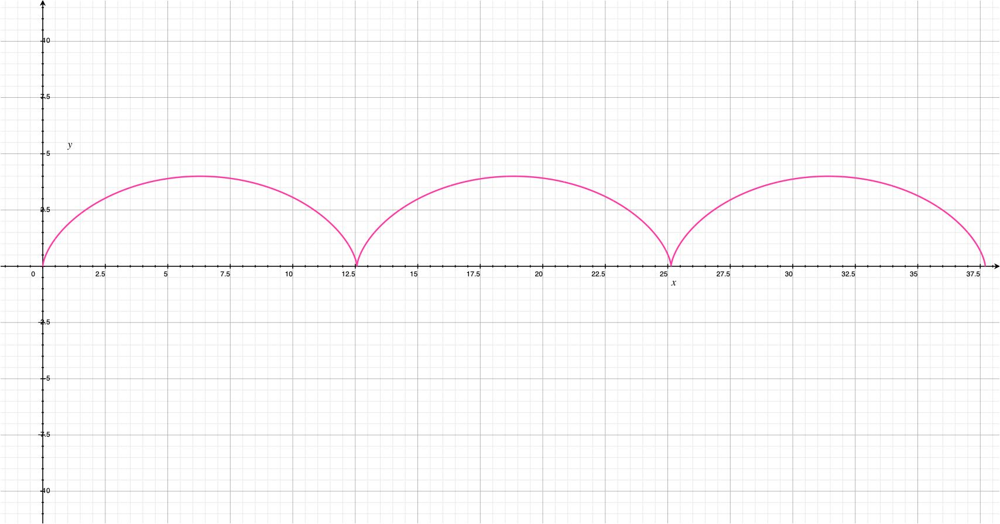

# Curves Defined by Parametric Equations

## Functions

### Definition

$f(x) = x^{2}$

- $f(x)$ is a function
- defines an input $x$ and an output $y$

Q: Can *any* curve on a plane be the graph of a function?

A: Not necessarily.

## Parametric Curves

### Definition

Imagine a particle that moves along a curve $C$. Then both of $x$ and $y$ coordinates of $C$ are functions of time.

- $x = f(t)$
- $y = g(t)$

A curve $C$ determined by the parametric equations $x = f(t)$  and $y = g(t)$ is called a **parametric curve** with parameter *t*

- $(f(a), g(a))$ is the initial point
- $(f(b), g(b))$ is the terminal point

### Example 1

- $x = 2t^{2} - 2$
- $y = t + 3$

Eliminating the parameter *t*

1. $t =  y - 3$
2. $x = 2(y - 2)^{2} - 2$
3. $x = 2(y^{2} - 6y + 9) - 2$
4. $x = 2y^{2} - 12y + 16$

Plot

Table of values

| t | x | y |
|----|---|---|
| 2 | 6 | 5 |
| 1 | 0 | 4 |
| 0 | -2 | 3 |
| -1 | 0 | 2 |
| -2 | 6 | 1 |

### Example 2

- $x = cos(t) \, 0 \le t \le 2\pi$
- $y = sin(t) \, 0 \le t \le 2\pi$

The particle moves around the unit circle starting and ending at $(1, 0)$.

### Example 3

- $x = e^{t}cos(t)$
- $y = e^{t}sin(t)$

The distance from  the origin is $e^{t}$

$0 \le t \le 2\pi$

$0 \le t \le 4\pi$

$(-\infty, \infty)$

### Example 4

- $x = sin(t) \, 0 \le t \le 2\pi$
- $y = cos^{2}(t) \, 0 \le t \le 2\pi$

Eliminating the parameter *t*

use $sin^{2}(t) + cos^{2}(t) = 1$

$x^{2} + y = 1 \to y = 1 - x^{2}$

Be careful when plotting, the direction of the graph can change its shape.

This is the graph of a parametric curve.

## Cycloid

A curve traced out by a point $P$ on the circumference of a circle

- $x =  0M - rsin(\theta) = r\theta - sin(\theta) = r(\theta - sin(\theta))$
- $y = r - CM = r - rcos(\theta) = r(1 - cos(\theta))$

### Example 5

Let the following parametric equations represent a cycloid with $r = 2$ 

- $x = 2(\theta - sin(\theta))$
- $y = 2(1 - cos(\theta))$

