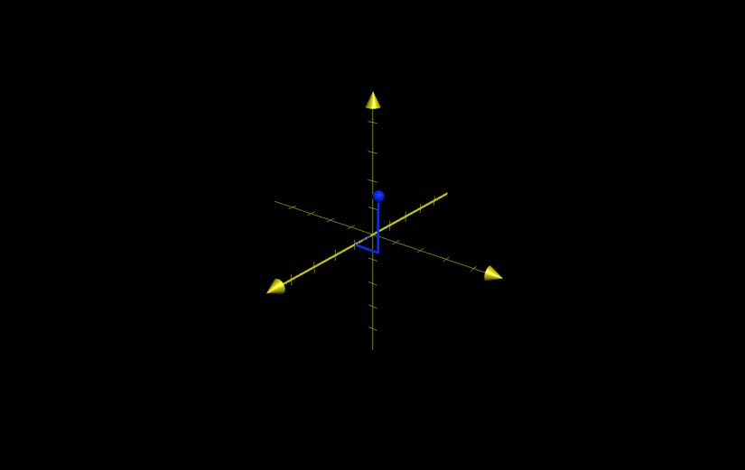
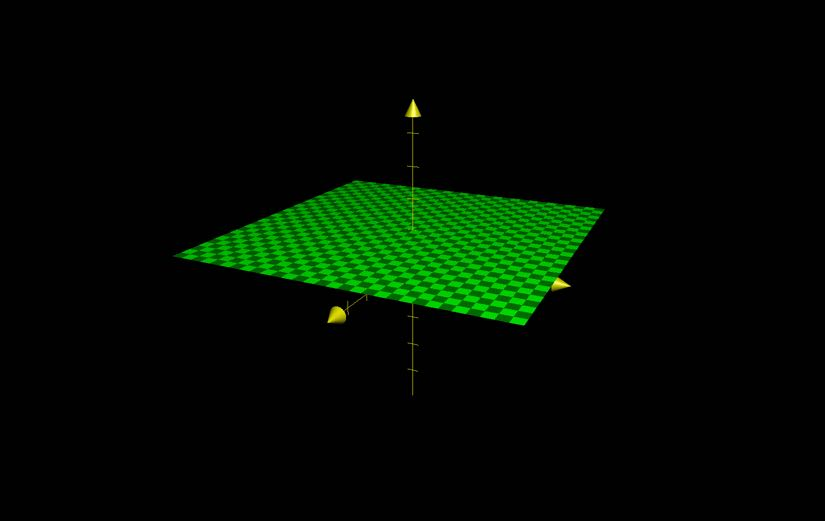
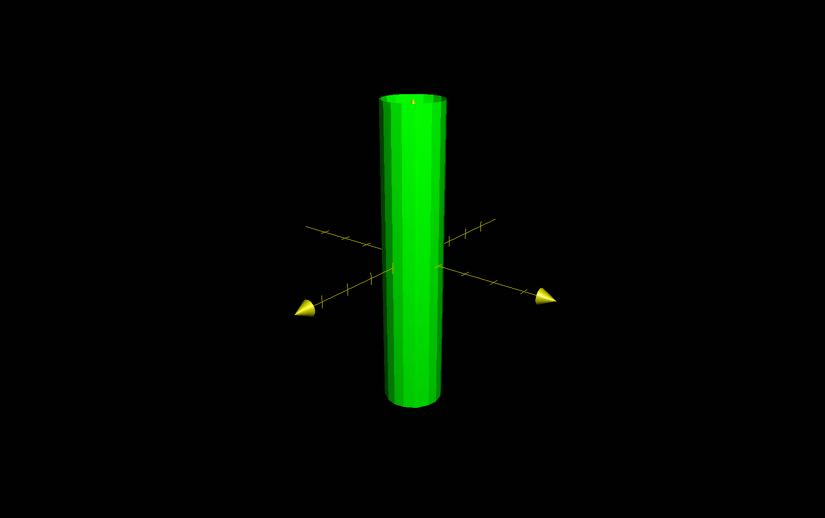
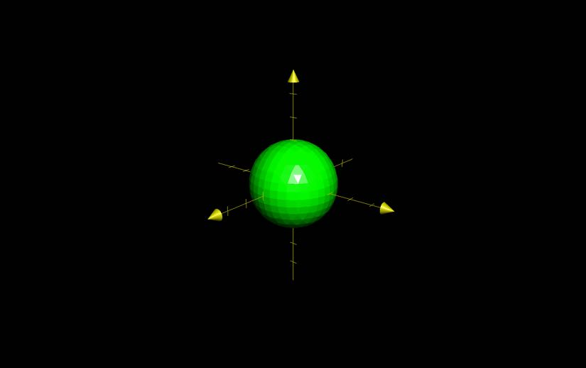

# 3D Coordinate Systems
## Space

### 2D Space
- 2 axes
- a plane
- coordinates represented as 2-tuples $(x, y)$
	- $x$ is the distance from the y-axis
	- $y$ is the distance from the x-axis
- divides space into 4 quadrants

### 3D Space
- 3 axes
- a collection of planes
- coordiantes represented as 3-tuples $(x, y, z)$
	- $x$ is the distance from the $yz$ plane
	- $y$ is the distance from the $xz$ plane
	- $z$ is the distance from the $xy$ plane
- divides space into 8 octants
- **Right-hand rule**
	- thumb points along z axis
	- fingers point along x axis
	- arm points along y axis

## Distance in 3D Space
- Distance between
	- $P_{1}(x_{1}, y_{1}, z_{1})$
	- $P_{2}(x_{2}, y_{2}, z_{2})$
	- $A(x_{1}, y_{1}, z_{1})$
	- $B(x_{1}, y_{2}, z_{1})$
	- $C(x_{2}, y_{2}, z_{1})$
	- $\vert P_{1} P_{2} \vert^{2} = \vert AB \vert^{2} + \vert BP_{2} \vert^{2} + \vert BC \vert^{2}$
	- $\vert P_{1} P_{2} \vert^{2} = \vert y_{2} - y_{1} \vert^{2} + \vert z_{2} - z_{1} \vert^{2} + \vert x_{2} - x_{1} \vert^{2}$
	- $\vert P_{1} P_{2} \vert = \sqrt{\vert y_{2} - y_{1} \vert^{2} + \vert z_{2} - z_{1} \vert^{2} + \vert x_{2} - x_{1} \vert^{2}}$

## Curves in 3D Space
- In 2D space
	- $y = f(x) \to$ a curve on a plane.
- In 3D space
	- $z = f(x, y) \to$ a surface in 3D space
- Examples
	- $z = 1 \to$ a plane parallel to the $xy$ plane
		- 
	- $x^{2} + y^{2} = 1$ with no bound on $z$
		- a cyclinder with radius 1
		- height is parallel to the z axis
		- 

## Spheres

### Equation of a sphere

- let $(a, b, c)$ be the center of a sphere.
	- $r^{2} = (x - x_{1})^{2} + (y - y_{1})^{2} (z - z_{1})^{2}$

### Distance between spheres

- $S_{1}: \, x^{2} + y^{2} + z^{2} = 1$
	- $A_{1}(0, 0, 0)$
	- $r = 1$
- $S_{2}: \, (x - 1)^{2} + (y + 32)^{2} + (z - 23)^{2} = \sqrt{22}$
	- $A_{2}(1, -32, 23)$
	- $r = 22$
- $\vert A_{1}A_{2} \vert = \sqrt{14} - 3$