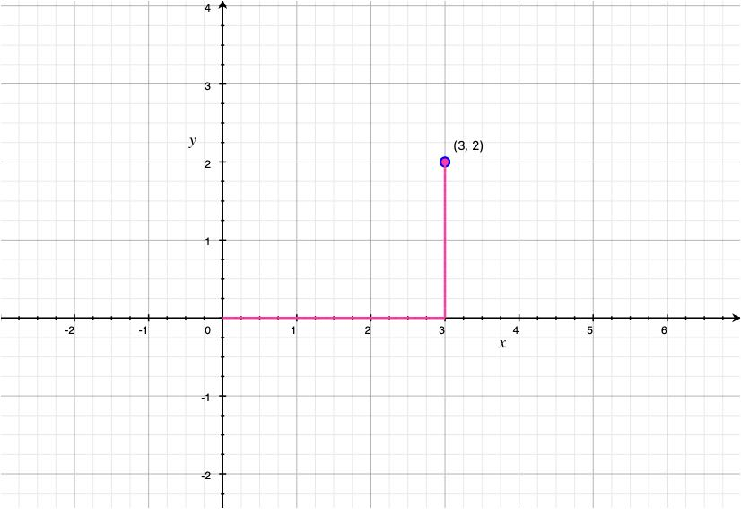
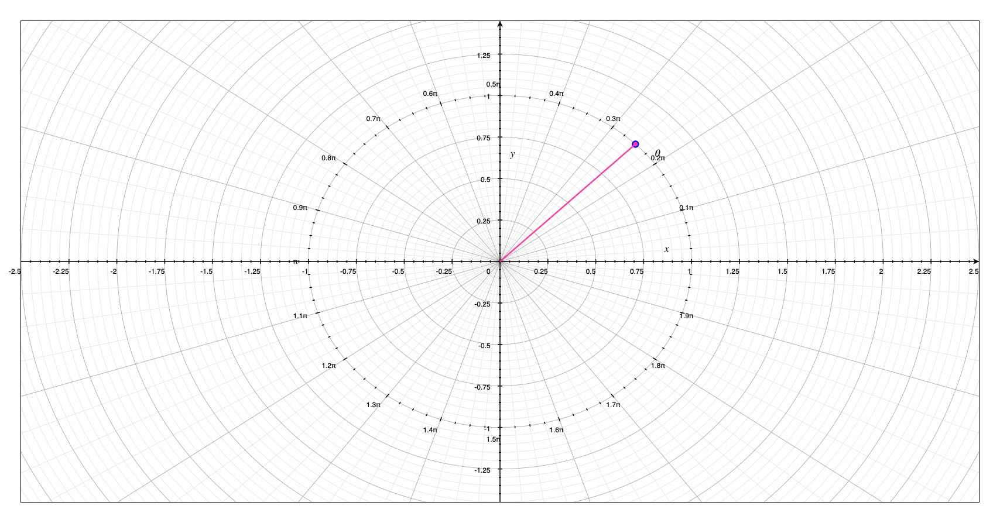
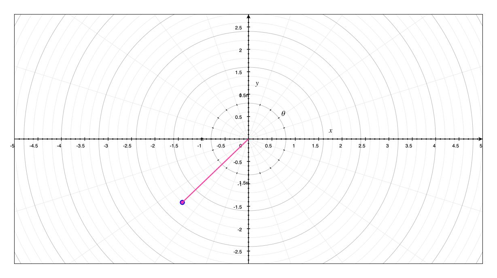
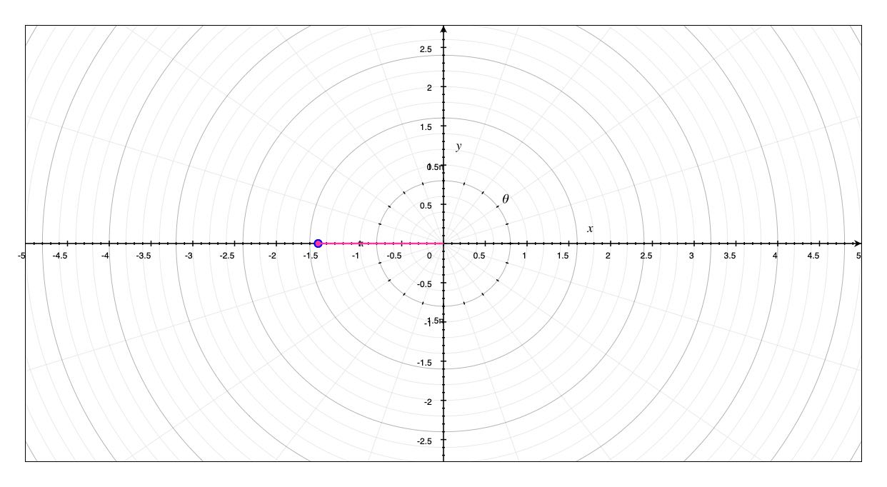

# Polar Coordinates
## Cartesian vs. Polar Coordinates

Cartesians coordinates were introduced by French mathematician and philosopher René Decartes in 1637.

Polar coordinates were introduced by Isaac Newton in 1671.

## Examples of polar coordinates

$P(1, \dfrac{\pi}{4})$

$Q(2, \dfrac{5\pi}{4})$

$R(\dfrac{3}{2}, \pi)$

## Identical points

- The pole $(0, \theta) \to$ a point may have multiple polar coordinates.
- $(1, \dfrac{\pi}{4})$ and $(1, \dfrac{9\pi}{4})$ are the same point.
- This implies that $(r, \theta)$ can be extended to $-r$.
- If $r < 0$, $(r, \theta)$ is represented as $(r, \theta + \pi)$

## Translating Coordinates

### Polar Coordinates to Cartesian Coordinates

Let a polar curve be represented by

- $x = rsin(\theta)$
- $y = rcos(\theta)$

Translate the polar coordinate $P(4, \dfrac{\pi}{6})$ to cartesian coordinate.

- $x = (4)cos(\dfrac{\pi}{6}) = 2 \sqrt{3}$
- $y = (4)sin(\dfrac{\pi}{6}) = 2$
- $P(4, \dfrac{\pi}{6}) \to C(2 \sqrt{3}, 2)$

### Cartesian Coordinates to Polar Coordinates

Let a circle be represented by

- $r^{2} = x^{2} + y^{2}$
- $tan(\theta) = \dfrac{y}{x}$ is a useful relationship.

Translate the cartesian coordinate $C(1, -1)$ to polar coordinate.

- $r = \sqrt{(-1)^{2} + 1^{2}} = \sqrt{2}$
- $tan(\theta) = \dfrac{-1}{1}$
- $\theta = tan^{-1}(-1) = \dfrac{\pi}{4}$

## Curves in Polar Coordinates

The graph of the curve $r = f(\theta)$, or generally $F(r, \theta) = 0$, consists of all points $P$ in polar coordinate with at least one representation $(r, \theta)$ which satisfy the equation.

- $r = 1$ is all points that are distance $\pm 1$ from the origin
- $r = -1$ is the unit circle
- $\theta = 1$ is a straight line
- $\theta = -1$ is the opposite straight line

Let a polar curve be represented by

- $r = 4sin(\theta)$

| r | $\theta$ |
|---|---|
| 0 | 0 |
| 2 | $\dfrac{\pi}{6}$ |
| $2\sqrt{2}$ | $\dfrac{\pi}{4}$ |
| $2\sqrt{3}$ | $\dfrac{\pi}{3}$ |
| 4 | $\dfrac{\pi}{2}$ |
| $2\sqrt{3}$ | $\dfrac{2\pi}{3}$ |
| $2\sqrt{2}$ | $\dfrac{3\pi}{4}$ |
| 2 | $\dfrac{5\pi}{6}$ |
| 0 | $\pi$ |

Some polar curves can be plotted by translating it to a corresponding cartesian function

- $r^{2} = 4rsin(\theta)$
- $x^{2} + y^{2} = 4y \to x^{2} + (y - 2)^{2} = 4$
- complete the square
	- $x^{2} + y^{2} - 4y = 0$
	- $x^{2} + (y^{2} - 4y + 4) = 4$
	- $x^{2} + (y - 2)^{2} = 4$

## Polar Symmetry

- If $F(r, \theta) = 0$ and $F(-r, \theta) = 0$ are identical, then the curve $F(r, \theta) = 0$ is symmetrical about the polar axis.
- If $F(r, \theta) = 0$ and $F(-r, \theta) = 0$ are identical **OR** $F(r, \theta) = 0$ and $F(r, \theta + \pi) = 0$ are identical, then the curve $F(r, \theta) = 0$ is symmetrical about the pole.
- If $F(r, \theta)$ and $F(r, \pi - \theta)$ are identical, then the curve $F(r, \theta) = 0$ is symmetrical about the vertical line $\theta = \dfrac{\pi}{2}$

## Calculus with Polar Coordinates

- $r = f(\theta) \to$ cartesian
- $x = rcos(\theta) \to f(\theta)cos(\theta)$
- $y = rsin(\theta) \to f(\theta)sin(\theta)$
- Polar curves are parametric equations with $\theta$ as the parameter
- The [derivatives](../week1/calculus-with-parametric-curves.md#Derivatives) and [integrals](../week1/calculus-with-parametric-curves.md#Integrals) apply similarly

