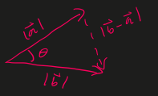

# The Dot Product
## Definition

Let

- $\overrightarrow{a} = <a_{1}, a_{2}, a_{3}>$
- $\overrightarrow{b} = <b_{1}, b_{2}, b_{3}>$

The dot product, denoted as $\overrightarrow{a} \cdot \overrightarrow{b}$, is defined as

- $\overrightarrow{a} \cdot \overrightarrow{b} = (a_{1})(b_{1} + a_{2})(b_{2}) + (a_{3})(b_{3})$

Example

- $\overrightarrow{a} = <1, 2, 2>$
- $\overrightarrow{b} = <2, -1, -2>$
- $\overrightarrow{a} \cdot \overrightarrow{b} = (1)(2) + (2)(-2) + (2)(-2) = -4$

## Properties

- $\overrightarrow{a} \cdot \overrightarrow{b} = \overrightarrow{b} \cdot \overrightarrow{a}$
- $\overrightarrow{a}(\overrightarrow{b} + \overrightarrow{c}) = \overrightarrow{a} \cdot \overrightarrow{b} + \overrightarrow{a} \cdot \overrightarrow{c}$
- $(c * \overrightarrow{a}) \cdot \overrightarrow{b} = c(\overrightarrow{a} \cdot \overrightarrow{b})$
- $\overrightarrow{0} \cdot \overrightarrow{a} = \overrightarrow{0}$
- $\overrightarrow{a} \cdot \overrightarrow{a} = a_{1}^{2} + a_{2}^{2} + a_{3}^{2} = \vert \overrightarrow{a} \vert^{2}$

## Alternate definition

Theorem

- $\overrightarrow{a} \cdot \overrightarrow{b} = \vert \overrightarrow{a} \vert \vert \overrightarrow{b} \vert cos(\theta)$

Proof: using law of cosines

- $z^{2} = x^{2} + y^{2} - 2xycos(\theta)$
- $\vert b - a \vert^{2} = \vert \overrightarrow{a} \vert^{2} + \vert \overrightarrow{b} \vert^{2} - 2\vert \overrightarrow{a} \vert \vert \overrightarrow{b} \vert cos(\theta)$
- Expand and solve for $\vert \overrightarrow{a} \vert \vert \overrightarrow{b} \vert$
- $\overrightarrow{a} \cdot \overrightarrow{b} = \vert \overrightarrow{a} \vert \vert \overrightarrow{b} \vert cos(\theta)$

If $\theta = \dfrac{\pi}{2}$ then $cos(\theta) = 0 \therefore \overrightarrow{a} \cdot \overrightarrow{b} = 0$

If $\overrightarrow{a} \cdot \overrightarrow{b} = 0$, then $\overrightarrow{a}$ and $\overrightarrow{b}$ are perpendicular to each other

## Projections

Let

- $\alpha$ be the angle between $\overrightarrow{a}$ and the x-axis.
- $\beta$ be the angle between $\overrightarrow{a}$ and the y-axis.
- $\gamma$ be the angle between $\overrightarrow{a}$ and the z-axis.

If $\vert \overrightarrow{a} \vert \ne 0$ and $\vert \overrightarrow{b} \vert \ne 0$ then $cos(\theta) = \dfrac{\overrightarrow{a} \cdot \overrightarrow{b}}{\vert \overrightarrow{a} \vert \vert \overrightarrow{b} \vert}$

- $cos(\alpha) = \dfrac{\overrightarrow{a} \cdot i}{\vert \overrightarrow{a} \vert \vert i \vert} = \dfrac{a_{1}}{\vert \overrightarrow{a} \vert}$
- $cos(\beta) = \dfrac{\overrightarrow{a} \cdot j}{\vert \overrightarrow{a} \vert \vert j \vert} = \dfrac{a_{2}}{\vert \overrightarrow{a} \vert}$
- $cos(\gamma) = \dfrac{\overrightarrow{a} \cdot k}{\vert \overrightarrow{a} \vert \vert k \vert} = \dfrac{a_{3}}{\vert \overrightarrow{a} \vert}$

The scalar projection of $\overrightarrow{b}$ onto $\overrightarrow{a}$ is $\dfrac{\overrightarrow{a} \cdot \overrightarrow{b}}{\vert \overrightarrow{a} \vert}$

The vector projection of $\overrightarrow{b}$ onto $\overrightarrow{b}$ is $(\dfrac{\overrightarrow{a} \cdot \overrightarrow{b}}{\vert \overrightarrow{a} \vert^{2}}) \overrightarrow{a}$

