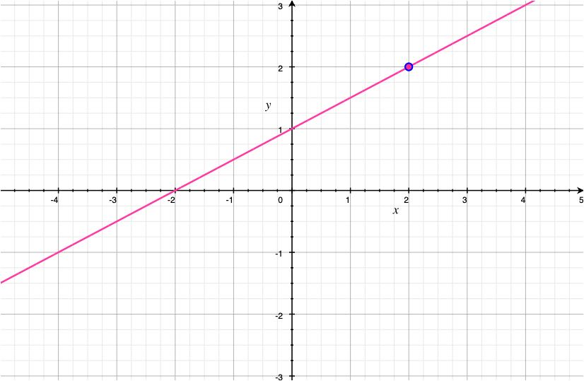
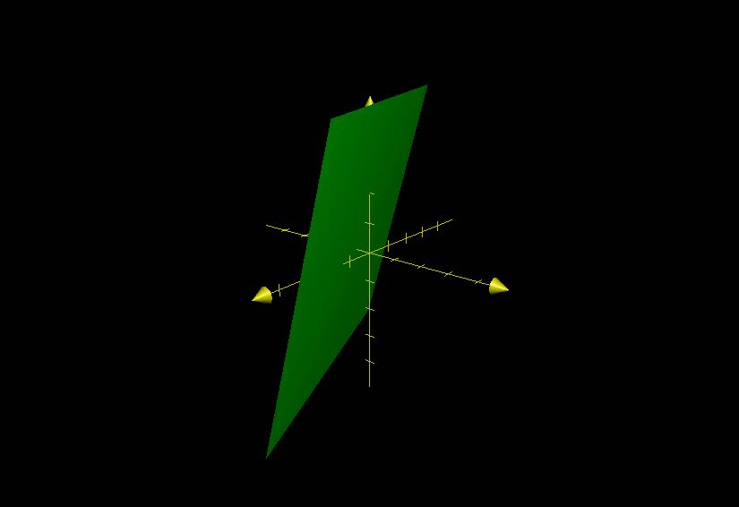
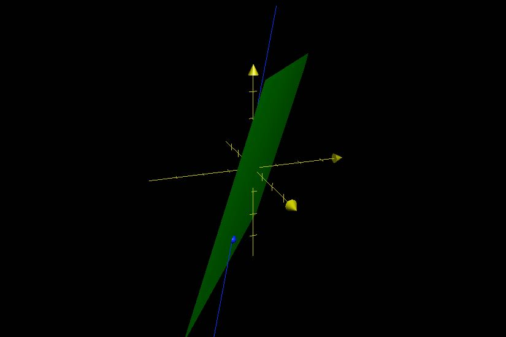
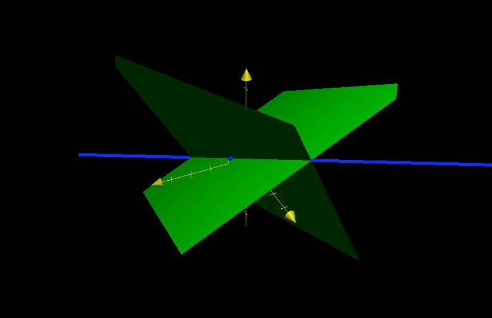

# Equations of Lines of Planes
## Lines

### 2D

Lines are determined by

- a point
- a slope ($\dfrac {rise}{run}$)

### 3D

Lines are determined by

- a point
- a vector

Denote $\overrightarrow{OP_{0}} = v_{0}$ for any point $(x, y, z)$ on the line.

- $v_{0} = <x, y, z>$
- $\overrightarrow{OP_{0}} + \overrightarrow{P_{0}P} = \overrightarrow{OP}$
- $\overrightarrow{OP} - \overrightarrow{OP_{0}} = \overrightarrow{P_{0}P}$
- $\overrightarrow{v} - \overrightarrow{v_{0}} = \overrightarrow{P_{0}P}$
- $t\overrightarrow{v} = <ta, tb, tc>$
- $t\overrightarrow{v} = <x - x_{0}, y - y_{0}, z - z_{0}>t$
- $\overrightarrow{r} = \overrightarrow{v_{0}} + \overrightarrow{v}t$

Using scalars

- $x = x_{0} + at$
- $y = y_{0} + bt$
- $z = z_{0} + ct$

Symmetric equation

- $\dfrac{x - x_{0}}{a} = \dfrac{y - y_{0}}{b} = \dfrac{z - z_{0}}{c}$
- if $a, b, c = 0$
	- $x = x_{0}$
	- $\dfrac{y - y_{0}}{b} = \dfrac{z - z_{0}}{c}$

Line Segment

- $A = (x_{0}, y_{0}, z_{0})$
- $B = (x_{1}, y_{1}, z_{1})$
- $\overrightarrow{OA} = <x_{0}, y_{0}, z_{0}>$
- $\overrightarrow{OB} = <x_{1}, y_{1}, z_{1}>$
- $v = \overrightarrow{OP}$
- $(v - v_{0}) = t(v_{1} - v_{0})$

## Planes

Planes cannot be determined by a point and parallel vector.

Instead, the normal vector $\overrightarrow{n} = <a, b, c>$ and point $P_{0}(x_{0}, y_{0}, z_{0})$.

Let 

- $P(x, y, z)$ be a point on the plane.
- $\overrightarrow{v_{0}} = (x_{0}, y_{0}, z_{0})$
- $\overrightarrow{v} = <x, y, z>$
- $\overrightarrow{P_{0}P} = \overrightarrow{v} - \overrightarrow{v_{0}}$ is a vector parallel to the plane
- $\therefore \overrightarrow{n} \cdot <\overrightarrow{v} - \overrightarrow{v_{0}}> = 0$
- Equivalently, $<a, b, c> \cdot <x - x_{0}, y - y_{0}, z - z_{0}> = 0$

Generally

- $ax + by + cz + d = 0$ where $d = ax_{0} - by_{0} - cz_{0}$
- $<a, b, c>$ is normal (perpendicular) to the plane.
- $(x_{0}, y_{0}, z_{0})$ is a point on the plane.

Example

Let P: $3x - 7y + 2z - 4 = 0$

## Intersection of a Line and a Plane

Find where $L$ and $P$ intersect

- $L:$ 
	- $x = 1 - t$ 
	- $y = -2 + t$ 
	- $z = 3t$
- $P:\, -2x -3y + z + 4 = 0$

$\overrightarrow{v} = <-1, 1, 3>$

$\overrightarrow{v} = <-2, -3, 1>$

$\overrightarrow{v} \cdot \overrightarrow{n} = (-1)(-2) + (1)(-3) + (3)(1) = 2$

Since $2 \ne 0$, $L$ and $P$ are not parallel.

$2(1 - t) - 3(-2 + t) + 3t + 4 = 0$

$2t + 8 = 0 \to t = -4$

$x = 1 -(-4) = 5$

$y = -2 + -4 = -6$

$z = 3(-4) = -12$

$L$ and $P$ intersect at $(5, -6, -12)$

## Parallel Planes

Two planes are parallel if their normal vectors are parallel

- $\overrightarrow{n_{1}} \, \vert \vert \, \overrightarrow{n_{2}} \to P_{1} \, \vert \vert \, P_{2}$

Look at coefficients to verify. If there is an $a$ such that $v_{1} = bv_{2}$, the planes are parallel.

Example

- $P_{1}$
	- $3x - 2y - z - 16 = 0$
	- $\overrightarrow{n_{1}} = <3, -2, -1>$
- $P_{2}$
	- $-9x + 6y + 3z - 100 = 0$
	- $\overrightarrow{n_{2}} = <-9, 6, 3>$

$P_{1} \, \vert \vert \, P_{2}$ because $-3\overrightarrow{n_{1}} = \overrightarrow{n_{2}}$

## Angle between Planes

The angle between planes is the acute angle $\theta$ between the normal vectors $\overrightarrow{n_{1}}$ and $\overrightarrow{n_{2}}$

Example

- $P_{1}$
	- $x - y + 2z + 1 = 0$
	- $\overrightarrow{n_{1}} = <1, -1, 2>$
- $P_{2}$
	- $-x - 2y + 2z - 2 = 0$
	- $\overrightarrow{n_{2}} = <-1, -2 ,1>$

$cos(\theta) = \dfrac{\overrightarrow{n_{1}} \cdot \overrightarrow{n_{2}}}{\vert \overrightarrow{n_{1}} \vert \vert \overrightarrow{n_{2}} \vert} = \dfrac{-1 + 2 + 2}{\sqrt{6} \sqrt{6}} = \dfrac{1}{2}$

$cos(\theta) = \dfrac{1}{2} \to \theta = \dfrac{\pi}{3}$

## Line of Intersection Between Planes

If two planes are not parallel, they intersect with a line.

Example

- $P_{1}$
	- $x - y + 2z = 1$
	- $\overrightarrow{n_{1}} = <1, -1, 2>$
- $P_{2}$
	- $2x + y - z = 1$
	- $\overrightarrow{n_{2}} = <2, 1, -1>$

To find the line of intersection

- fix $z = 0$
	- $P_{1}: \, x - y = 1$
	- $P_{2}: \, 2x + y = 1$

$x = \dfrac{2}{3}$

$y = \dfrac{-1}{3}$

$\therefore (\dfrac{2}{3}, \dfrac{-1}{3}, 0)$ is on the intersection line.

Direction of intersection line:

$\overrightarrow{n_{1}} \times \overrightarrow{n_{2}} = \begin{bmatrix} i & j & k \\ 1 & -1 & 2 \\ 2 & 1 & -1 \end{bmatrix} = <-1, 5, 3>$

$L: \, \dfrac{x - \dfrac{2}{3}}{-1} = \dfrac{y + \dfrac{1}{3}}{5} = \dfrac{z}{3}$

## Distance between Point and Plane

$B(x_{0}, y_{0}, z_{0})$ is on the plane $ax_{0} + by_{0} + cz_{0} + d = 0$

$\overrightarrow{BA} = <x_{1} - x_{0}, y_{1} - y_{0}, z_{1} - z_{0}>$

$M$ isa point on the plane such that $\overrightarrow{MA}$ is normal to the plane.

$\vert \overrightarrow{AM} \vert = \dfrac{(a_{0})(x_{1} - x_{0}) + (b)(y_{1} - y_{0}) + (c)(z_{1} - z_{0})}{\sqrt{a^{2} + b^{2} + c^{2}}}$

$\vert \overrightarrow{AM} \vert = \dfrac{ax_{1} + by_{1} + cz_{1} - d}{\sqrt{a^{2} + b^{2} + c^{2}}}$

## Skewed Lines

Two lines are skewed if they are not parallel, but do not intersect.

$dist(L_{1}, L_{2}) = \vert Proj_{\overrightarrow{n}} \cdot \overrightarrow{AB} \vert$  where $\overrightarrow{n} = \overrightarrow{v_{1}} \times \overrightarrow{v_{2}}$

