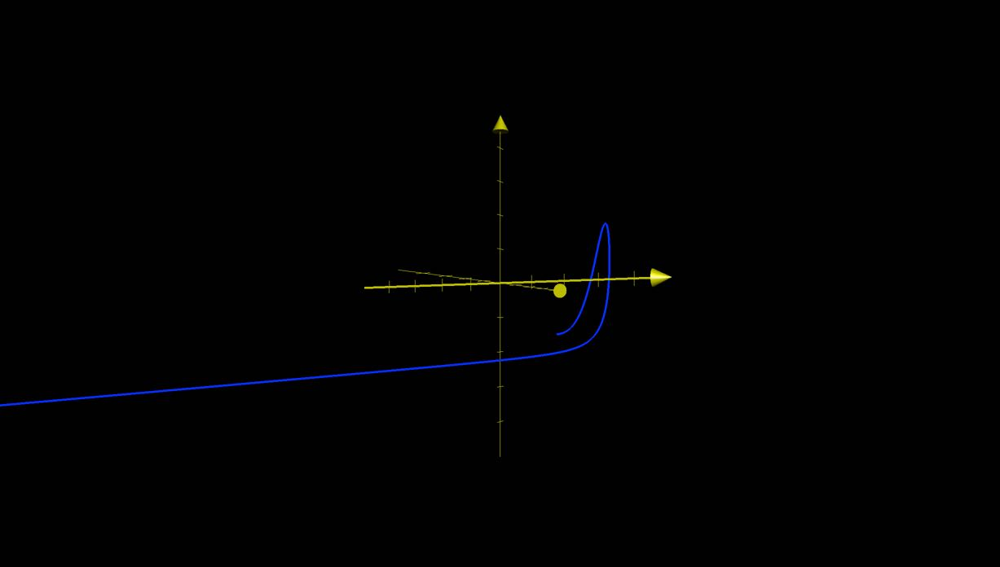
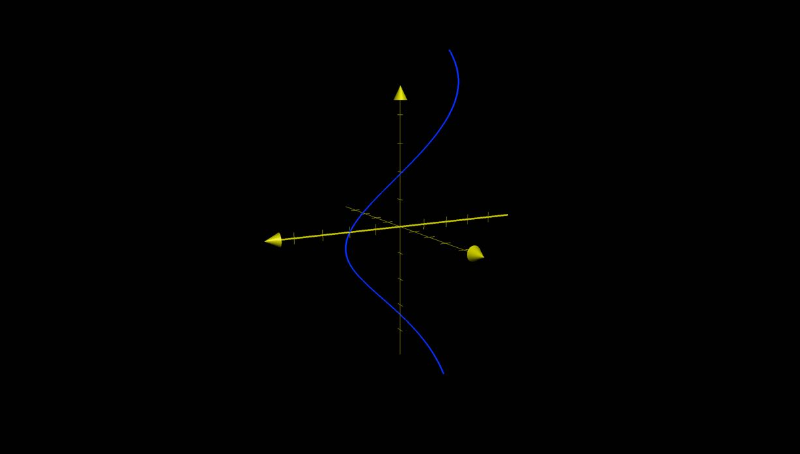
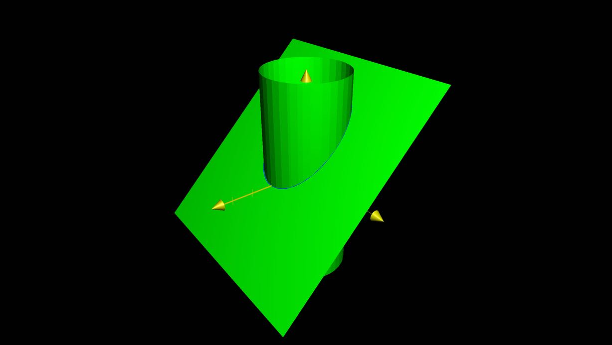

# Vector Functions and Space Curves

## Vector Functions

- A function maps a number to a number
	- $f(x) = sin(x)$
- Vector function, or Vector-Value functions map a number to a vector
	- $\overrightarrow{v}(t) = \begin{bmatrix} f(t) \\ g(t) \\ h(t) \end{bmatrix}$
	- $t \to \begin{bmatrix} f(t) \\ g(t) \\ h(t) \end{bmatrix}$
	- $t \to f(t)\overrightarrow{i} + g(t)\overrightarrow{j} + h(t)\overrightarrow{k}$

### Example 1

$\overrightarrow{v}(t) = \begin{bmatrix} \sqrt{2 - t} \\ ln(3t + 2) \\ sin(2t) \end{bmatrix}$

Domain of $\overrightarrow{v}(t)$

- $2 - t > 0 \to 2 > t$
- $3t + 2 > 0 \to t > \dfrac{-2}{3}$
- Thus, $\dfrac{-2}{3} < t \le 2$

## Limits of Vector Functions

If $\overrightarrow{v}(t) = \begin{bmatrix} f(t) \\ g(t) \\ h(t) \end{bmatrix}$

Then $\lim_{t \to t_{0}}\overrightarrow{v}(t) = \lim_{t \to t_{0}} \begin{bmatrix} f(t) \\ g(t) \\ h(t) \end{bmatrix} = \begin{bmatrix} \lim_{t \to t_{0}}f(t) \\ \lim_{t \to t_{0}} g(t) \\ \lim_{t \to t_{0}} h(t) \end{bmatrix}$

### Example 2

Let $\overrightarrow{v}(t) = \begin{bmatrix} t^{2} + 1 \\ \dfrac{tan(2t)}{t} \\ \dfrac{e^{t} - 1}{t} \end{bmatrix}$

Find $\lim_{t \to 0} \, \overrightarrow{v}(t)$

- $\lim_{t \to 0} \, t^{2} + 1 = 1$
- $\lim_{t \to 0} \, \dfrac{tan(2t)}{t} = \lim_{t \to 0} \, \dfrac{2sec^{2}(2t)}{1} = 2$
- $\lim_{t \to 0} \, \dfrac{e^{t} - 1}{t} = \lim_{t \to 0} \, \dfrac{e^{t}}{1} = 1$

$\lim_{t \to 0} \, \overrightarrow{v}(t) = \begin{bmatrix} 1 \\ 2 \\ 1 \end{bmatrix}$

## Space Curves

### Definition

Let $f(t)$, $g(t)$, $h(t)$, be continuous functions.

Let set $C$ be all points $(x, \, y, \, z)$ in space where

- $x = f(t)$
- $y = g(t)$
- $z = h(t)$

are the parametric equations for $C$.

If $\overrightarrow{r}(t) = \begin{bmatrix} f(t) \\ g(t) \\ h(t) \end{bmatrix}$, then $\overrightarrow{r}(t)$ is a position vector.

### Example 3

$\overrightarrow{r}(t) = \begin{bmatrix} 2 - t \\ 3 + 2t \\ -1 -3t \end{bmatrix}$

$\overrightarrow{r}(t) = \begin{bmatrix} 2 \\ 3 \\ -1 \end{bmatrix} + \begin{bmatrix} -1 \\ 2 \\ -3 \end{bmatrix}t$

This is a line in 3D space that:

- Passes through the point $(2, \, 3, \, -1)$
- Has the direction $\begin{bmatrix} -1 \\ 2 \\ -3 \end{bmatrix}$

### Example 4

$\overrightarrow{r}(t) = (cos(t))\overrightarrow{i} + (sin(t))\overrightarrow{j} + t\overrightarrow{k}$

### Example 5

The line segment joining the points $(x_{1}, \, y_{1}, \, z_{1})$ and $(x_{2}, \, y_{2}, \, z_{2})$:

$\overrightarrow{r}(t) = (1 - t)\begin{bmatrix} x_{1} \\ y_{1} \\ z_{1} \end{bmatrix} + \begin{bmatrix} x_{2} \\ y_{2} \\ z_{2} \end{bmatrix}$

So if the two points are $(-1, \, 2, \, -2)$ and $(2, \, 1, \, -2)$,

The line segment $\overrightarrow{r}(t) = \begin{bmatrix} -1 + 3t \\ 2 - t \\ -2 \end{bmatrix}$

### Example 6

Find the space curve made from the intersection between 

- $x^{2} + y^{2} = 1$
- $x + z = 1$

$\overrightarrow{r}(t) = \begin{bmatrix} f(t) \\ g(t) \\ h(t) \end{bmatrix}$

- $f(t) = sin(t)$
- $g(t) = cos(t)$
- $h(t) = z = 1 - x = 1 - cos(t)$

