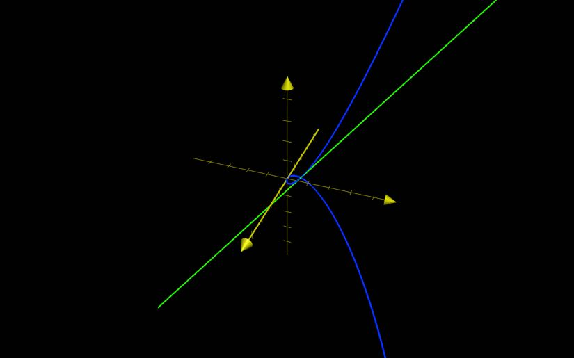

# Derivatives and Integrals of Vector Functions

## Derivatives

Given $\overrightarrow{r}(t)$

$\dfrac{d(\overrightarrow{r}(t))}{dt} = \overrightarrow{r'}(t) = \lim_{h \to 0} \, \dfrac{\overrightarrow{r}(t + h) - \overrightarrow{r}(t)}{h}$

is the tangent vector to the curve defined by $\overrightarrow{r}$ at $P = \overrightarrow{r}(t)$ provided that

- $\overrightarrow{r}'(t)$ exists
- $\overrightarrow{r}'(t) \ne 0$

$\overrightarrow{r}(t) = \begin{bmatrix} f(t) \\ g(t) \\ h(t) \end{bmatrix} = f(t)\overrightarrow{i} + g(t)\overrightarrow{j} + h(t)\overrightarrow{k}$

$\dfrac{d\overrightarrow{r}}{dt} = \begin{bmatrix} \dfrac{df}{dt} \\ \dfrac{dg}{dt} \\ \dfrac{dh}{dt} \end{bmatrix} = f'(t)\overrightarrow{i} + g'(t)\overrightarrow{j} + h'(t)\overrightarrow{k}$

## Tangent Line

### Definition

The line through $P$ and parallel to $\overrightarrow{r}(t)$ to $C$ at $P$

The unit tangent vector 

- $\overrightarrow{T}(t) = \dfrac{\overrightarrow{r'}(t)}{\vert \overrightarrow{r'}(t) \vert}$

### Example 1

Find the tangent at $t = 1$

$\overrightarrow{r}(t) = \begin{bmatrix} t \\ t^{2} \\ t^3 \end{bmatrix}$

$\overrightarrow{r'}(t) = \begin{bmatrix} 1 \\ 2t \\ 3t^{2} \end{bmatrix}$

$\overrightarrow{r}(1) = \begin{bmatrix} 1 \\ 1 \\ 1 \end{bmatrix}$

$\overrightarrow{r'}(t) = \begin{bmatrix}1 \\ 2 \\ 3 \end{bmatrix}$

Thus, the tangent line at $t = 1$ is:

$\dfrac{x - 1}{1} = \dfrac{y - 1}{2} = \dfrac{z - 1}{3}$

## Second Derivative

The second derivative of a vector function is simply the derivative of the vector function's derivative.

$\overrightarrow{r''}(t) = (\overrightarrow{r'}(t))' = \begin{bmatrix} f''(t) \\ g''(t) \\ h''(t) \end{bmatrix}$

## Differentiation rules

Should be familiar; mostly the same concept as with traditional derivatives.

Let $\overrightarrow{u}$ and  $\overrightarrow{v}$ be differentiable

- $\dfrac{d}{dt}[\overrightarrow{u} + \overrightarrow{v}] = \overrightarrow{u'} + \overrightarrow{v'}$
- $\dfrac{d}{dt}[(\overrightarrow{u})(\overrightarrow{v})] = \overrightarrow{u'}\overrightarrow{v} + \overrightarrow{v'}\overrightarrow{u}$
- $\dfrac{d}{dt}[\overrightarrow{u} \cdot \overrightarrow{v}] = \overrightarrow{u'} \cdot \overrightarrow{v} + \overrightarrow{v'} \cdot \overrightarrow{u}$
- $\dfrac{d}{dt}[\overrightarrow{u} \times \overrightarrow{v}] = \overrightarrow{u'} \times \overrightarrow{v} + \overrightarrow{v'} \times \overrightarrow{u}$
- $\dfrac{d}{dt}[\overrightarrow{u}(\overrightarrow{v})] = \overrightarrow{u'}(\overrightarrow{v})\overrightarrow{v'}$

## Integrals

Let $\overrightarrow{r}(t) = \begin{bmatrix} f(t) \\ g(t) \\ h(t) \end{bmatrix}$

### Indefinite

$\int \overrightarrow{r}(t) \, dt = \begin{bmatrix} \int f(t) \, dt \\ \int g(t) \, dt \\ \int h(t) \, dt \end{bmatrix}$

### Definite

$\int_{a}^{b} \overrightarrow{r}(t) \, dt = \begin{bmatrix} \int_{a}^{b} f(t) \, dt \\ \int_{a}^{b} g(t) \, dt \\ \int_{a}^{b} h(t) \, dt \end{bmatrix}$