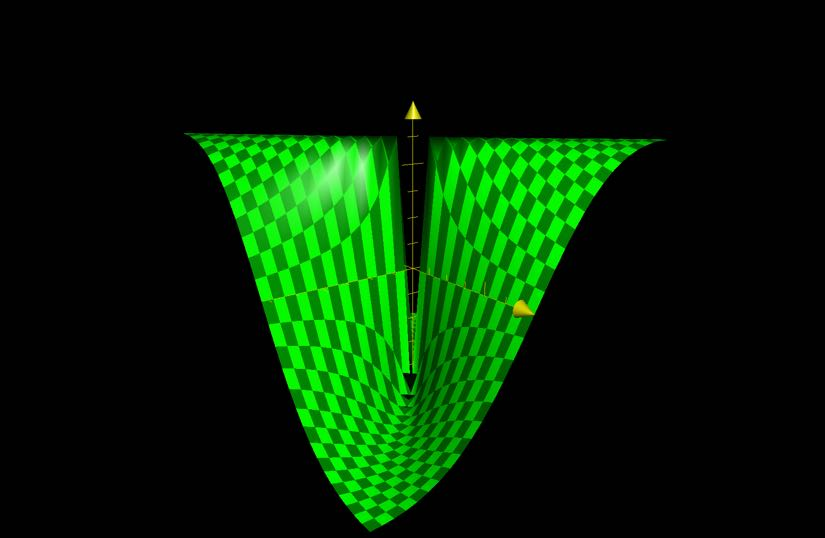

# Limits and Continuity

## Limits

### Definition

A limit is the distance between $(x, y)$ and $(a, b)$ as $(x, y) \to (a, b)$

The limit of $f(x, y)$ as $(x, y) \to (a, b)$ is $L$ if for any $\epsilon > 0$ there is a corresponding number $\delta > 0$ such that if $(x, y) \in D$ then $\vert f(x, y) - L \vert < \epsilon$. That is $0 < \sqrt{(x - a)^{2} + (y - b)^{2}} < \delta$

Limits are typically denoted by

- $\lim_{(x, y) \to (a, b)} f(x, y) = L$
- $\lim_{y \to b}^{x \to a} f(x, y) = L$
- $f(x, y) \to L$ as $(x, y) \to (a, b)$

Limits do not depend on the path $(x, y) \to (a, b)$.

To show that a limit does not exists, show that two different paths $(x, y) \to (a, b)$ yield different values.

### Examples

#### Example 1

$f(x, y) = \dfrac{sin(x^{2} + y^{2})}{x^{2} + y^{2}}$

Find $\lim_{(x, y) \to (0, 0)} \, f(x, y)$.

- Let $z = x^{2} + y^{2}$
- It is known that $\lim_{z \to 0} \, \dfrac{sin(z)}{z} = 1$
- Thus, $\lim_{(x, y) \to (0,0)} f(x, y) = 1$ as well.

#### Example 2

Let $g(x, y) = \dfrac{x^{2} - y^{2}}{x^{2} + y^{2}}$

Statement: $\lim_{(x, y) \to (0, 0)} \, g(x, y) = DNE$

Reasoning:

- By fixing on variable and solving the limit, we expose a disagreement.
- Fixing $y = 0$
	- $\lim_{(x, 0) \to (0, 0)} \, \dfrac{x^{2}}{x^{2}} = 1$
- Fixing $x = 0$
	- $\lim_{(0, y) \to (0, 0)} \, \dfrac{-y^{2}}{y^{2}} = -1$
- $1 \ne -1$, Thus the limit does not exist.

#### Example 3

Let $f(x, y) = \dfrac{xy}{x^{2} + y^{2}}$.

Find $\lim_{(x, y) \to (a, b)} \, f(x, y)$ or show that it does not exist.

- The limit does not exist. Examing a plot of the fuction, it is clear that not all paths $(x, y) \to (0, 0)$ approach the same value.
- 

#### Example 4

Let $f(x, y) = \dfrac{xy^{2}}{x^{2} + y^{4}}$

Find $\lim_{(x, y) \to (0, 0)} \, f(x, y)$ or show that it does not exist.

- Let Path 1 be $(x, y) \to (0, 0)$ along the line $y = mx$
	- $\lim{(x, mx) \to (0, 0)} \, \dfrac{m^{2}x^{3}}{x^{2} + m^{4}x^{4}} = \dfrac{m^{2}x}{1 + m^{4}x^{2}} = 0$
- Let Path 2 be $(x, y) \to (0, 0)$ along the curve $x = y^{2}$
	- $\lim_{(y^{2}, y) \to (0, 0)} \, \dfrac{y^{4}}{2y^{4}} = \dfrac{1}{2}$
- $0 \ne \dfrac{1}{2}$, Thus the limit does not exist

#### Example 5

Let $f(x, y) = \dfrac{2x^{2}y}{x^{2} + y^{2}}$

Find $\lim_{(x, y) \to (0, 0)} \, f(x, y)$ or show that it does not exist.

Choose a path along the x-axis.

- $\lim_{(x, 0) \to (0, 0)} \, \dfrac{0}{x^{2}} = 0$
- For any $\epsilon > 0$, we choose $\delta$ $0 < \sqrt{x^{2} + y^{2}} < \delta$
- $\vert f(x, y) - 0 \vert = \vert \dfrac{2x^{2}y}{x^{2} + y^{2}} - 0 \vert < \epsilon$
	- $0 < \dfrac{x^{2}}{x^{2} + y^{2}} < 1$
	- $\dfrac{x^{2}}{x^{2} + y^{2}} \vert 2y \vert < \epsilon \to \vert 2y \vert < \epsilon$
	- $2\vert y \vert \le 2\sqrt{x^{2} + y^{2}} = 2\delta$
	- choose $\delta = \dfrac{1}{2}\epsilon$
	- $\lim_{(x, y) \to (0, 0)} \, f(x, y) = 0$ does exist

This method is not required to show a limit exists, typically exhausting a few different paths is enough to suggest that the limit exists.

## Continuity

