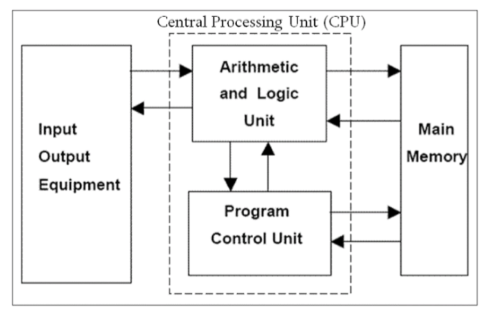

# Behind the scenes

## Understanding the abstraction layer of a language

- What are you allowed to say?
- What are the semantics of language constructs?
- What effects do the language's constructs have on performance?
- How do you decompose larger programs into smaller pieces?
- How do you reuse pieces?
- Who decides how values are organized in memory?
- Who decides when they are allocated?
- Who decides when they are deallocated?
- How do you interact with devices other than the processor and memory?

## Breaking down the C++ abstraction layer

- To use C++, we need a better understanding of some things
- [Computer organization](../../ics-51/syllabus.md)
    - Processors
    - Registers
    - Memory hierarchy
- Runtime organization of memory
- What determine the real cost of things we do

### The Von Neumann architecture

#### Diagram



#### Cycle

1) Read an instruction
2) Decode the instruction
3) Read operands
4) Execute instruction
5) Store results

### Implementing C++ features

- C++ compiler jobs
    - Check syntax and sematics
    - Emit machine instructions with the same **observable** effect as your program (i.e. optimize your shitty code)

#### Variables

- Type detemine how much memory compiler uses
    - `int a` needs 32 bits or 4 bytes
    - `long b` needs 64 bits or 8 bytes
    - `short c` needs 16 bits or 2 bytes

#### Control structures

- Utilize the `jump` and `branch` instructions
    - `jump` for unconditional
    - `branch` for conditionals

#### Functions

- Use the runtime stack to create an activation record and keep track of
    - local variables
    - arguments
    - return value
    - return pointer
    - saved registers
    - temporary values

```
+--------+ <--- stack pointer (points to top of activation record of current running function)
|  bar   |
+--------+ <--- frame pointer (points to bottom of current activation record)
|  foo   |
+--------+
|  main  |
+--------+ <--- program starts here
```