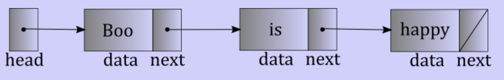

# Linked data structures

## Linked list

- Collection of nodes
- Nodes contain
    - Data element
    - Next pointer
- Can be anywhere in memory

## In C++

- Implement as a struct
    - One value member
    - One pointer to the next node
- Head pointer: points to the first node
- Traversing
    - Can't index
        - `head->value`
        - `head->next->value`
        - `head->next->next->value`
        - ...
    - Use `Node* current`
        - Initial point to head
        - `while(current != nullptr) { current = current->next; }`

