# Multicycle datapath

## Single cycle performance

- The single cycle implementation of the MIPS datapath was inefficient.
    - Clock cycle time is dictated by the longest instruction.
    - Throughput (number of instructions per unit time) as a result is low
- Could split the datapath into smaller pieces/stages each which can be performed efficiently in a single clock cycle.
    - Each type of instruction must then execute only the stages of the datapath that are required
    - The clock cycle time is now dictated by the longest stage of the datapath
    - Extra control is needed to determine how many and which stages are required

## The multicycle approach

- Break up the instructions into steps, each step takes a cycle
    - Balance the amount of work to be done in each cycle
    - Restrict each cycle to use only one major functional unit
- At the end of a cycle, we must
    - Store the intermediate values for use in the later cycles

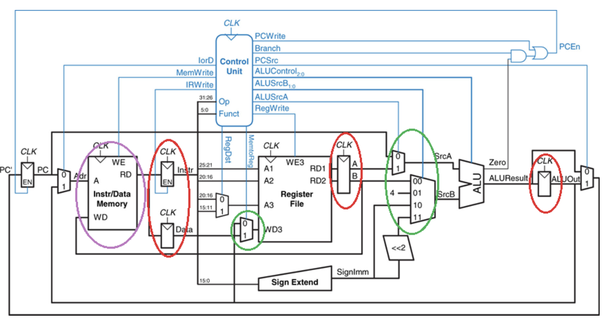

- Red circles indicate the added registers.
- The Instruction memory and data memory are now combined in to a single unit (purple).
- The adders are removed. ALU can perform all necessary operations.
- Additional multiplexors are added to select between more options (green). The Jump mux is removed.

## Execution stages of the multicycle datapath

### Instruction fetch

- Two main tasks
    1) Use PC to retrieve the instruction from the Memory and store the 32-bit instruction value in the Instruction Register
    2) Increment the PC by 4 and store the result back in the PC
- This stage is instruction independent. No knowledge of the type of instruction is available.

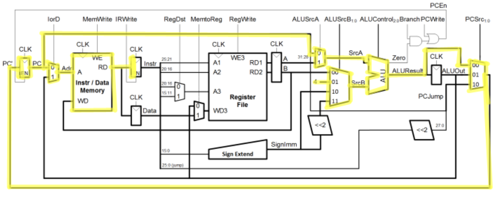

### Instruction decode and register read

- 3 components
    1) Use the opcode to determine which instruction this is (control unit)
    2) Read registers `rs` and `rt` from the register file (in case needed)
    3) Compute the branch address (in case needed)
- This stage is instruction independent. The control lines are not set on the instruction type yet

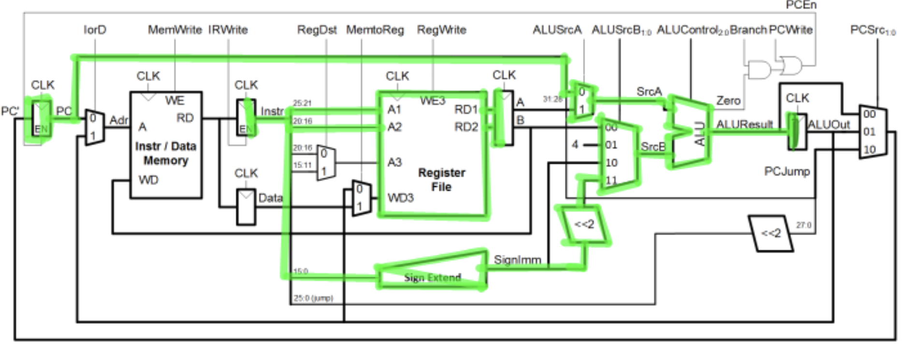

### ALU

- This stage is instruction dependent. ALU is performing one of 4 functions, based on instruction type

#### Memory reference / immediate instructions

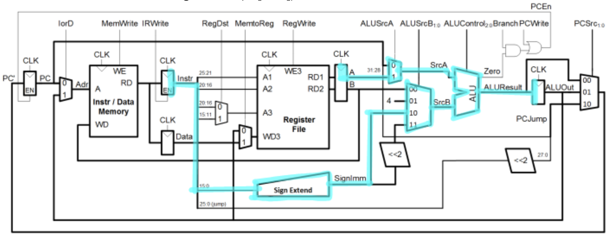

#### R-type instructions

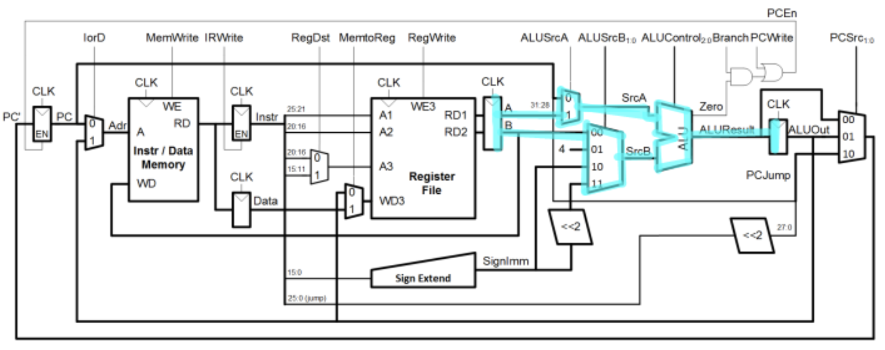

#### Branch

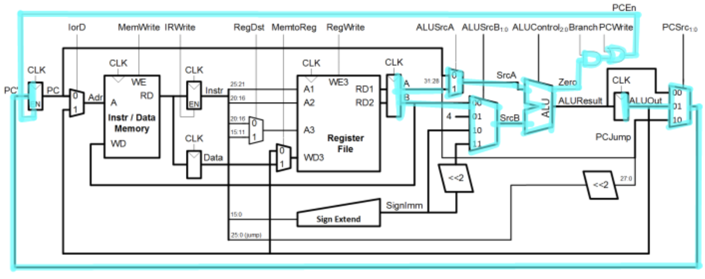

### Memory

- This stage is only required for R-type or memory-access (lw,sw)

#### Load word

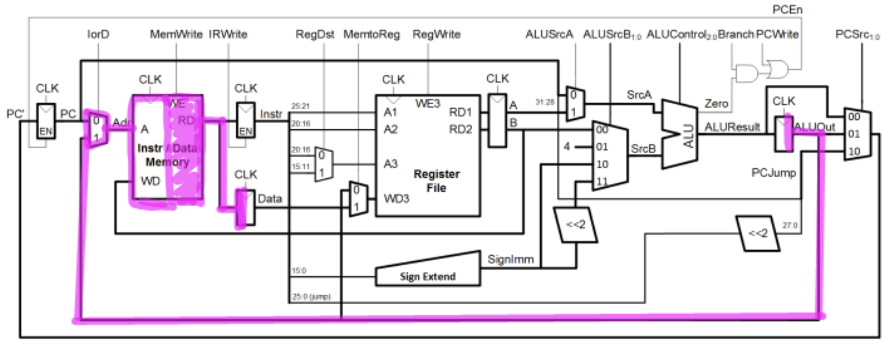

#### Store word

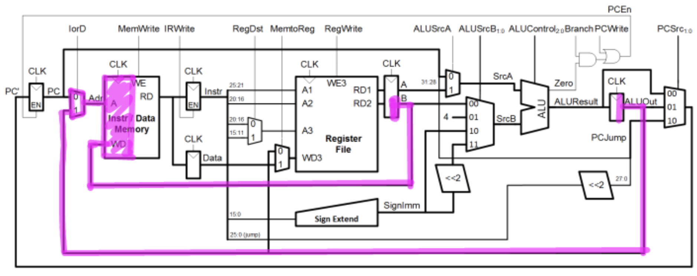

#### Register file

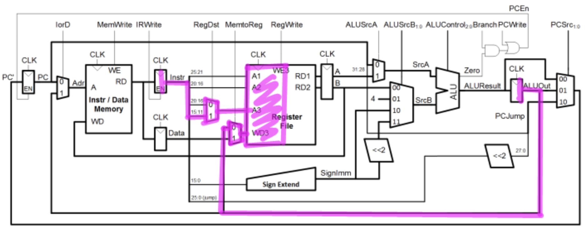

### Write back

- This is instruction dependent and only required for load word instructions.

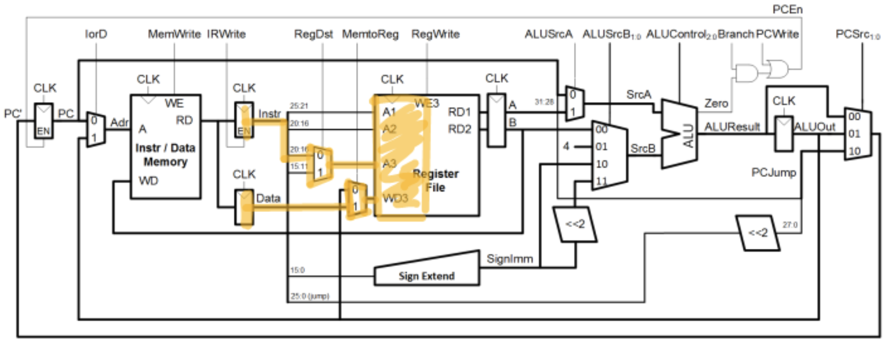

## Thinking about timing

```
lw $t2, 0($t3)
lw $t3, 4($t3)
beq $t2, $t3, Label
add $t5, $t2, $t3
sw $t5, 8($t3)

Label: ...
```

$$
    \text{21 clock cycles} = 5 + 5 + 3 + 4 + 4 = \text{lw + lw+ beq + R-type + sw}
$$

## Multicycle datapath control

- The multicycle datapath created smaller stages to perform the tasks for each instruction.
- The control signals for the entire datapath must be determined for each stage.

### Finite state machines

- Finite state machines, have a finite set of defined states
- The next state is determined by the current state and any input values
- The output values are determined by the current state and possibly the input values
- We use a finite state machine to denote the state transitions and the control values for each type of operation in the multicycle datapath

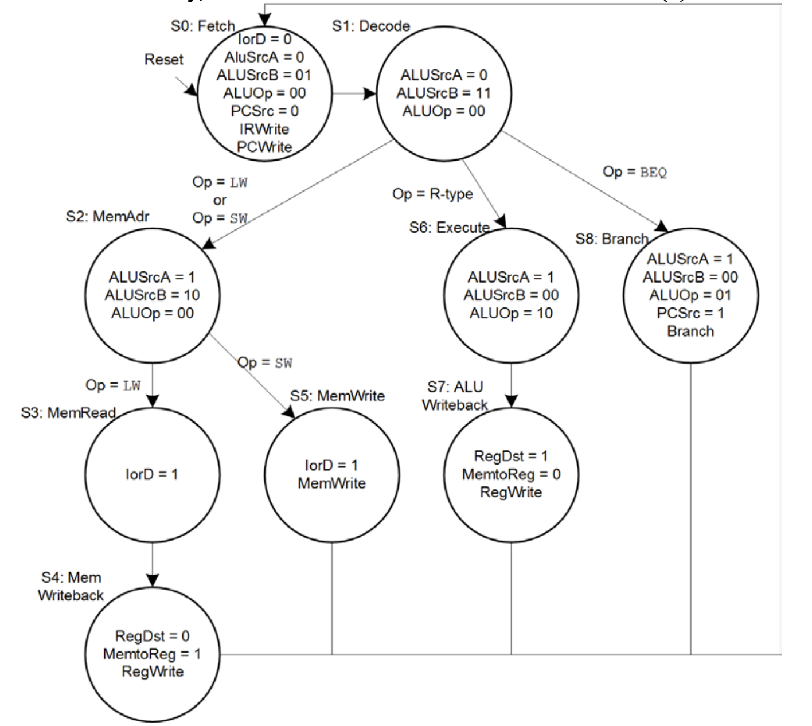

### Microprogramming

- A static program for each instruction is created. The processor executes one microinstruction per clock cycle.
- The microprograms for each instruction is stored in a "control store" which is a ROM (read only memory)
- A microprogram never changes. The instructions and the sequence of these microinstructions is set in stone when the datapath is designed. 
- The opcode usually provides the address of the first microinstruction in the corresponding microprogram.
- The microcode storage works like a look-up table.

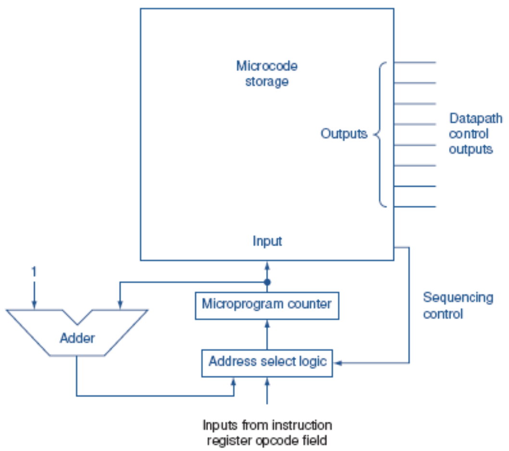