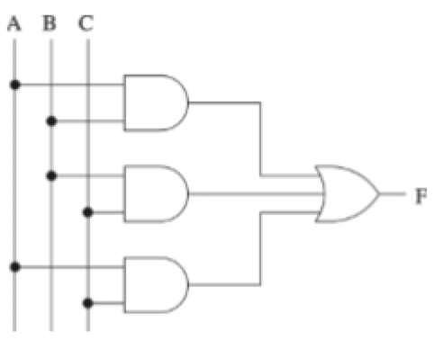
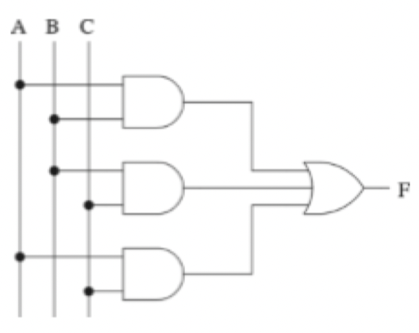
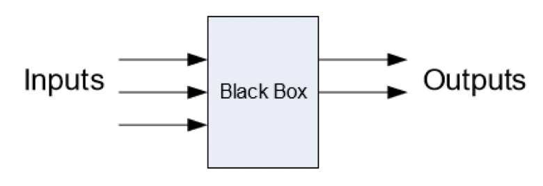
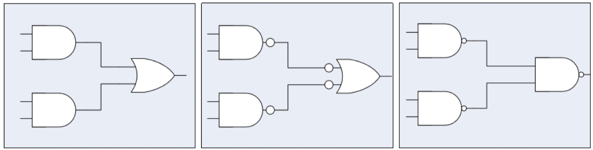
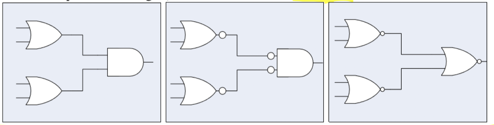

# Digital Logic

## Boolean expression forms

- Two ways to describe outputs in terms of the set of inputs
    1) Set of input combinations where output is TRUE
    2) Set of input combinatinos where output is FALSE

### Canonical sum-of-products

1) Write an *AND* term for each input combination that produces 1 as a result
2) Write input variable if its value is 1, otherwise write its complement
3) *OR* the *AND* terms together to get the final expression

- Each *AND* term is called a **minterm**
- Each minterm *must* contain an occurence of all input variables
- The gate network is a 2-level *AND-OR* gate network

- Has the shorthand form $F(\text{input variables}) = \sum m(\dots)$
- $m(\dots)$ stands for "Summation of minterms"
- The order of input variables matters
    - $\sum m(2, 5, 6, 7) \ne \sum m(7, 6, 5, 2)$

### Canonical product-of-sums

1) Write an *OR* term for each input combination that produces 0 as the result
2) Write input variable is its value is 0, otherwise write its complement
3) *AND* the *OR* terms together to get the final expression

- Each *OR* term is called a **maxterm**
- Each maxterm *must* contain an occurence of all input variables
- The gate network is a 2-level *OR-AND* gate network

- Has the shorthand form $F(\text{input variables}) = \prod M(\dots)$
- Order of input variables matters

## 2 level gate networks

- Create basic gate networks
- Imagine a black box
    - Input variables enter
    - Output variables exit
- Black box contains an implementation using logic gates

### Nand-nand gate

- Invert output of *AND* gates
- Invert input of *OR* gates

### Nor-nor gate

- Invert output of *OR* gates
- Invert input of *AND* gates

## Critical path

- Each logic gate has a propogation delay
- This is the delay between when all inputs are available and the correct output is available
- To calculate
    - Assume each input value availabe at $t = 0$
    - For each gate the input value propogates through
        - Calculate time output will be available
    - For each internal gate
        - Take input value with largest delay
    - Continue until the output delay is found
- The critical path is the set of gates which dictate the longest time
- If two paths have the same delay, they are both part of the critical path