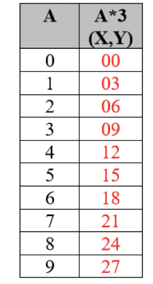
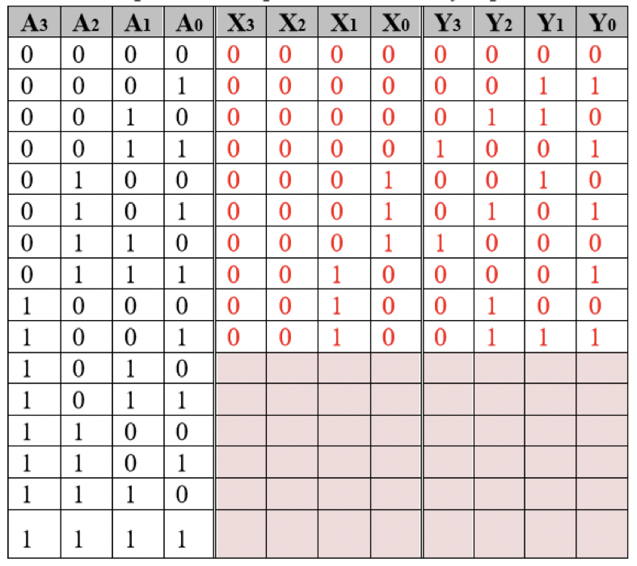
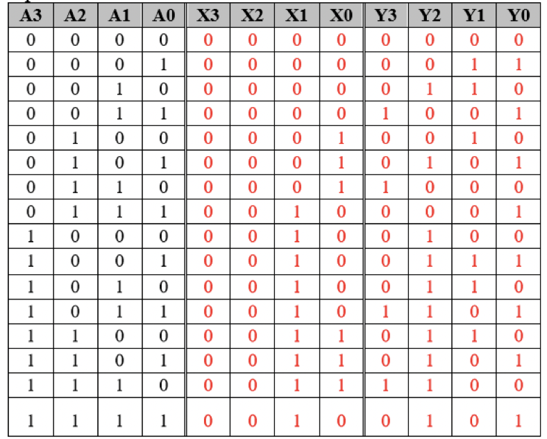

# Building components

## How?

- Boolean logic is the primary tool
- Follow these steps to design a logical process
    1) Problem specification
    2) Truth table derivation
    3) Derivation of logical expression
    4) Simplification of logical expression
    5) Implementation

## Don't cares

- Some designs use a subset of possible binary input combinations
- For unused combinations, you could
    1) Create new output to signify error (extra power, hardware, and checks)
    2) A set value across all outputs to signify error (extra pwer, hardware, and *other* units must check)
    3) Output values to reduce hardware required to implement circuit (Not my problem)
- Don't care values can be either 1 or 0 (usually whichever helps minimize the boolean expression)
- Once set, it cannot be changed without reimplementing the circuit

## Example

- Design a component that
    - Takes in an decimal digit encoded as a 4-bit binary string
    - Outputs the decimal digit multiplied by 3 as 2 decimal digits, each encoded as a 4-bit binary string

### Specification

### Create truth table

### Using don't care values

- Complete the truth table with fixed values
- Consider which would help minimize the expression faster (and in fewer groups)

### Deriving boolean expression

#### X outputs

- $X_{3} = 0$
- $X_{2} = 0$
- $X_{1} = A_{3}A_{2}'A_{1}'A_{0} + A_{3}A_{2}'A_{1}'A_{0}' + A_{3}'A_{2}A_{1}A_{0}$
- $X_{0} = A_{3}'A_{2}A_{1}'A_{0}'+ A_{3}'A_{2}A_{1}'A_{0} + A_{3}'A_{2}A_{1}A_{0}'$

#### Y outputs

- $Y_{3} = A_{3}'A_{2}'A_{1}A_{0} + A_{3}'A_{2}A_{1}A_{0}'$
- $Y_{2} = A_{3}'A_{2}'A_{1}A_{0}' + A_{3}'A_{2}A_{1}'A_{0} + A_{3}A_{2}'A_{1}'A_{0}' + A_{3}A_{2}'A_{1}'A_{0}$
- $Y_{1} = A_{3}'A_{2}'A_{1}'A_{0} + A_{3}'A_{2}'A_{1}A_{0}' + A_{3}'A_{2}A_{1}'A_{0}' + A_{3}A_{2}'A_{1}'A_{0}$
- $Y_{0} = A_{0}$

### Simply the expressions

- Can use Boolean algebra or K-maps here
- This is why deciding don't cares carefully can be very helpful

#### X outputs

- $X_{3} = 0$
- $X_{2} = 0$
- $X_{1} = A_{3} + A_{2}A_{1}A_{0}$
- $X_{0} = A_{2}A_{1}' + A_{2}A_{1}A_{0}'$

#### Y outputs

- $Y_{3} = A_{2}'A_{1}A_{0} + A_{2}A_{1}A_{0}'$
- $Y_{2} = A_{2}'A_{1}A_{0}' + A_{2}A_{1}'A_{0} + A_{3}$
- $Y_{1} = A_{2}'A_{1}'A_{0} + A_{2}'A_{1}A_{0}' + A_{2}A_{1}'A_{0}'$
- $Y_{0} = A_{0}$

### Implementation

- Take the derived Boolean expressions as draw a gate network for each