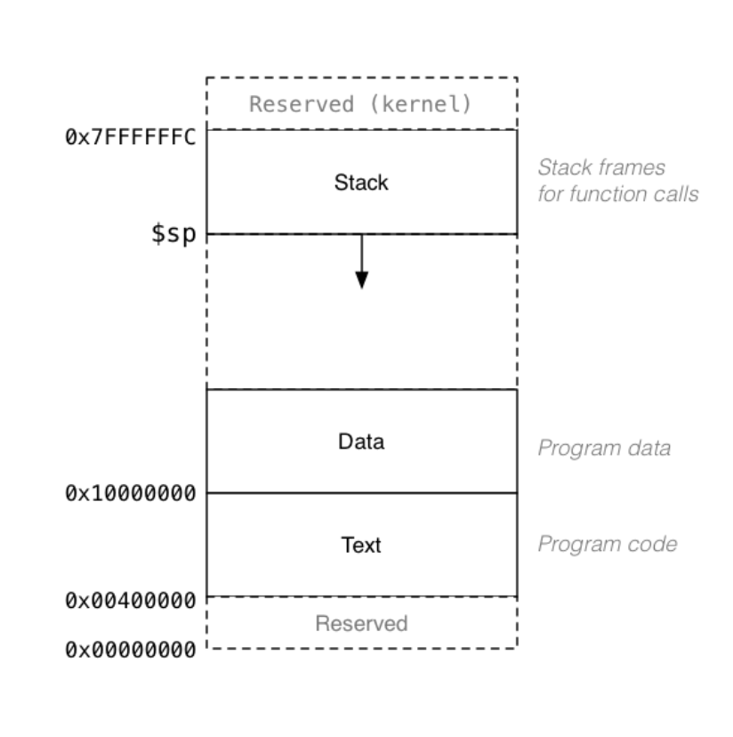
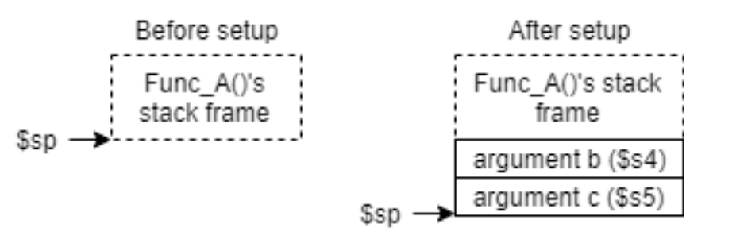
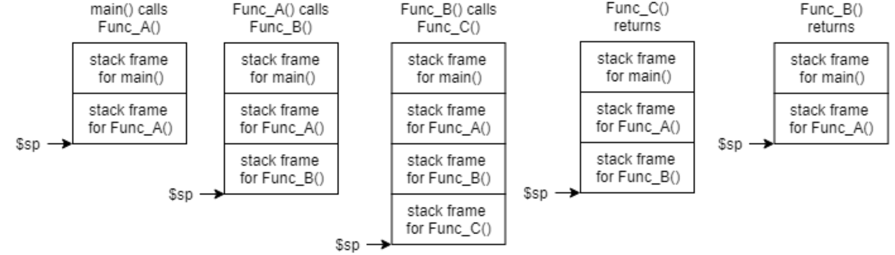

# More on functions

## The MIPS stack

- A region of memory within the running program space (a process – discussed in ICS53)
- The `$sp` register holds the address of the current item at the top of the stack



- It is important to remember in MIPS that the stack grows downward in memory
- To place a value on the stack (“push”), the stack pointer (`$sp`) is moved down to acquire space.

```
    addi $sp, $sp, -4 # grow the on stack  
    sw $t0, 0($sp) # store value in $t0 onto the top of the stack
```

- To remove a value from the stack (“pop”), the value is read from the stack and then the stack pointer (`$sp`) is moved up to release the space

```
    lw $t0, 0($sp) # read value into $t0 from the top of the stack 
    addi $sp, $sp, 4 # shrink the stack
```

## Functions with more than 4 arguments

- The caller must place the additional arguments on to the stack prior to calling the function

```C
int func_A(. . .)
{  
    int x,y,z,a,b,c; #in $s0-s5 .. .  
    a = func_B(x,y,z,a,b,c) .. .

}
```

```
# code for func_A
# load arguments
move $a0, $s0
move $a1, $s1
move $a2, $s2
move $a3, $s3

# move stack down to make space

addi $sp, $sp, -8

sw $s4, 4($sp)
sw $s5, 0($sp)
jal func_B
move $s0, $v0

```



## Preserving saved registers

- If a function utilizes any of the saved (`$s`) registers, the caller's value must be saved and then restored before returning from the function
- For efficiency, the callee will only save on the stack the values in $s registers which the callee uses.

### Non-leaf functions

- When calling a function from another function
    1) The return address must be preserved (or it will be lost)
    2) The argument values might need to be preserved
- In order for each non-leaf function to proper return to the line of code where it was called, the return address in `$ra` must be preserved prior to making a function call

### Stack frames / activation records

- Each function allocates a small section of the stack (a frame)
- As each function is called, a new stack frame is created, further growing the stack



- To create a stack frame the caller function uses the following general structure

```
FunctionName:

# function prologue
#   Setup the stack frame (save $fp, allocate space on stack $sp) 
#   Save $ra and $s registers on stack  
...  

# function body
#   Perform the desired functionality, make function calls 
#   Place return values in $v registers  
...  

# function epilogue
#   Restore the $ra and $s registers
#   Remove the stack frame (restore the $fp, reset $sp)
    jr $ra
```

- All information is saved on to the stack before any changes can be made.
- All information is restored from the stack after desired functionality is completed

