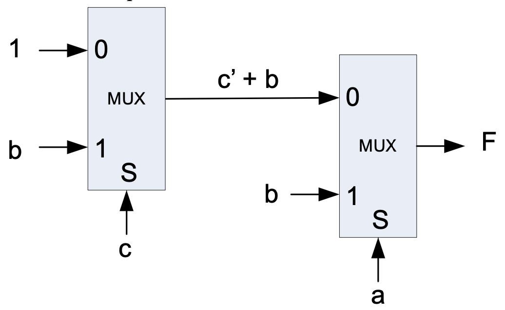

# Multiplexors

## Multiplexors (MUX)

- Multiplexors are selectors which, based on the value of the ‘selector’ bits, the corresponding input is placed on the output line
- Multiplexors come in a variety of sizes, 2-input, 4-input, 8-input, etc. where n inputs means $\lceil{\log_{2}n}\rceil$
- Consider at 2-input multiplexor (or also known as a 1-bit selector multiplexor)


- Multiplexors also can perform selection between m-bit inputs.

## Univeral (complete) sets

- A set of gates is *complete/universal* if you can implement **any** logical function using only the types of gates in the set
- *Minimal* complete set is a complete set with no redundant elements

```
{AND, OR, NOT} – this is a complete set, but not a minimal complete set.
{AND, NOT}  
{OR, NOT}  
{NAND}
{NOR}
{MUX}
```

## Implementing gate networks with multiplexors

- Since multiplexors are a minimal complete set $\{MUX\}$, they can be used to implement any Boolean expression/function.
- To do so
    - A single or set of the input variables are chosen as the selectors for the multiplexors.
    - Remaining input variables (and also 0 and 1) are placed on the input options of the mux to be chosen between.
- In Boolean algebra terms
    - Factor out all combinations of the selector input variables from all terms in the Boolean expression.

### Example

> Implement the function $F = abc’ + a’bc’ + a’b’c’$ + bc using 2-input muxes

#### Step 1

- Select a single input variable as the selector (2-input muxes) and factor the variable out of all terms.
- $F = a(bc’ + bc) + a’(bc’ + b’c’ + bc)$
    - $(bc’ + bc)$ is placed on 1 input of the multiplexor
    - $(bc’ + b’c’ + bc)$ is placed on 1 input of the multiplexor

#### Step 2

- Simplify each of the sub-expressions using the Boolean Identities, if possible.
    - $bc’ + bc = b(c’ + c) = b$
    - $bc’ + b’c’ + bc = c’(b + b’) + bc = c’ + bc = c’ + b$
- If the sub-expression is a single literal, 1, or 0, no further gates are needed.
- Otherwise, repeat the process to implement the sub-expression with additional muxes.
- **Note**: If complemented forms of variables are not given, then NOT gates must be built using the MUXes to invert the uncomplemented variable



- Selecting different variables for use as the selector(s) will result in different gate networks
- By selecting a variable which appears in the most terms and which appear in as close to equal number of complemented and uncomplemented forms, the resultant gate network will be balanced

## Decoders

- A decoder is another unit which has n input bits and 2n output bits.
- The unit outputs a single 1 on the output bit corresponding to the value of the input combination
- A decoder translates the minterm to its binary value.
- A multiplexor is built from a decoder plus extra gates.