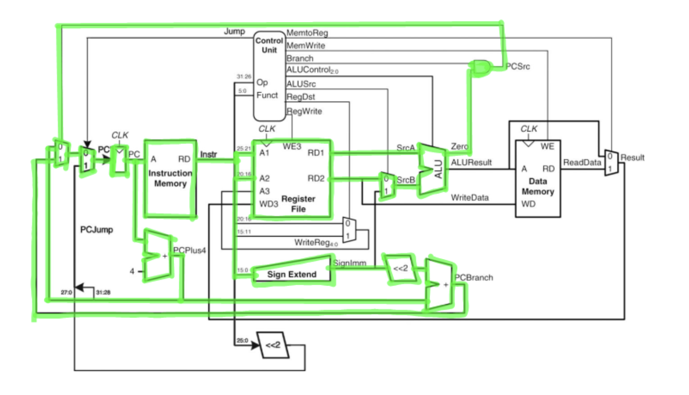
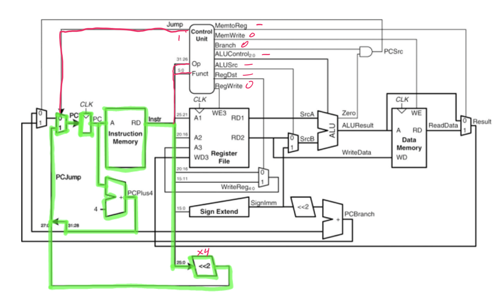
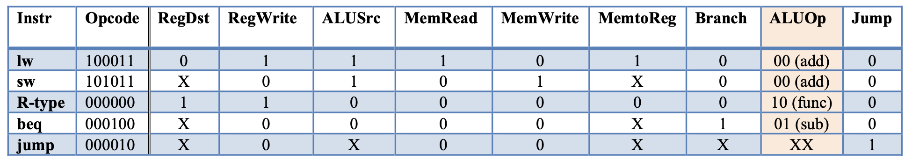

# Single cycle datapath (part 2)

## Branch

- Fectch
    1) Fetch instruction
    2) Fetch instruction bits
- Decode
    1) Read register `$rs` and `$rt` from register file
    2) Sign extend immediate value
- Execute
    1) Compare by performing ALU subtraction operation
    2) If true, set PC to new address

## Jump

- Fetch
    1) Fetch instruction bits
- Decode
    1) Send opcode to control unit
- Execute
    1) Jump unconditionally

## Control unit

- The names of the control signals are named to represent flags
- A signal is asserted = 1 or deasserted = 0
- The complete Control Table the 5 basic operations is as follows

- The `ALUOp` is a 2-bit control determined within the Control Unit and is used to create the 3-bit ALUControl output for the ALU.
- `ALUOp` can be created as an intermediate output. This value then combined with the function field produces the proper ALU Operation control.
