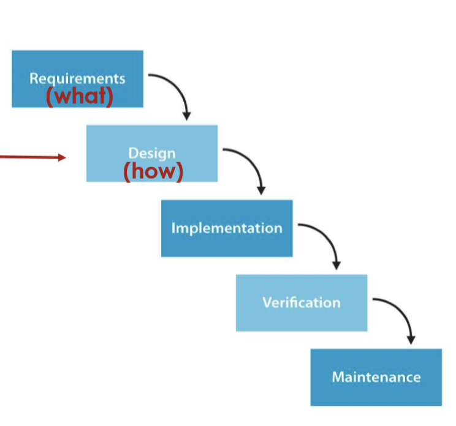

# Lecture 7: designs, models, and notations (part 1)

## Design phase of software engineering

- Make system-wide decisions
    - Architecture
    - Languages
    - Libraries
    - Platforms
- Making lower-level decisions in an *iterative* manner
    - Studying the problem
    - Identifying solutions
    - Creating abstractions
    - Evaluating

### Approaching design 

- Functional decomposition: breaking system into smaller sub-systems
- Relational database design: design structure of data
- Object-oriented design: visualize object data/actions and relationships between objects
- User interface design: decide what user interface will look like

## Designs

- Scribbles and sketches to communicate thoughts
- 3D models for more formal representations

### Purpose of design

- Designs to think: share ideas
- Designs to talk: communicating with others
- Designs to prescribe: explain how to implement

## Abstraction

- Remove irrelevant information, but keep high-level, relevant information
- All notations support a certain kind of abstraction
- Software engineering is about constructing and elaborating abstractions/models