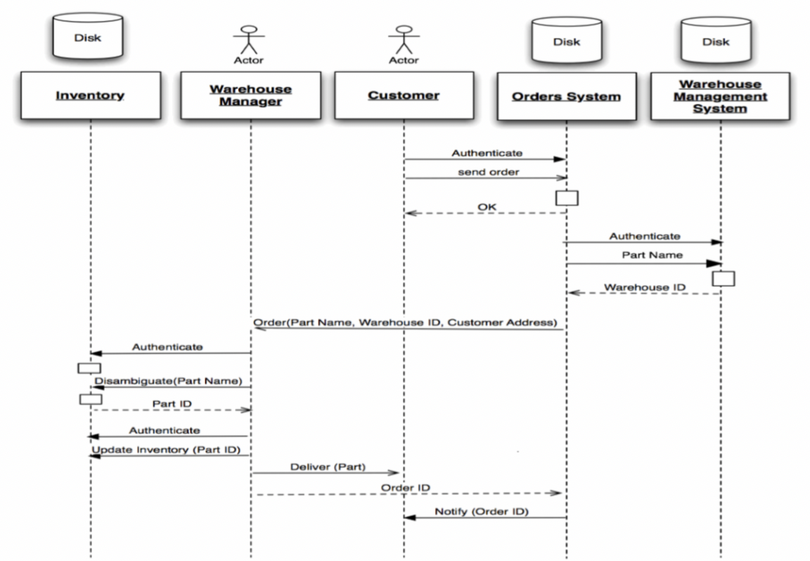

# Lecture 8: designs, models, and notations (part 2)

## Notations and diagrams

### UML 

- **U**nified **M**odeling **L**anguage
- Industry standard for designing software
- Different types of UML diagrams represent different aspects of the system

#### Class diagrams

- Used to decompose a system into classes known as **modules**
- Models domain concepts
- Creates detailed, object-oriented design of the code

- `-` means private visibility
- `+` means public visibility

#### Relationships between classes

##### Inheritance

##### Association

##### Multiplicities

##### Aggregation

- One object contains a *set* of other objects
- This relationship is [transitive and assymetric](../../../summer-2020/ics-6b/week3/relations-and-properties.md)

##### Composition

- A variant of aggregation
- Adds the **existence dependency** property
    - When the whole is destroyed, parts cannot exist

#### How to create classes?

- The *set of nouns* in the problem description become **classes or attributes** (data)
- The *set of verbs* in the problem description become **operations or associations**
- Review use cases to flesh out flow and needed objects
- UI mockup may be helpful
- Refer to, add to, and revise design as needed

#### Activity diagrams

- Demonstrate user flows and work flows

#### Sequence diagrams

- Represent interactions between objects as they happen

#### Use case diagrams

- Represent use cases and interactions between actors and the system

### Other diagrams

- Interface mockups
- Psuedo code
- Entity-relationship diagrams (good for designing relational database schemas)
- Architecture diagrams
- Storyboards
- Sketches

## Design principles

### High cohesion / Low coupling

- *High cohesion*: grouping related functionality together
- *Low coupling*: ungrouping unrelated functionality / reducing interdependency
- Effects
    - Changes don't propogate
    - Reuse is facilitated

### Information hiding

- Hide design decisions that are most likely to change
- Protects other parts of the program if a change is made

