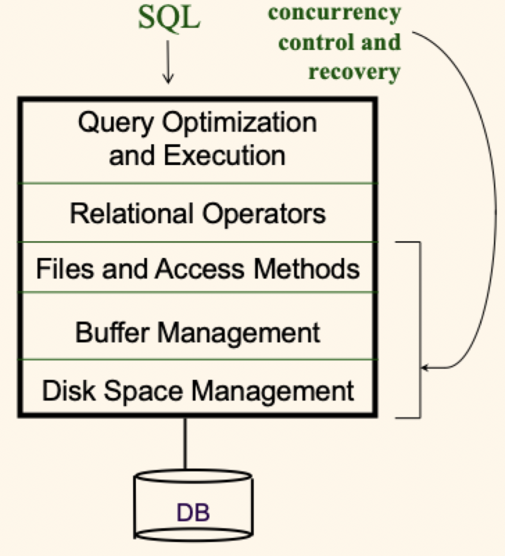

# Lecture 1

## What is a database system?

- A very large, integrated collection of data
- Usually a model of a *real-world enterprise*
	- **Entities** (students, courses) with attributes (name, course number)
	- **Relationships** (Susan is *taking* CS234) between objects
- **Database management system**: a software system designed to store, manage, and provide access to one or more databases

### Filesystems vs DBMS

- Application programs must sometimes *stage large datasets* between main memory and secondary storage
- *Special code needed* for different queries, and that code must be (stay) correct and efficient
- Must *protect data from inconsistency* due to multiple concurrent users
- *Crash recovery* is important since data is now the currency of the day
- *Security and access control* are also important

### Evolution of DBMS

- Files
	- Byte streams
	- Majority of application development effort goes towards building and then maintaining data access logic
- Early DBMS technologies
	- Records and pointers
	- Large, carefully tuned data access programs that have dependencies on physical access paths, indexes, etc.
- Relational DB systems
	- **Declarative approach**
	- Tables and views bring "data independence"
	- Details left to the system
	- Designed to simplify data-centric application development

### Why use a DBMS?

1) Data independence
2) Efficient data access
3) Reduces application development time
4) Data integrity and security
5) Uniform data administration
6) Concurrent access, recovery from crashes

### Why study databases?

- Shift from *computation* to *information*
	- At the "low end": explosion of the web (messy)
	- At the "high end": scientific applications and social data analytics
- Datasets increasing in diversity and volume
	- Digital libraries, interactive video, Human Genome project
	- Mobile devices and the internet of things
	- ... need for DBMS exploding
- DBMS field encompasses most of CS
	- Operating systems
	- Languages
	- Theory
	- Artificial intelligence
	- Multimedia
	- Logic

## Data models

- A *data model* is a collection of concepts for describing data
- A *schema* is a description of a particular collection of data, using a given data model
- The *relational model* is (still) the most widely used data model today
	- *Relation*: basically a table with rows and (named) columns
	- *Schema*: describes the tables and their columns

### Levels of abstraction

There are many *views* of one *conceptual* (logical) schema and an underlying *physical* schema

- Views describe how different users see the data
- Conceptual schema defines the logical structure of the database
- Physical schema describes the files and indexes used under the covers

### Data independence

- Applications are *insulated* (at multiple levels) from how data is actually structured and stored, thanks to schema layering and high-level queries
	- *Logical data independence*: protection from changes in the **logical** structure of data
	- *Physical data independence*: protection from changes in the **physical** structure of data
- One of the most important benefits of DBMS use
	- Allow *changes* to occur -- **without application rewrites**

### Example: university DB

#### Conceptual schema (tables)

```SQL
Students(sid: string, name: string, login: string, age: integer, gpa: real)
Courses(cid: string, cname: string, credits: integer)
Enrolled(sid: string, cid: string, grade: string)
```

#### Physical schema (hard drives and filesystem)

- Relations stored as unordered files
- Indexes on first and third columns of `Students`

#### External schema (pretend tables)

```SQL
CourseInfo(cid: string, cname: string, enrollment: integer)
```

#### End user query (against *external* schema)

```SQL
SELECT c.cid, c.enrollment
FROM CourseInfo c
WHERE c.cname = 'Computer Game Design'
```

#### Equivalent query (against *conceptual* schema)

```SQL
SELECT c.cid, count(e.*)
FROM Enrolled e, Courses c
WHERE e.cid = c.cid AND c.cname = 'Computer Game Design'
GROUP BY c.cid
```

#### Steps of the hood

1) Access `Courses` - use index on `cname` to find associated `cid`
2) Access `Enrolled` - use index on `cid` to count the enrollment

### Concurrency and recovery

- *Concurrent execution* of user programs is essential to achieve good DBMS performance
	- Disk accesses are frequent and slow, should keep CPU busy by serving multiple user programs
	- Interleaving multiple programs' actions can lead to inconsistency
- *Error or crashes* may occur during, or soon after, the execution of users' programs
	- Could lead to undesirable partial results or lost results
- DBMS answer: let users/programmers pretend that they're using a reliable, single-user system

## Structure of DBMS

- A typical DBMS has a *layered architecture*
- One of several possible architectures; each RDBMS has its own variation



### Component roles

#### Query optimization and execution

- Query parser
	- Parse and analyze *SQL query*
	- Makes sure the query is **valid** and talking about data that exists
- Query optimizer
	- *Rewrite* the query logically
	- Perform cost-based *optimization*
	- Goal is finding a "good" query plan considering
		- Available access paths (files and indexes)
		- Data statistics (if known)
		- Costs of the various relational operators
- Plan executor + relational operator
	- Runtime side of query processing
	- Query plan is a tree of relational operators (drawn from *relational algebra*)

#### Files and access methods

- Files of records
	- DBMSs have *record* based APIs under the hood
	- Record = set of fields
	- Fields are typed
	- Records reside on pages of files
- Access methods
	- Index structures for lookups based on field values
	- *B+ tree* indexes are the most common type

#### Buffer management

- Buffer manager
	- The DBMS answer to *main memory management*
	- All disk page accesses go via the buffer pool
	- Buffer manager caches pages from files and indexes
- Disk space and I/O managers
	- Manage space on disks (pages)
	- Also manage I/O (sync, async, prefetch, etc)
	- Database data is **persistent**
- System catalog
	- Info about tables
	- Data statistics
	- Info about indexes
- Transaction management
	- ACID (atomicity, consistency, isolation, durability)
	- Lock manager for CI
	- Log manager for AD

## Miscellany

### Terms

- **D**ata **D**efinition **L**anguage (DDL): used to express views + logical schemas (using a syntactic form of a data model)
- **D**ata **M**anipulation **L**anguage (DML): used to access and update the data in the database
- **Q**uery **L**anguage (QL): synonym for DML, or for its retrieval sublanguage

### Roles

- Database administrator (DBA)
	- The "super user" for a database or DBMS
	- Handles physical DB design, tuning, performance monitoring, backup/restore, user/group management
- Application developer
	- Builds data-centric applications
	- Involved with logical DB design, queries, and DB application tools
- Data analyst or end user
	- Non-expert who uses tools to interact with the data
- Data engineer
	- Develops/constructs/maintains big data platforms and data flows
	- Uses multiple big data tools and technologies to prepare data products for consumption by data scientists

### Brief history of DBs

- Pre-relational era: 1960's, early 1970's
- **Codd's relational model paper: 1970**
- Basic RDBMS research & development: 1970-1980
- RDBMS improvements: 1980-85
- Relational goes mainstream: 1985-90
- Distributed DBMS research: 1980-90
- Parallel DBMS research: 1985-95
- Extensible DBMS research: 1985-95
- OLAP and warehouse research: 1990-2000
- Stream DB and XML DB research: 2000-2010
- Big data research & development (NoSQL): 2005-present