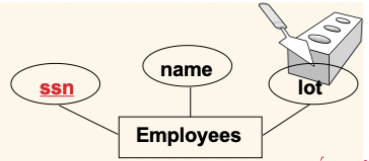
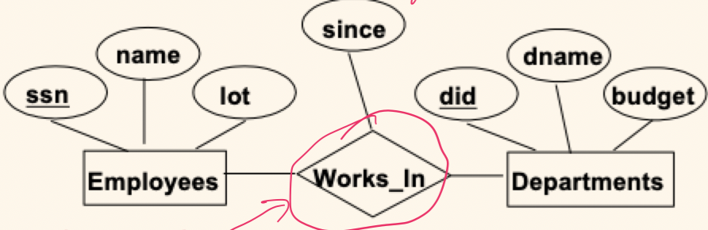
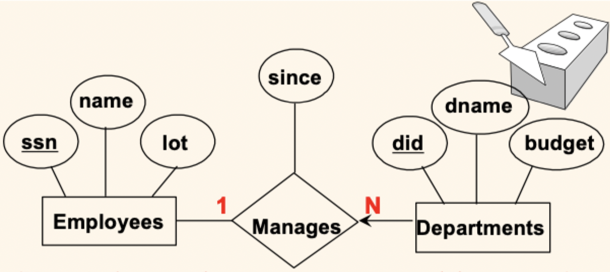
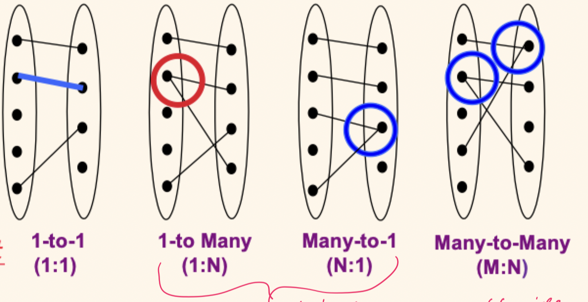
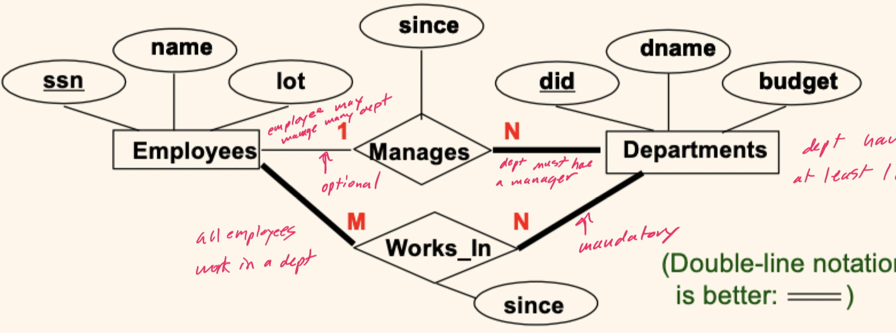
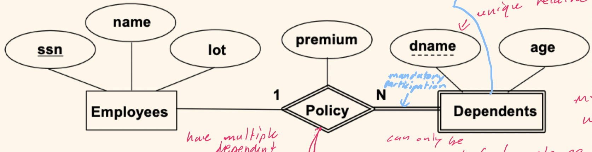
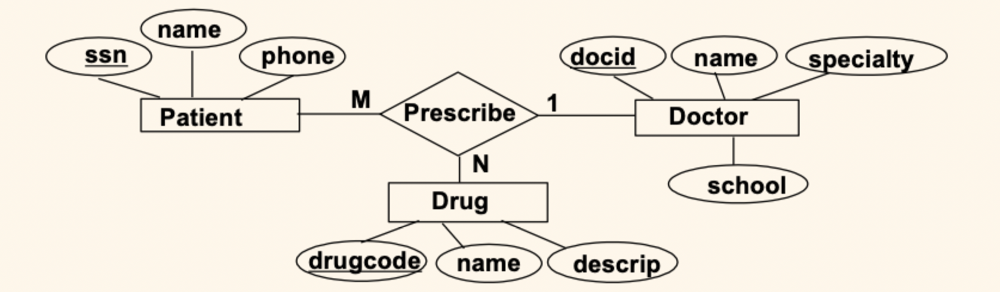

# Lecture 2

## The database design process

- Essentially a top-down process
	1) Requirements gathering (interviews)
	2) Conceptual design (using E-R model)
	3) Platform selection (which DBMS)
	4) Logical design (for target data model)
	5) Physical design (for target DBMS and workload)
	6) Implement (and test, of course)
- Notes
	- Expect backtracking, iteration, and incremental changes over time
	- Out targets: relational model & RDBMS

### Conceptual design

- What are the *entities* and *relationships* in the enterprise?
- What information about these entities and relationships should we store in the database?
- What are the *integrity constraints* or *business rules* that hold?
- A database schema in the ER model can be represented pictorially
- Can map an ER diagram into a relational schema

## ER model basics

### Entities

- *Entity*: real-world object, distinguishable from all other objects. An entity is described using a set of *attributes*
- *Entity set*: a collection of similar entities
	- All entities in an entity set have the **same** set of attributes (for now)
	- Each entity set has a **key** as a unique identifier; can be a single attribute (atomic) or several attributes (composite)
	- Each attribute has a **domain** (similar to a datatype)

### Relationships

- *Relationship*: association among two or more entities
- *Relationship set*: collection of similar entities
	- An n-ary relationship set $R$ relates $n$ entity sets $E_{1},\, \dots ,\, E_{n}$; each relationship in $R$ involves entities $e_{1}:E_{1} ,\, \dots ,\, e_{n}:E_{n}$
	- One entity set can participate in different relationship set or in different roles in the same set

### Cardinality constraints

- Consider `Works_In`: an employee can work in many departments; a department can have many employees (many-to-many)
- In contrast, each department has at most one manager; a manager can manage many departments (one-to-many)

- If not specified, the default cardinality constraint is many-to-many
- Such constraints need to be determined

### Participation constraints

> Does every `Department` have an employee that `Manages` it?

- If so, this is a **participation constraint**
	- *Total*: all entities participate in a relationship
	- *Partial*: some entities may not participate
- The participation of `Departments` in `Manages` is said to be *total*

### Weak entities

- A **weak entity** can be identified uniquely only by considering the primary key of some other (owner) entity
- Owner entity set and weak entity set must participate in a one-to-many relationship
	- One owner and many weak entities
- Weak entity set must have *total* participation in this **identifying** relationship set
- Dependent identifier is unique only *within* owner context 

### Ternary relationships

- A prescription might be a 3-way relationship between a doctor, a patient, and a drug
- This is fairly unusual, but should be considered a limit (due to complexity)
- The relationship keys will be a subset of the entity keys

- A given *patient and drug* will be associated with *one* doctor
- A given *patient and doctor* may be associated with *several* drugs
- A given *doctor and drug* may be associated with *several* patients