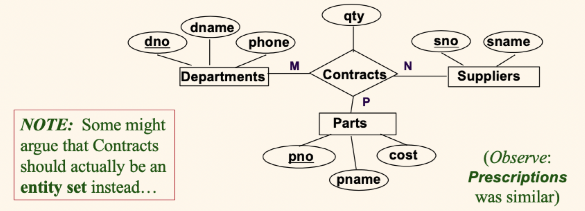

# Lecture 3

## Advanced ER features

### IsA hierarchies

- As in Java or other programming languages, ER attributes are *inherited* (including the key attribute)
- If we declare `A` **IsA** `B`, then every `A` entity is also considered to be a `B` entity
- Most **IsA** hierarchies will include a single generalized entity with multiple specialized sub-entities
	- The hierarchy is *covering* if every entity must be at least one sub-entity (there can be no entities itself)
	- The hierarchy is *disjoint* if every entity can only be at most one sub-entity
- Reasons for using IsA
	- To add descriptive attributes specific to a subclass
	- To identify subclasses that participate in a relationship
	- Design specialization (top-down) and generalization (bottom-up)

### Aggregation

- Used when we have to model a relationship involving (entity sets and) a *relationship set*
- **Aggregation** allows us to treat a relationship set as an entity set for purposes of participating in (other) relationships

- `Monitors` is a distinct relationship; it even has its own attributes
- Each sponsorship can be monitored by zero or more employees

### Additional features

## Conceptual design using the ER model

- Design choices
	- Should a given concept be modeled as an *entity* or as an *attribute*?
	- Should a given concept be modeled as an *entity* or as a *relationship*?
	- How should we characterize relationships?
- Constraints in the ER model
	- Many of the semantics can (and should) be captured
	- But not every constraint can be captured (should write it down somewhere)

### Attribute considerations

- Should *address* be an attribute of `Employee` or an entity (connected to `Employees` by a relationship)?
- Depends on how we want to use addresses, on the data semantics, and the available model features
	- If we have *several* addresses per employee, `address` would be a multivalued attribute or an entity
	- If address *structure* is important, `address` should be modeled as a composite attribute or entity
	- If the address itself is *logically separate* (representing a property) it is **rightly** an entity in any case
- What if a manager gets a discretionary budget that covers **all** departments managed?
	- *Redundancy*: `dbudget` could be stored (repeatedly) with each department managed by the manager
	- *Misleading*: suggests `dbudget` is associated with department+manager combination

### Binary vs ternary relationships

- Ternary needed: a ternary relation `Contracts` relates the entity sets `Parts`, `Departments`, and `Suppliers` and has descriptive attribute `qty`

- What the entity set perspective would lead to: an entity set `Contracts` related to the entity sets `Parts`, `Departments`, and `Suppliers`, with descriptive attribute `qty`

