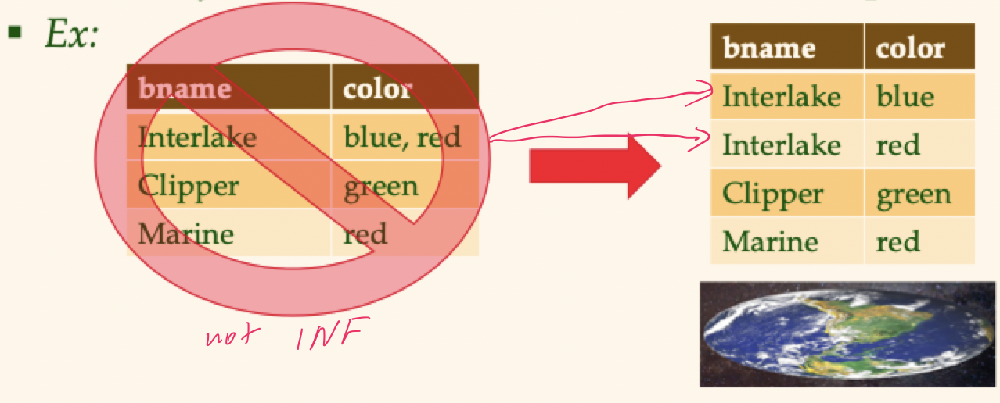

# Lecture 7

## Reasoning about functional dependencies

### Inferring more

- Given some functional dependencies, we can usually infer additional functional dependencies
	- `ssn` -> `did` AND `did` -> `lot` IMPLIES `ssn` -> `lot` by transitivity
- A functional dependency $f$ is *implied by* a set of functional dependencies $F$ if $f$ holds whenever all functional dependencies in $F$ hold
	- $F^{+}$ is the *closure of* $F$ is the set of *all* functional dependencies implied by $F$

### Armstrong's axioms

- *Reflexivity*: if $X \subset Y$ then $Y \to X$
- *Augmentation*: if $X \to Y$ then $XZ \to YZ$ for any $Z$
- *Transitivity*: if $X \to Y$ and $Y \to Z$ then $X \to Z$

### Rules of inference

- **Union**: if $X \to Y$ and $X \to Z$, then $X \to YZ$
- **Decomposition**: if $X \to YZ$, then $X \to Y$ and $X \to Z$

### Inference examples

Consider `R(ABCDE)` and $R = \{ A \to B ,\, B \to C ,\, CD \to E \}$

| Label | Functional dep | Derived from |
|:-----:|:--------------:| ------------ |
| A | $A \to B$ | Given |
| B | $B \to C$ | Given |
| C | $CD \to E$ | Given |
| D | $A \to C$ | Transitivity between (A) and (B) |
| E | $BD \to CD$ |Augmentation of (B) with $D$ |
| F | $BD \to E$ | Transitivity between (E) and (C) |
| G | $AD \to CD$ | Augmentation of (D) with $D$ |
| H | $AD \to E$ | Transitivity between (G) and (C) |
| I | $AD \to C$ and $AD \to D$ | Decomposition of (G) |
| K | $AD \to BD$ | Augmentation of (A) with $D$ |
| L | $AD \to B$ | Decomposition of (K) |
| M | $AD \to A$ | Reflexivity of (A) |
| N | $AD \to ABCDE$ | Union of (H), (I), (L), (M) |

- Computing the closure of a set of functional dependencies can be very expensive
- Typically, we just want to check if a *specific* functional dependencies is in the closure set of $F$
	1) Compute the *attribute closure* of $X$ with respect to $F$
		- Set of all attributes $A$ such that $X \to A$ is in $F+$
		- There is a *linear time algorithm* to compute this: start with $X$ and keep adding attributes that can (now) be inferred via the functional dependencies
	2) Check if $Y$ is in $X+$

### Functional dependencies and redundancy

- Functional dependencies help *detect* redundancy in a schema
- If **no** non-trivial functional dependencies hold -> there is no redundancy here
- Given $A \to B$, several tuples could have the same $A$ value and so they will have the same $B$ value (repeats imply redundnacy)

## Normal forms

- Returning to the issue of schema refinement, the first question to ask: is it needed?
- We can define various *normal forms* based on the nature of functional dependencies that hold
- Depending upon the normal form a relation is in, it has a different level of redundancy
- Checking which normal form a given relation is in will help us decide if we need to decompose (fix) it

### First normal form

> Relations in the first normal form have all of its attributes as atomic values

- No set-valued attributes
- Usually goes without saying for relational models, but not for NoSQL systems

### Some terms and definitions

- If $X$ is part of a (candidate) key, we say the $X$ is a *prime attribute*
- If $X$ (an attribute set) contains a candidate key, we say that $X$ is a superkey
- $X \to Y$ can be pronounced as "X determines Y" or "Y is functionally dependent on X"
- Some types of dependencies on a key
	- *Trivial*: $XY \to X$
	- *Partial*: $XY$ is a key ($X \to Z$)
	- *Transitive*: $X \to Y$ and $Y \to Z$, $Y$ is non-prime, $X \to Z$