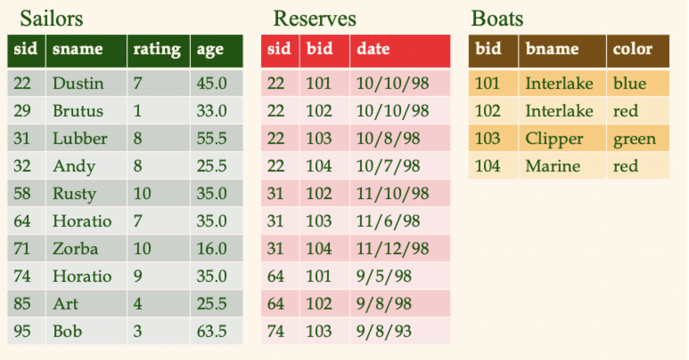
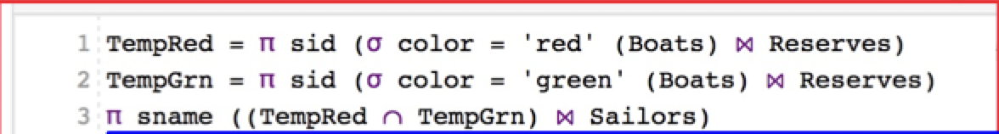
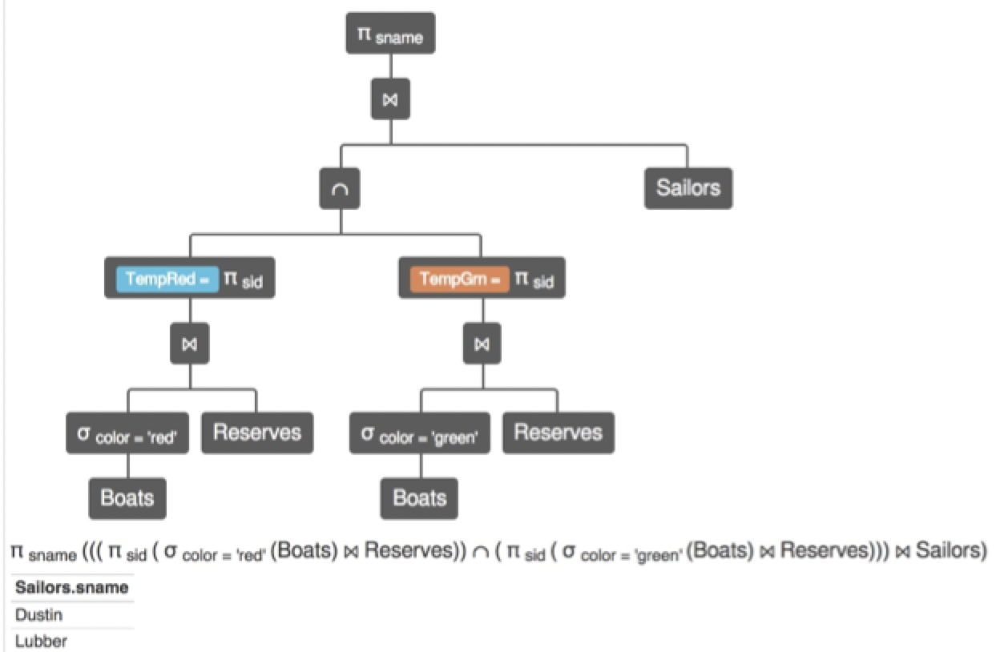

# Lecture 10

## Wisconsin sailing club database

## Queries

### Specific boat ID

> Find the names of sailors who've reserved boat #103

$$
	\pi_{sname}((\sigma_{bid = 103}Reserves) \bowtie Sailors)
$$

$$
	\pi_{sname}(\sigma_{bid=103}(Reserves \bowtie Sailors))
$$

### Specific boat colors

> Find names of sailors who've reserved a **red** boat

$$
	\pi_{sname}((\sigma_{color = 'red'} Boats) \bowtie Reserves \bowtie Sailors)
$$

$$
	\pi_{sname} (\pi_{sid}((\pi_{bid}\sigma_{color='red'} Boats) \bowtie Reserves) \bowtie Sailors)
$$

A query optimizer will find the latter given the first query

> Find sailors who've reserved a **red** *or* a **green** boat

$$
	\rho(Tempboats, (\sigma_{color='red' \lor color = 'green'} Boats))
$$

$$
	\pi_{sname}(Tempboats \bowtie Reserves \bowtie Sailors)
$$

> Find sailors who've reserved a **red** *and* a **green** boat

$$
	\rho(Tempred, \pi_{sid}((\sigma_{color='sid'} Boats) \bowtie Reserves))
$$

$$
	\rho(Tempgreen, \pi_{sid}((\sigma_{color='green'} Boats) \bowtie Reserves))
$$

$$
	\pi_{sname} ((Tempred \cap Tempgreen) \bowtie Sailors)
$$

### All boats

> Find the names of sailors who've reserved *all* boats

$$
	\rho(Tempsids, (\pi_{sid, bid} Reserves) / (\pi_{bid} Boats))
$$

$$
	\pi_{sname} (Tempsids \bowtie Sailors)
$$

## The RelaX calculator

Can be used to visualize and execute relational algebra queries

