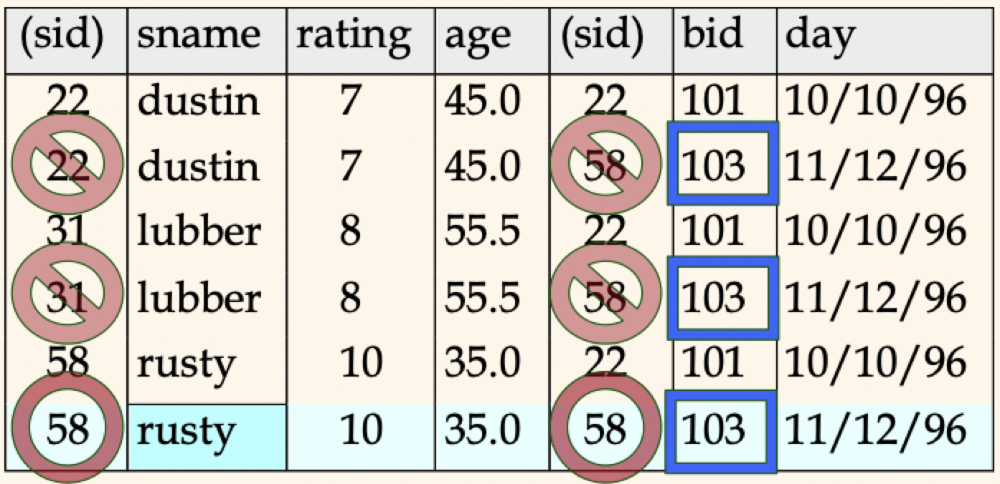
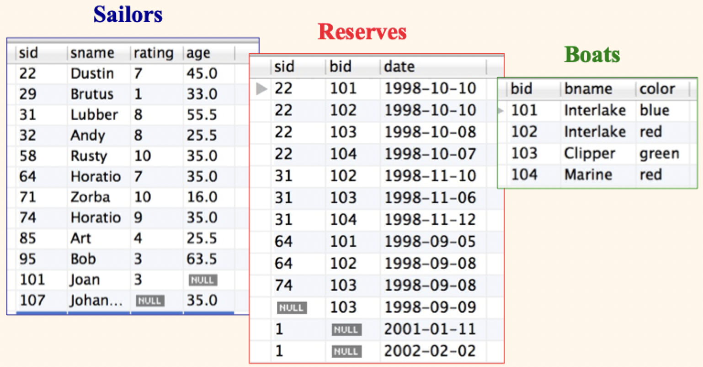

# Lecture 12

## On to SQL

```SQL
SELECT [DISTINCT] target_list
FROM relation_list
WHERE qualification
```

- `relation_list`: a list of relation names (possibly with a range variable after each name)
- `target_list`: a list of attributes of relations in `relation_list`
- `qualification`: comparisons combined using logical operators
- `DISTINCT` is an optional keyword indicating that the answer should not contain duplicates. Default is that duplicates are *not* eliminated

### SQL-based DBMSs

- Commercial RDBMS choices
	- DB2 (IBM)
	- Oracle
	- SQL server (Microsoft)
	- Teradata
- Open source RDBMS options
	- MySQL
	- PostgreSQL (used in this course)
- For so-called "Big Data"
	- Apache hive
	- Hadoop/Tez
	- Spark SQL

### Conceptual evaluation strategy

- Semantics of an SQL SPJ query defined in terms of the following conception evaluation strategy
	1) Compute the cross-product or `relation_list`
	2) Discard resulting tuples if the fail `qualifications`
	3) Project out attributes that are not in `target_list`
	4) If `DISTINCT` is specified, eliminate duplicate rows
- This strategy is probably the *least* efficient way to compute a query, an optimizer will find more efficient strategies to compute the *same answers*

```SQL
SELECT S.sname
FROM Sailors S, Reserves R
WHERE S.sid = R.sid AND R.bid = 103
```



### Range variables

- Named variables needed when the same relation appears twice (or more) in the `FROM` clause
- The previous query could be written lazily

```SQL
SELECT sname
FROM Sailors S, Reserves R
WHERE S.sid = R.sid AND bid = 103
```

- It's better style, though, to use range variables (always)

## Examples with sailing club DB



> Find sailors who've reserved at least one boat

```SQL
SELECT S.sid
FROM Sailors S, Reserves R
WHERE S.sid = R.sid
```

- Using `DISTINCT` in this query will remove duplicates where a sailor has reserved more than once
- Changing the attributes in the `SELECT` clause from `S.sid` to `S.sname` will get the names instead of the ID of sailors

> Find triples (names and ages of sailors plus a field defined by an expression) for sailors whose name begin and end with `B` and contain at least 3 letters

```SQL
SELECT S.sname, S.age, S.age / 7.0 AS dogyears
FROM Sailors S
WHERE S.sname LIKE 'B_%B'
```

- `AS` provides a way to (re)name fields in a result
- `LIKE` is used for string matching
	- `_` stands for any 1 character
	- `%` stands for 0 or more arbitrary characters

> Find sailor IDs who've reserved a red **or** a green boat

```SQL
SELECT DISTINCT S.sid
FROM Sailors S, Boats B, Reserves R
WHERE S.sid = R.sid AND R.bid = B.bid
	AND (B.color = 'red' OR B.color = 'green')
```

- If we replace `OR` with `AND`, we get no data
- Can use `UNION` to compute the union of any two *union-compatible* sets of tuple

```SQL
UNION ( -- This will eliminate duplicates by default, need UNION ALL to keep duplicates
	SELECT S.sid
	FROM Sailors S, Boats B, Reserves R
	WHERE S.sid = R.sid AND R.bid = B.bid AND B.color = 'green'
)
```

> Find IDs of sailors who've reserved a red **and** a green boat

```SQL
SELECT S.sid
FROM Sailors S, Boats B1, Reserves R1, Boats B2, Reserves R2
WHERE S.sid = R1.sid 
	AND R1.bid = B1.bid 
	AND S.sid = R2.sid 
	AND R2.bid = B2.bid 
	AND (B1.color = 'red' AND B2.color = 'green')
```

- Can use `INTERSECT` to compute the intersection of any two *union-compatible* sets of tuples
- Contrast symmetry of the `UNION` and `INTERSECT` queries with how much the two other version differ

```SQL
INTERSECT (
	SELECT S.sid
	FROM Sailors S, Boats B, Reserves R
	WHERE S.sid = R.sid AND R.bid = B.bid AND B.color = 'green'
)
```