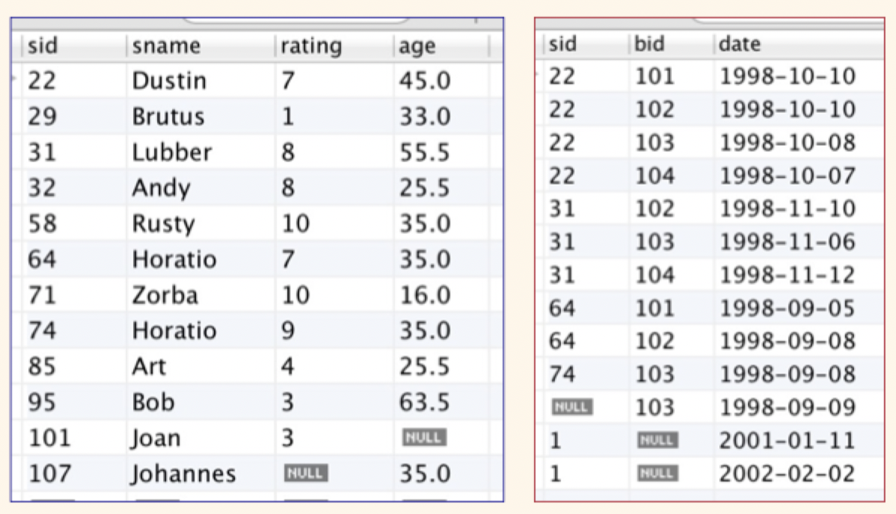
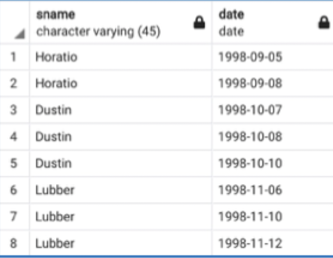

# Lecture 15

## More on `NULL`s



### `NULL`s with aggregates

```SQL
SELECT COUNT(rating)
FROM Sailors;
-- 11 (nulls do not count)
```

```SQL
SELECT COUNT(DISTINCT rating)
FROM Sailors;
-- 7 (nulls do not count)
```

```SQL
SELECT SUM(rating), COUNT(rating), AVG(rating)
FROM Sailors
-- (70, 11, 6.3636) nulls not included when aggregated
```

### `NULL`s with grouping

```SQL
SELECT bid, COUNT(*)
FROM Reserves
GROUP BY bid
-- Null becomes its own group 
```

| `bid` | `COUNT(*)` |
| --- | --- |
| `NULL` | 2 |
| 101 | 2 | 
| 102 | 3 |
| 103 | 4 |
| 104 | 2 |

### `NULL`s with joins

#### Inner joins

```SQL
SELECT DISTINCT s.sname, r.date
FROM Sailors s INNER JOIN Reserves r ON s.sid = r.sid
ORDER BY r.date
```

- `INNER` is optional and will be the default type of join if not specified
- Only keeps tuples that can be joined (not nulls and equals)



#### Outer joins

```SQL
SELECT DISTINCT s.sname, r.date
FROM Sailors s LEFT OUTER JOIN Reserves r ON s.sid = r.sid
ORDER BY r.date;
-- All tuples on the left relation survive; missing data in result is NULL
```

```SQL
SELECT DISTINCT s.sname, r.date
FROM Reserves r RIGHT OUTER JOIN Sailors s ON s.sid = r.sid
ORDER BY r.date;
-- All tuples on the right relation survive; missing data in result is NULL
```

```SQL
SELECT DISTINCT s.sname, r.date
FROM Reserves r FULL OUTER JOIN Sailors s ON s.sid = r.sid
ORDER BY r.date;
-- All tuples in both relations survive; missing data in result is NULL
```

## Updates: oh CRUD!

- CRUD: **C**reate, **R**etrieve, **U**pdate, **D**elete
- Can add one or more tuples using `INSERT`

```SQL
INSERT INTO Sailors(sid, sname, rating, age)
VALUES (200, 'Dr. Mike', 10, 64.5); -- constant data

INSERT INTO Sailors(sid, sname, rating, age)
SELECT ... -- Move data between tables
```

- Can remove all tuples satisfying any SQL query condition using `DELETE`

```SQL
DELETE FROM Sailors S
WHERE S.age = (SELECT MAX(age) FROM Sailors)
```

- Can change one or more tuples using `UPDATE`

```SQL
UPDATE Sailors
SET sname = 'King Arthur', rating = rating + 1
WHERE sname = 'Art'
```

- Left-hand side of `SET` is column name, right-hand side is (any) expression
- `WHERE` predicate is any SQL condition, which again means SQL subqueries are available as a tool