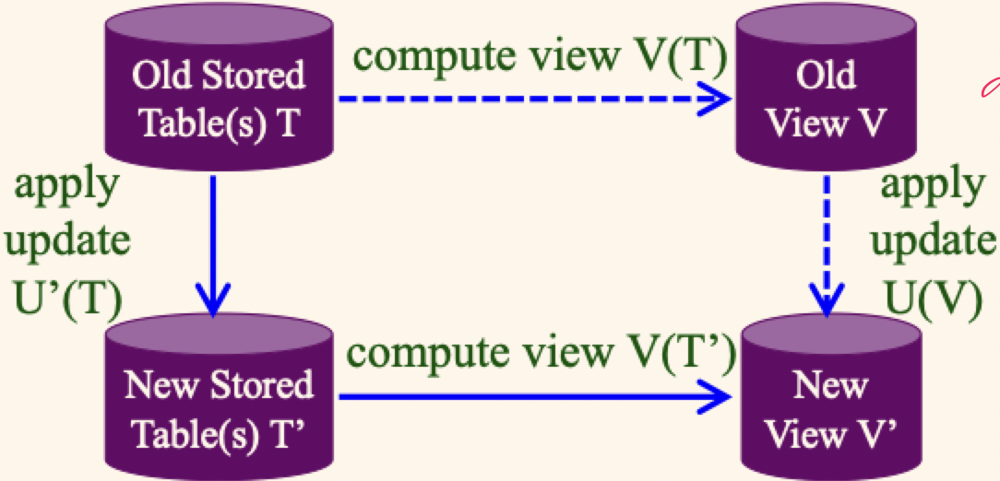

# Lecture 17

## Layers of schema

- The may be *many* views of a single conceptual schema and an underlying physical schema
- Views describes how different users see the data
- Conceptual schema defines the logical structures of the database
- Physical schema describes the files and indexes used under the hood

### View example

```SQL
-- Create the view
CREATE VIEW YoungSailorsView(yid, yname, yage, yrating) 
AS (
	SELECT sid, sname, age, rating
	FROM Sailors
	WHERE age < 18
);

-- Using the view
SELECT * FROM YoungSailorsView;

SELECT yname, yrating, yage
FROM YoungSailorsView
WHERE yrating >= 9
```

- Views as essentially a virtual table
- Computed on the fly, inserted as a subquery

```SQL
SELECT * FROM (
	SELECT sid, sname, age, rating
	FROM Sailors
	WHERE age < 18
);
```

### Views and updates

- Consider the following view

```SQL
CREATE VIEW SailsBoat 
AS (
	SELECT DISTINCT S.*, B.*
	FROM Sailors S, Boats B, Reserves R
	WHERE S.sid = R.sid AND R.bid = B.bid
);
```

- Now, if we try the following update statement

```SQL
UPDATE SailsBoats
SET rating = 12
WHERE sid = 22 AND bid = 101;
```

- This query is **not** updatable since there is no update to the real (stored) tables that would have (just) the asked-for effect



- A legal update $U$ to view $V$ must be translatable into an equivalent update $U'$ on the underlying tables
- If this isn't possible, the system will **reject the update**
- Systems differ in how well they do this and err on the conservative side

### Aside: what is a schema

- A **schema**, as a feature in SQL's DDL, is a namespace used to organize all the objects for a given SQL database-based application
	- It's a home for tables, views, stored procedures, types
	- Kind of like as OS file system folder (but SQL schemas are not hierarchical and its entities are more strongly typed)
- Everything a user does is in the context of *some* schema
	- There's a default schema called `public` PostgreSQL
	- You can create a schema: `CREATE SCHEMA schema_name;`
	- You can also say: `SET search_path TO schema_name, public;`
	- You can also ask where you are: `SELECT current_schema()`
	- Objects can be in the current schema (implicit) or fully qualified

## SQL access control

- Based on the concept of access rights or **privileges** for objects (schemas, tables, views, stored procedures) and mechanisms for giving users (or roles) privileges (as well as revoking privileges)
- The creator of a database object automatically gets all privileges on it
	- DBMS keeps track of who gains and loses privileges, and it ensures that only requests from users who have the necessary privileges (when the request is issued) are allowed to execute
	- Two useful PostgreSQL commands with
		- `SET SESSION AUTHORIZATION 'horatio'` (similar to `su` command)
		- `SELECT SESSION_USER, CURRENT_USER` (similar to `whoami` command)

### `GRANT` command

```SQL
GRANT privileges ON objects TO users [WITH GRANT OPTION]
```

- The following **privileges** can be specified
	- `SELECT`: can read all columns
	- `INSERT`: can insert tuples to relation
	- `DELETE`: can remove tuples from relation
	- `REFERENCES(col-name)`: can define foreign keys that refer to this column
- If a user has a privilege with the `GRANT OPTION`, they can pass the privilege onto other users (with or without the `GRANT OPTION`)
- Only the owner can execute `CREATE`, `ALTER`, or `DROP` on objects

### `GRANT` and `REVOKE` of privileges

```SQL
GRANT INSERT, SELECT ON Sailors TO Horatio -- Horatio can query sailors and insert tuples into it
GRANT DELETE ON Sailors TO Yuppy WITH GRANT OPTION -- Yuppy can delete tuples and authorize others to do so
GRANT UPDATE(rating) ON Sailors TO Dustin -- Dustin can update (only) the rating field of Sailors tuples
GRANT SELECT ON ActiveSailors TO Guppy, Yuppy -- Can query view, but not the actual Sailors relation
```

**Revoke**: when a privilege is revoked from $X$, it is also revoked from all users who got it *solely* from $X$

### `GRANT` and `REVOKE` on views

- Great combination to enforce restrictions on *data visibility* for various groups/users
- If a view *creator* loses the `SELECT` privilege on an underlying table, the view is dropped
- If view creator loses a privilege held with a grant option on an underlying table, it is lost on the view as well

### Views and security

- Views can be used to present just the necessary information (or a summary) while hiding details of the underlying relations
- *Creator* of a view has a privilege on the view if he/she has the privilege on all underlying tables
- Used together with `GRANT`/`REVOKE` commands views are a very powerful access control tool
- *Stored procedures* can be utilized similarly