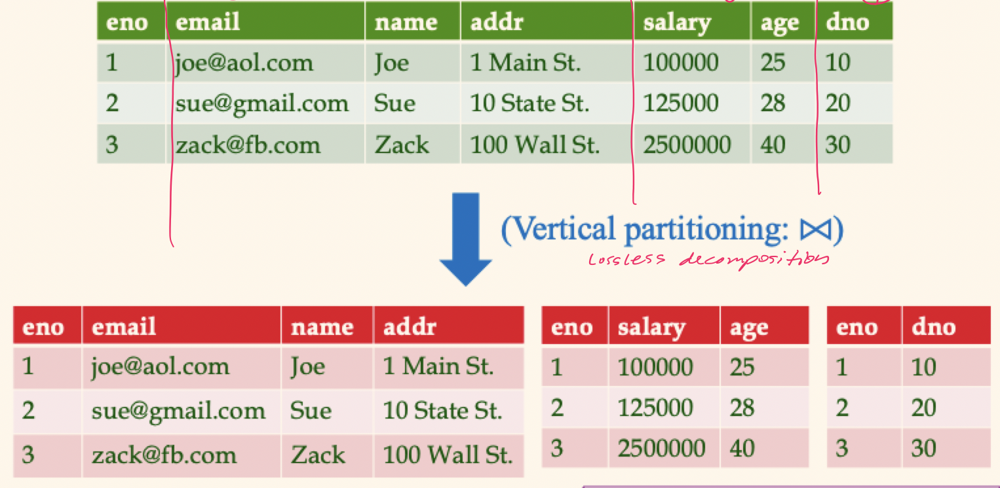
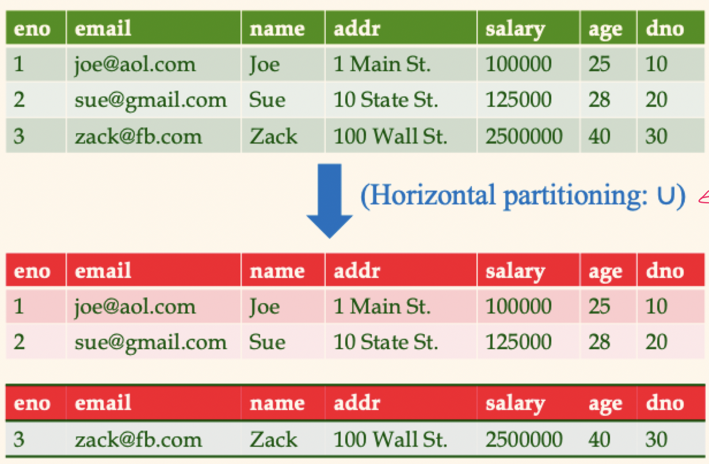

# Lecture 21

## Join methods and index selection

- Index nested loop join (INLJ) method
	- For each outer table tuple, use its join attribute value to probe the inner table for tuples to join it with
	- Indexing the inner table's join column will help
	- Good for this index to be clustered if the join column is not the inner table's primary key and inner tuples need to be fetched
- Sort-merge join (SMJ) method
	- Sort outer and inner tables on join attribute value and then scan them concurrently to match tuples
	- *Clustered* B+ trees on both join column(s) is fantastic for this
- Hash Join (HJ) method
	- Build in-memory hash table for one table, probe with the other
	- Indexing not needed

## Clustering and joins

- Clustering is very useful when accessing the inner tuples in an INLJ
- Clustering is useful whenever *many* tuples are expected for one value or for a range of values

## Tuning the conceptual schema

- The choice of conceptual schema should be guided by the workload, in addition to redundancy issues
	- We may go for a 3NF (or lower) schema rather than BCNF
	- Workload may influence the choice we make when we're decomposing a relation into 3NF or BCNF
	- We might *denormalize* or add redundant fields to a relation
	- We might consider *vertical decompositions*
- If such a change comes *after* a database is in use, it's called **schema evolution**
- Changes can be masked from applications by defining *views*

### Vertical partitioning

- Consider a table with many columns, not all of which are of interest to all queries

```SQL
CREATE TABLE Emp (
	eno INTEGER,
	email TEXT,
	name TEXT,
	addr TEXT,
	salary INTEGER,
	age REAL,
	dno INTEGER
);
```

- A given workload might actually turn out to a b *union of sub-workloads* in reality

```SQL
CREATE TABLE EmpComms (
	eno INTEGER,
	email TEXT,
	name TEXT,
	addr TEXT
);

CREATE TABLE EmpComp (
	eno INTEGER,
	salary INTEGER,
	age REAL
);

CREATE TABLE EmpDept (
	eno INTEGER,
	dno INTEGER
);
```



### Horizontal partitioning

- We may want to replace a relation by a set of relations that are *selections*
- Each new relation has the same schema as the original, but only a subset of the rows
- Collectively, the new relations contain all the rows of the original (new relations are disjoint)
- The original relation is the `UNION ALL` of the new ones



- Suppose contracts with values over 10,000 are subject to different rules
- Could deal with this by creating a clustered index on `Contracts(val)`
- Could also replace `Contracts` with `LargeContracts` and `SmallContracts`
	- Clusters data like an index, but without the indexing overhead
	- The replacement schemas could then have separate clustering indexes (potentially on different attributes)

### Masking schema changes

- Replacement of `Contracts` by `LargeContracts` and `SmallContracts` can be masked by this view

```SQL
CREATE VIEW Contracts(cid, sid, jid, did, pid, qty, val) AS (
	SELECT * FROM LargeContracts
	UNION ALL
	SELECT * FROM SmallContracts
)
```

- Note that queries with `val > 1000` can be written against `LargeContracts` for faster execution

## Query tuning

- If a query runs slower than expected, see if an index needs to be re-built or it *table statistics* are too old
- Sometimes, the DBMS may not be executing the plan you had in mind. Common areas of weakness
	- Selections involving arithmetic or `LIKE` expressions
	- Selections involving `OR` conditions
	- Selections involving `NULL` values
	- Lack of advanced evaluation features
- Always check the query plan
	- Adjust your choice of indexes
	- Rewrite the query
- Minimize the use of `DISTINCT`
	- If duplicates are tolerable, usage will only slow down a query
	- Not needed if the answer contains a key
- Consider the DBMS's use of indexes when writing arithmetic expressions
	- `E.age = 2 * D.age`
	- `E.age` would benefit from an index, but not `D.age`