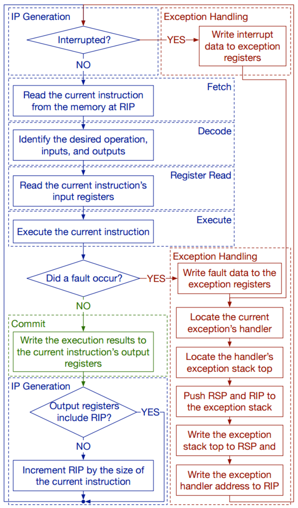
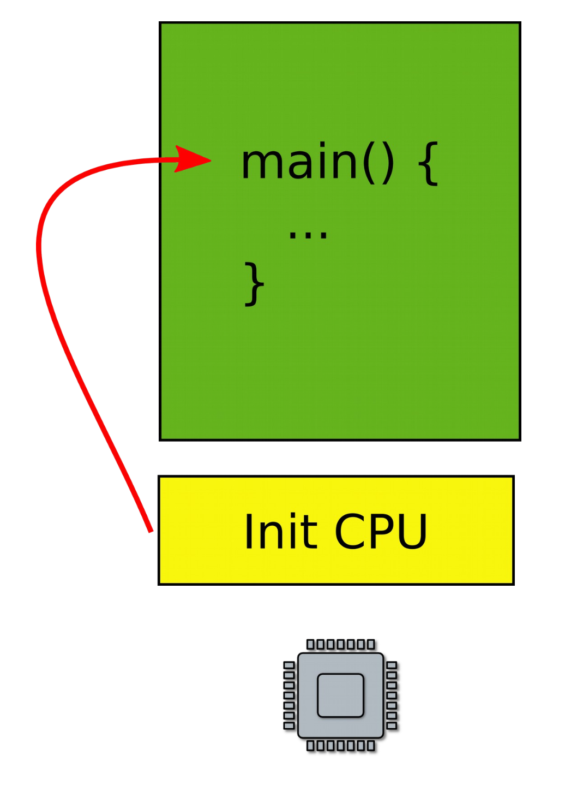
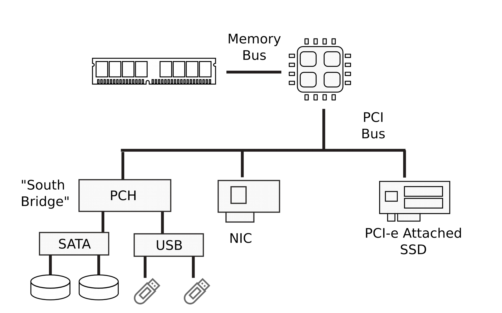
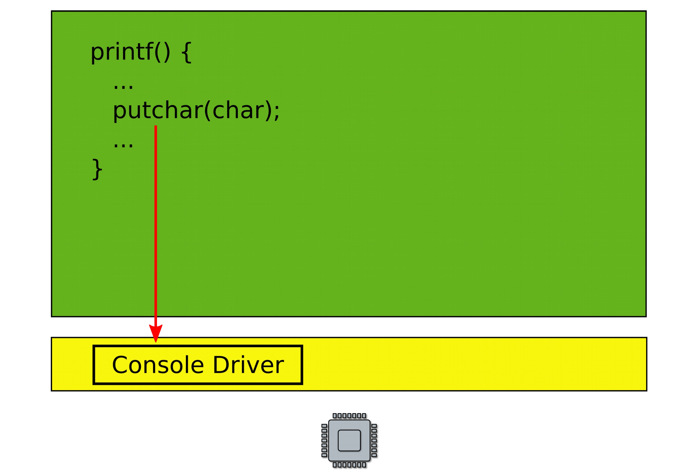
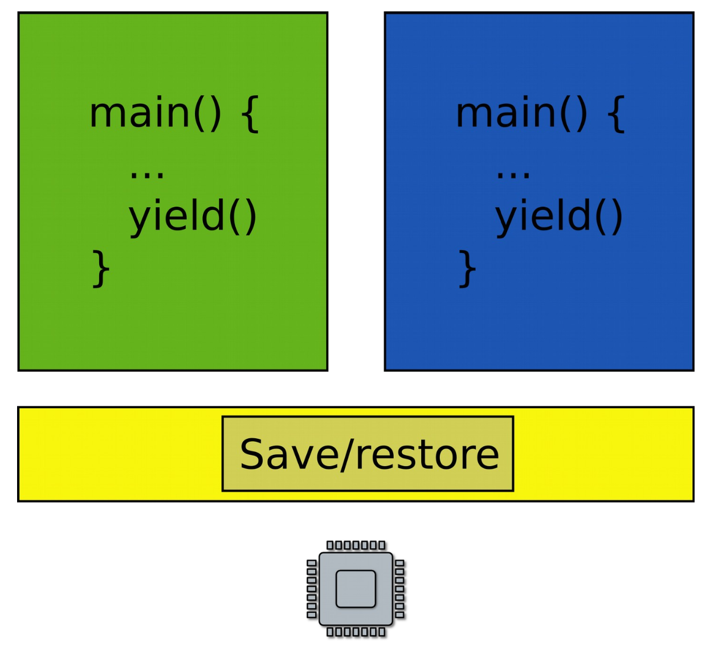

# Introduction to operating systems

## How computers work

### CPU

- **C**entral **P**rocessing **U**nit
- Composed of multiple CPU cores (nowadays)
- Each core can have 2 logical threads (hyper-threading)

### Memory

- Exists outside of the CPU
- Linked to the CPU through a memory bus
- Allows CPU to read and write to main memory
- Memory can be abstracted to two primary operations

| Function | Description |
| --- | --- |
| `WRITE(addr, value)` | Store *value* in the storage cell identified by *addr* |
| `READ(addr)` | Return the *value* argument to the most recent `WRITE` referencing *addr* |

### CPU execution loop

- CPU repeatedly reads instructions from memory
- Executes the most recently read instruction
- Hardware executes instructions one by one



## What is an operating system?

### Task 1: run code on a piece of hardware

- Read the CPU's manual
- Create a tiny boot layer
	1) Initialize the CPU
	2) Jump to the entry point of your program
- **This can be the beginning of your OS!**



### Task 2: print something on the screen

- On the screen or a serial line requires dealing with I/O devices



- That's quite a few devices, but nothing a little programming can handle

```C
void printf() {
	if (vga) {
		asm("mov <magic constant 1>, char");
	}
	else if (serial) {
		asm("out <magic constant 2>, char");
	}
	...
}
```

- But how do we support devices that are not shown, or new, cutting edge devices without the `printf` function getting out of hand?



#### Device drivers

- Abstract hardware
	- Provide high-level interface
	- Hide minor differences
	- Implement some optimizations (batch request)
- Examples
	- Console
	- Disk
	- Interface
	- Virtually any piece of hardware you know

### Task 3: run multiple programs simultaneously

- We have two programs that want to run on hardware, but we only have one CPU
- Could run program #1, pause it, and run program #2



- Exit into the kernel periodically
- Context switch
	- Save state of one program
	- Restore state of another program

#### Time sharing

- Programs use the CPU in turns
	- One program runs
	- OS takes control
	- Launch the other program
	- OS takes control again
	- ... and repeat
- Can be expand to beyond a couple of programs

#### State of the program

- Roughly consists of
	- Registers
	- Memory
- Plus some state (data structures) in the kernel associated with the program
	- Information about files opened by the program (i.e. file descriptors)
	- Information about network flows
	- Information about address space, loaded libraries, communication channels to other programs, etc.

#### Saving and restoring state

- Note that you do not really have to save/restore in-kernel state on the context switch
- It's in the kernel already, in some part of the memory where kernel keeps its data structures
- You only have to switch from using one to using another
	- Instead of using the file descriptor table for program X, start using the file descriptor table for program Y

#### Time sharing memory?

- Can copy in and out the state of the program into a region of memory where it can run
- Similar to time-sharing the CPU
- Issues with this approach
	- Unlike registers, the state of the program in memory can be large
	- Takes time to copy it in and out

#### Virtual address spaces

- Gives the illusion of private memory for each application
	- Keep a description of an address space
	- In one of the registers
- OS maintains description of address spaces
	- Switches between them when needed

#### Staying in control

- What if one program fails to release the CPU?
- It will run forever, so we need a way to preempt it

#### Scheduling

- Pick which application to run next (and for how long)
- Illusion of a private CPU for each task (frequent context switching)

#### Isolation

- What if one faulty program corrupts the kernel?
- Or other programs
- Give each process a private address space


#### Files and network

- Want to save some data in a file?
	- Permanent storage
	- Disks are just arrays of blocks (`write(block_number, block_data)`)
- Files
	- High level abstractions for saving data
	- `int fd = open("contacts.txt");`
	- `fprintf(fd, "Name:%s\n", name);`
 - Network interfaces are treated similarly