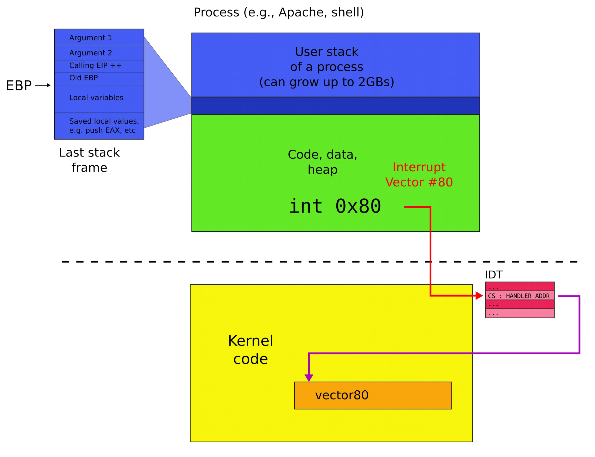
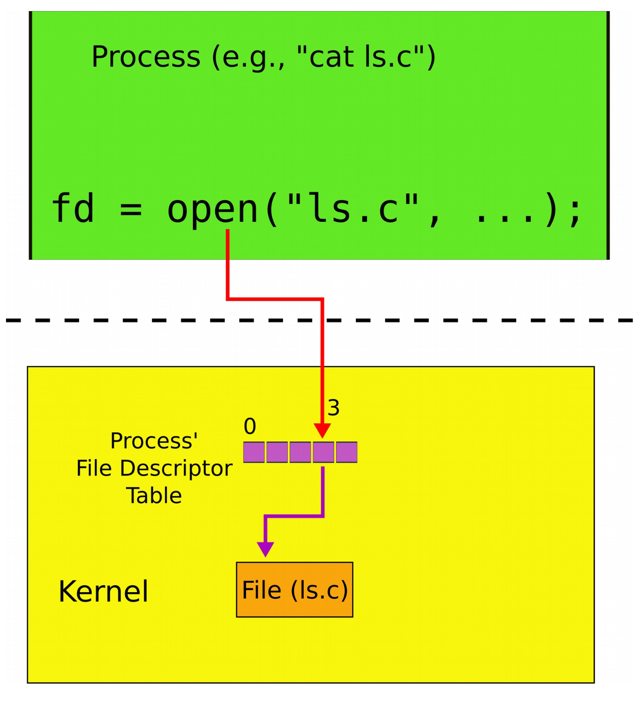
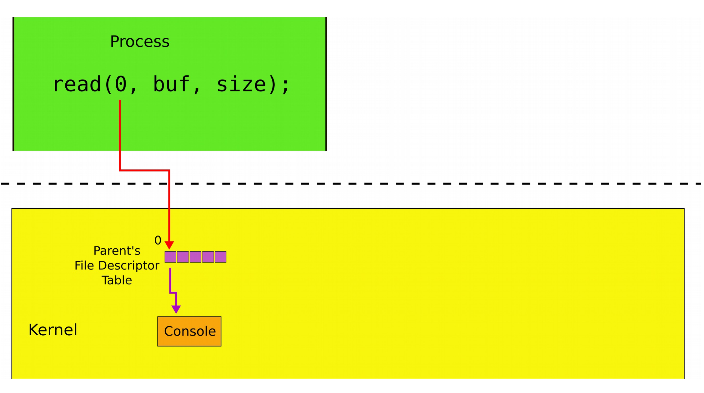
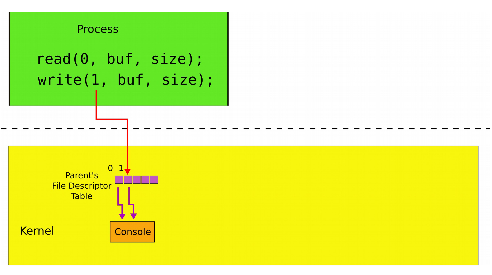
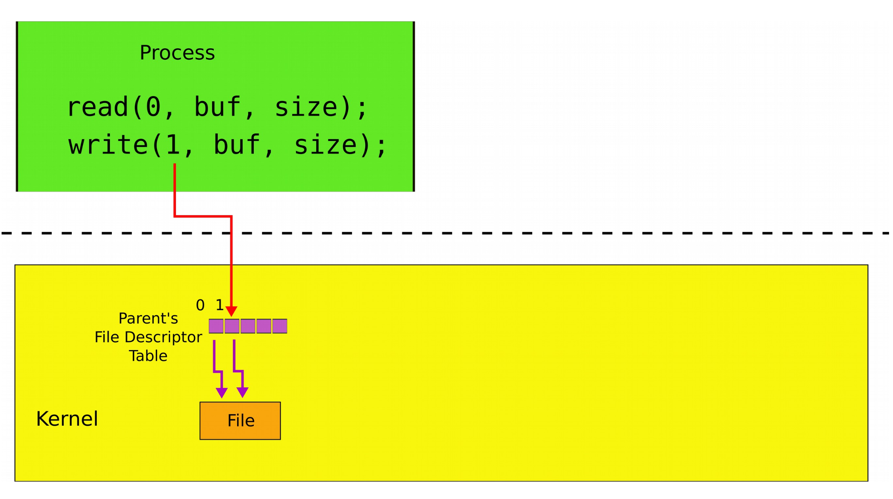
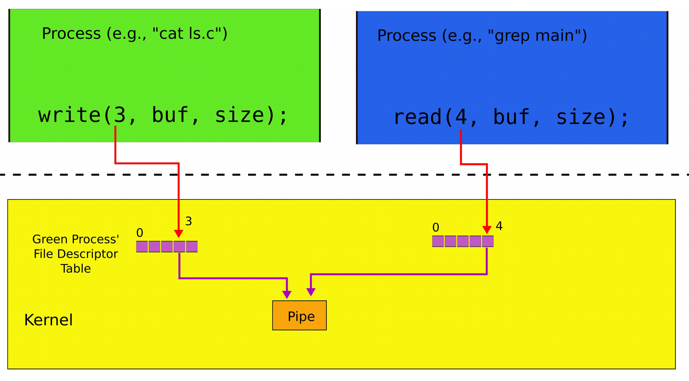

# OS interfaces

## Recap: role of the operating system

- Share hardware across multiple processes: illusion of private CPU, private memory
- Abstract hardware: hide details of specific hardware devices
- Provide services: serve as a library for applications
- Security
	- Isolation of processes
	- Controlled ways to communicate (in a secure manner)

## System calls

- Provide user to kernel communication
- Effectively an invocation of a kernel function
- System calls *implement* the interface of the OS

### Invocation



### Necessary calls

- Processes
	- Creating
	- Exiting
	- Waiting 
	- Terminating
- Files and folders
	- Opening
	- Reading
	- Writing
	- Closing
- Inter-process communication
	- Pipes

## Shell

### Inspiration

- List all files

```
$ ls
total 9212
drwxrwxr-x  3 aburtsev aburtsev    12288 Oct  1 08:27 ./
drwxrwxr-x 43 aburtsev aburtsev     4096 Oct  1 08:35 ../
-rw-rw-r--  1 aburtsev aburtsev      936 Oct  1 08:26 asm.h
-rw-rw-r--  1 aburtsev aburtsev     3397 Oct  1 08:26 bio.c
-rw-rw-r--  1 aburtsev aburtsev      100 Oct  1 08:26 bio.d
-rw-rw-r--  1 aburtsev aburtsev     6416 Oct  1 08:26 bio.o
```

- Count number of lines in a file

```
$ wc -l ls.c
85 ls.c
```

### What is shell?

- A normal process (like any other)
	- Kernel starts it for each user that logs into the system
	- In xv6, sell is created after the kernel boots
- Shell interacts with the kernel through system calls
	- E.g., starts other processes

### What happens underneath?

```
$ wc -l ls.c
85 ls.c
$ 
```

- Shell starts `wc`
	- Creates a new process to run `wc`
	- Passes the arguments (`-l` and `ls.c`)
- `wc` sends its output to the terminal (console)
	- Exits when done with `exit()`
- Shell detects that `wc` is done (`wait()`)
	- Prints (to the same terminal) its command prompt
	- Ready to execute the next command

## File I/O

### File open

- `int fd = open("ls.c", O_READONLY)` to open a file
- Operating system returns a file descriptor (an integer)

### File descriptors



- An index into a table just an integer
- The table maintains pointer to "file" objects
	- Abstracts files, devices, pipes
	- In UNIX everything is a file -- all objects provide file interfaces
- Process may obtain file descriptors through
	- Opening a file, directory or device
	- By creating a pipe
	- Duplicating an existing descriptor
- Each process maintains its own file descriptor table

### File I/O interfaces

- `int fd = open("foobar.txt", O_READONLY)` opens a file
- `read(fd, buf, n)` reads `n` bytes from `fd` into `buf`
- `write(fd, buf, n)` writes `n` bytes from `buf` into `fd`

## Console I/O

### Standard descriptors

- Numbers are just a convention
	- 0: standard input
	- 1: standard output
	- 2: standard error
- This convention is used by the shell to implement I/O redirection and pipes

### Console read



### Console write



### Example: `cat.c`

```C
int main() {
	char buf[512];
	int n;
	for(;;) {
		n = read(0, buf, sizeof buf); // Read from standard input
		if (n == 0)
			break;
		if (n < 0) {
			fprintf(2, "read error\n"); // Write to standard error
			exit();
		}
		if (write(1, buf, n) != n) { // Attempt to write to standard output
			fprintf(2, "write error\n"); // Write to standard error
			exit();
		}
	}
}
```

## Creating processes

### `fork()`

- Creates a new process ... sort of ...
- Actually creates copies of the same process

```C
int pid;

pid = fork();
if (pid > 0) {
	printf("praent: child=%d\n", pid);
	pid = wait();
	printf("child %d is done\n", pid);
}
else if (pid == 0) {
	printf("child: exiting\n");
	exit();
}
else {
	printf("fork error\n");
}
```

### Conjunction with `exec()`

- `fork()` is used together with `exec()`
- `exec()` replaces memory of a current process with a memory image (of a program) loaded from a file

```C
char *argv[3];
argv[0] = "echo";
argv[1] = "hello";
argv[2] = 0;
exec("/bin/echo", argv);
printf("exec error\n");
```

- If `exec()` does the program loading, why not just use `exec()` directly?

## I/O redirection

- Normally `wc` sends its output to the console (screen)

```
$ wc -l ls.c
85 ls.c
```

- What if we want to save the number of lines into a file? We can add the following argument

```
$ wc -l ls.c -o foobar.txt
```

- However, supporting the argument is at the discretion of the implementor (which may also be a different switch)
- A better way through native OS support

```
$ wc -l ls.c > foobar.txt
```

### Redirect output

```
$ cat ls.c > ls-new.c
```



### Redirect input

```
$ cat < ls.c
```

### Redirect both

```
wc -l < ls.c > foobar.txt
```

### A powerful design choice

- File descriptors don't have to point to files *only*
	- Any object with the same read/write interface is ok
	- Files
	- Devices (console)
	- Pipes

### Pipes

- Imagine we have a way to redirect output of one process into input of another
- A pipe (`|`) does redirection of output in the first process and redirection of input in the second process

```
$ cat ls.c | grep main
```

- `cat` outputs `ls.c` to its output
	- `cat`'s output is connected to `grep`'s input with the pipe
	- `grep` filters lines that match a specific criteria
- Pipe is a kernel buffer exposed as a pair of file descriptors
	- One for reading
	- Other for writing
- Pipes allow processes to communicate
	- Send messages to each other



### Composability

- Now if we want to see how many strings in `ls.c` contain "main" we do

```
$ cat ls.c | grep main | wc -l
1
```

- But if we want to count the ones that contain "a"

```
cat ls.c | grep a | wc -l
33
```

- Only the input to `grep` is changed
- A small set of tools compose into complex workflows

### Implementing

- `close(fd)` closes a file descriptor
	- The next opened file descriptor will have the lowest number
- `exec()` replaces process memory but
	- Leaves its file table untouched
	- A process can create a copy of itself with `fork()`
	- Change the file descriptors for the next program it is about to run
	- And then execute the program with `exec()`
- The reason for the pair of `fork()` and `exec()`
	- Shell can manipulate the new process (the copy created by `fork()`)
	- Before running it with `exec()`

```C
int p[2];
char *argv[2];
argv[0] = "wc";
argv[1] = 0;
pipe(p);
if(fork() == 0) {
	close(0);
	dup(p[0]);
	close(p[0]);
	close(p[1]);
	exec("/bin/wc", argv);
} else {
	write(p[1], "hello world\n", 12);
	close(p[0]);
	close(p[1]);
}
```

- `fork()`, standard file descriptors, `pipes` and `exec()` allow complex programs out of simple tools
- They form the core of the UNIX interface

## More system calls

### Process management

- `exit()` terminates the current process
- `wait()` waits for the child process to exit


### Creating files

- `mkdir()` create a directory
- `open(O_CREATE)` creates a file
- `mknod()` creates an empty file marked as a device
	- Major and minor numbers uniquely identify the device in the kernel
- `fstat()` retrieves information about a file

### Links and inodes

- Same file can have multiple names (links) but a unique inode number
- `link()` creates a link
- `unlink()` deletes a file

```C
fd = opne("/tmp/xyz", O_CREATE | O_RDWR); // Creates a temporary directory
unlink("/tmp/xyz"); // Deletes the temporary directory
```