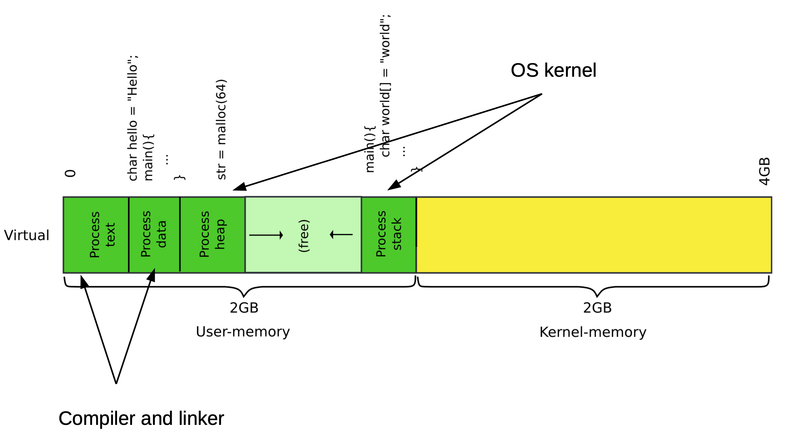
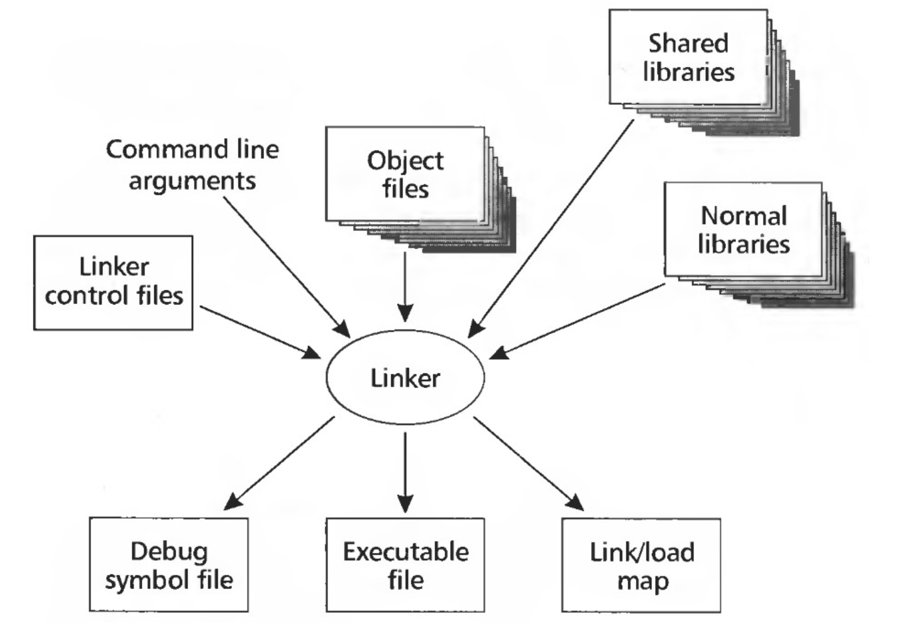
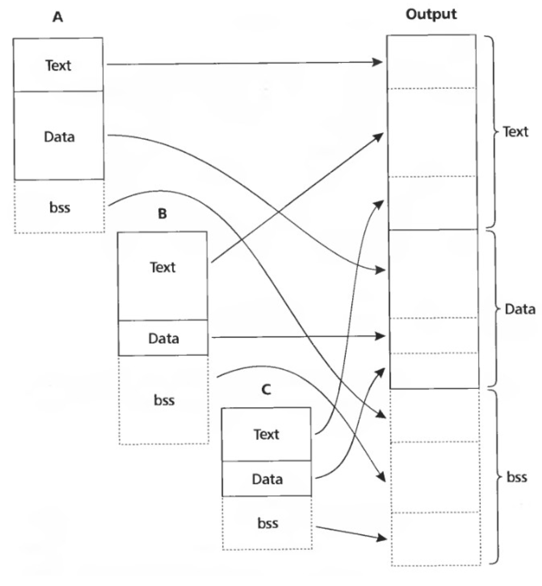

# Linking and loading (part 1)

## Stuff needed to run a program

- The code itself: by convention it is called text
- Stack: to call functions
- Space for variables

### Variables in a program

- Global variables
	- Initialized -> `.data` section
	- Uninitialized -> `.bss` section
- Local variables: on the stack
- Dynamic variables: on the heap

### Memory layout of a process



### Example program

```C
#include <stdio.h>

int main(int ac, char **av) {
	int a = 5;
	int b = 6;
	return a + b;
}
```

- We build it like so
	- On a 64 bit system, need to explicitly request 32 bit code with `-m32`
	- `-fno-pic` disables position independent code (we'll talk about this soon)

```bash
$ gcc -m32 -fno-pic hello-int.c
```

### Object dump of sample program

```
Contents of section .text:
 1060 f30f1efb 31ed5e89 e183e4f0 505452e8  ....1.^.....PTR.
 1070 18000000 81c3682f 00006a00 6a005156  ......h/..j.j.QV
 1080 ffb31c00 0000e8b5 fffffff4 8b1c24c3  ..............$.
 1090 8b1c24c3 66906690 66906690 66906690  ..$.f.f.f.f.f.f.
 10a0 e8e40000 0081c237 2f00008d 8a2c0000  .......7/....,..
 10b0 008d822c 00000039 c8741d8b 82100000  ...,...9.t......
 10c0 0085c074 135589e5 83ec1451 ffd083c4  ...t.U.....Q.... --------+
 10d0 10c9c38d 74260090 c38db426 00000000  ....t&.....&....         |
 10e0 e8a40000 0081c2f7 2e000055 89e5538d  ...........U..S.         |
 10f0 8a2c0000 008d822c 00000083 ec0429c8  .,.....,......).         |
 1100 89c3c1e8 1fc1fb02 01d8d1f8 74148b92  ............t...         |
 1110 20000000 85d2740a 83ec0850 51ffd283   .....t....PQ...         |
 1120 c4108b5d fcc9c38d b4260000 00006690  ...].....&....f.         |
 1130 f30f1efb 5589e553 e853ffff ff81c39f  ....U..S.S......         |
 1140 2e000083 ec0480bb 2c000000 0075278b  ........,....u'.         |
 1150 83140000 0085c074 1183ec0c ffb32800  .......t......(.         |
 1160 0000e8e9 feffff83 c410e831 ffffffc6  ...........1....         |
 1170 832c0000 00018b5d fcc9c38d 74260090  .,.....]....t&..         |
 1180 f30f1efb e957ffff ff8b1424 c35589e5  .....W.....$.U..         |
 1190 83ec10c7 45f80500 0000c745 fc060000  ....E......E....         |
 11a0 008b55f8 8b45fc01 d0c9c3             ..U..E.....              |
                                                                    |
0000118d <main>:                                                    |
    118d:	55                   	push   %ebp <-------------------+
    118e:	89 e5                	mov    %esp,%ebp <--------------+
    1190:	83 ec 10             	sub    $0x10,%esp               # Allocate space for a and b
    1193:	c7 45 f8 05 00 00 00 	movl   $0x5,-0x8(%ebp)          # Initialize a = 5
    119a:	c7 45 fc 06 00 00 00 	movl   $0x6,-0x4(%ebp)          # Initialize b = 6
    11a1:	8b 55 f8             	mov    -0x8(%ebp),%edx          # Move b into %eax
    11a4:	8b 45 fc             	mov    -0x4(%ebp),%eax          # Move a into %edx
    11a7:	01 d0                	add    %edx,%eax                # a + b
    11a9:	c9                   	leave                           # Pop the frame ESP = EBP
    11aa:	c3                   	ret                             # return
```

### Alignment of code

- Most microprocessors fetch code in aligned 16-byte or 32-byte blocks
- If a piece of code happens to be of a block, the following block may also need to be fetched
- This can be avoided by aligning important areas with `NOP` instructions

## Load program in memory

### Linking an loading

- Linking: combining multiple code modules into a single executable
- Loading: process of getting an executable running on a machine

### Linker



- Input
	- Object files
	- Link control files
	- Shared and normal libraries
	- Command line arguments
- Output
	- Debug symbol file
	- Link/load map
	- Executable file

### Why linking?

- Modularity
	- Program can be written as a collection of modules
	- We can build libraries of common functions
- Efficiency
	- Code compilation: change one source file, recompile it, and re-link the executable
	- Space efficiency
		- Share common code across executable files
		- On disk and in memory

### Two path process

- Path 1: scan input files
	- Identify boundaries of each segment
	- Collect all defined and undefined symbol information
	- Determine sizes and locations of each segment
- Path 2: relocation
	- Adjust memory addresses in code and data to reflect relocated segment addresses

#### Multiple object files


#### Merging segments



## Relocation

### Motivating example

- Source file `m.c`

```C
extern void a(char *);
int main(int ac, char **av) {
	static char string[] = "Hello, world\n";
	a(string);
}
```

- Source `a.c`

```C
#include <unistd.h>
#include <string.h>
void a(char *s) {
	write(1, s, strlen(s));
}
```

- Object dump

```
00000000 <main>:                                               # Code starts at 0
   0:	8d 4c 24 04          	lea    0x4(%esp),%ecx
   4:	83 e4 f0             	and    $0xfffffff0,%esp
   7:	ff 71 fc             	push   -0x4(%ecx)
   a:	55                   	push   %ebp
   b:	89 e5                	mov    %esp,%ebp
   d:	51                   	push   %ecx                    # Push string onto stack
   e:	83 ec 04             	sub    $0x4,%esp
  11:	83 ec 0c             	sub    $0xc,%esp
  14:	68 00 00 00 00       	push   $0x0
  19:	e8 fc ff ff ff       	call   1a <main+0x1a>          # Mark call, address unknown
  1e:	83 c4 10             	add    $0x10,%esp
  21:	b8 00 00 00 00       	mov    $0x0,%eax
  26:	8b 4d fc             	mov    -0x4(%ebp),%ecx
  29:	c9                   	leave
  2a:	8d 61 fc             	lea    -0x4(%ecx),%esp
  2d:	c3                   	ret
```

```
00000000 <a>:
   0:	55                   	push   %ebp
   1:	89 e5                	mov    %esp,%ebp
   3:	83 ec 08             	sub    $0x8,%esp
   6:	83 ec 0c             	sub    $0xc,%esp
   9:	ff 75 08             	push   0x8(%ebp)
   c:	e8 fc ff ff ff       	call   d <a+0xd>              # Mark call, address unknown
  11:	83 c4 10             	add    $0x10,%esp
  14:	83 ec 04             	sub    $0x4,%esp
  17:	50                   	push   %eax
  18:	ff 75 08             	push   0x8(%ebp)
  1b:	6a 01                	push   $0x1
  1d:	e8 fc ff ff ff       	call   1e <a+0x1e>            # Mark call, address unknown
  22:	83 c4 10             	add    $0x10,%esp
  25:	90                   	nop
  26:	c9                   	leave
  27:	c3                   	ret
```

### Producing the final executable

- Combine the corresponding segments from each object file
	- Combined text segment
	- Combined data segment
- (Optional) pad each segment to 4KB to match the page size

### Linked executable

```
000011ad <a>: <-------------------------------------------------+
    11ad:	55                   	push   %ebp                 |
    11ae:	89 e5                	mov    %esp,%ebp            |
    11b0:	83 ec 08             	sub    $0x8,%esp            |
    11b3:	83 ec 0c             	sub    $0xc,%esp            |
    11b6:	ff 75 08             	push   0x8(%ebp)            |
    11b9:	e8 fc ff ff ff       	call   11ba <a+0xd>         |  # Call with effective address
    11be:	83 c4 10             	add    $0x10,%esp           |
    11c1:	83 ec 04             	sub    $0x4,%esp            |
    11c4:	50                   	push   %eax                 |
    11c5:	ff 75 08             	push   0x8(%ebp)            |
    11c8:	6a 01                	push   $0x1                 |
    11ca:	e8 fc ff ff ff       	call   11cb <a+0x1e>        |  # Call with effective address
    11cf:	83 c4 10             	add    $0x10,%esp           |
    11d2:	90                   	nop                         |
    11d3:	c9                   	leave                       |
    11d4:	c3                   	ret ------------------------+-------------------------------+
                                                                |                               |
000011d5 <main>:                                                |                               |
    11d5:	8d 4c 24 04          	lea    0x4(%esp),%ecx       |                               |
    11d9:	83 e4 f0             	and    $0xfffffff0,%esp     |                               |
    11dc:	ff 71 fc             	push   -0x4(%ecx)           |                               |
    11df:	55                   	push   %ebp                 |                               |
    11e0:	89 e5                	mov    %esp,%ebp            |                               |
    11e2:	51                   	push   %ecx                 |                               |
    11e3:	83 ec 04             	sub    $0x4,%esp            |                               |
    11e6:	83 ec 0c             	sub    $0xc,%esp            |                               |
    11e9:	68 08 40 00 00       	push   $0x4008              |                               |
    11ee:	e8 ba ff ff ff       	call   11ad <a>             # Call with effective address   |
    11f3:	83 c4 10             	add    $0x10,%esp <-----------------------------------------+
    11f6:	b8 00 00 00 00       	mov    $0x0,%eax
    11fb:	8b 4d fc             	mov    -0x4(%ebp),%ecx
    11fe:	c9                   	leave
    11ff:	8d 61 fc             	lea    -0x4(%ecx),%esp
    1202:	c3                   	ret

```