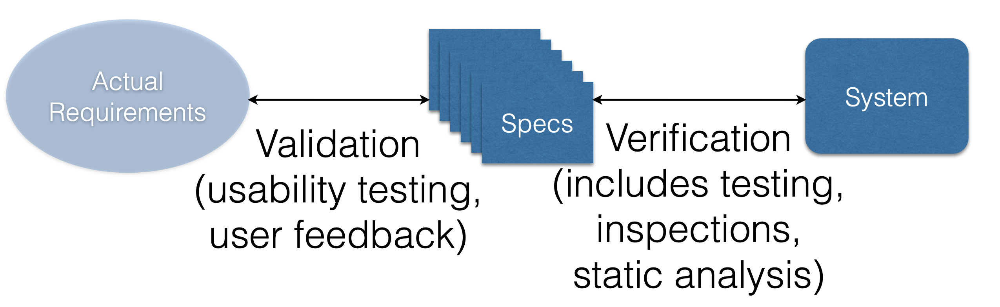
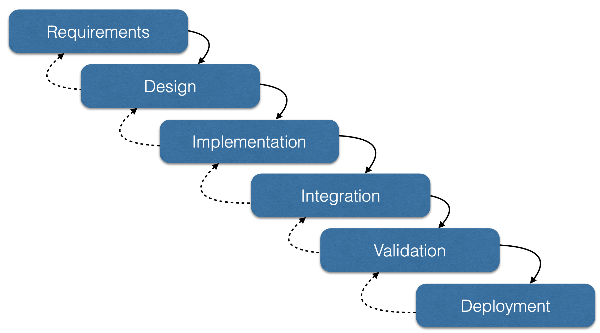
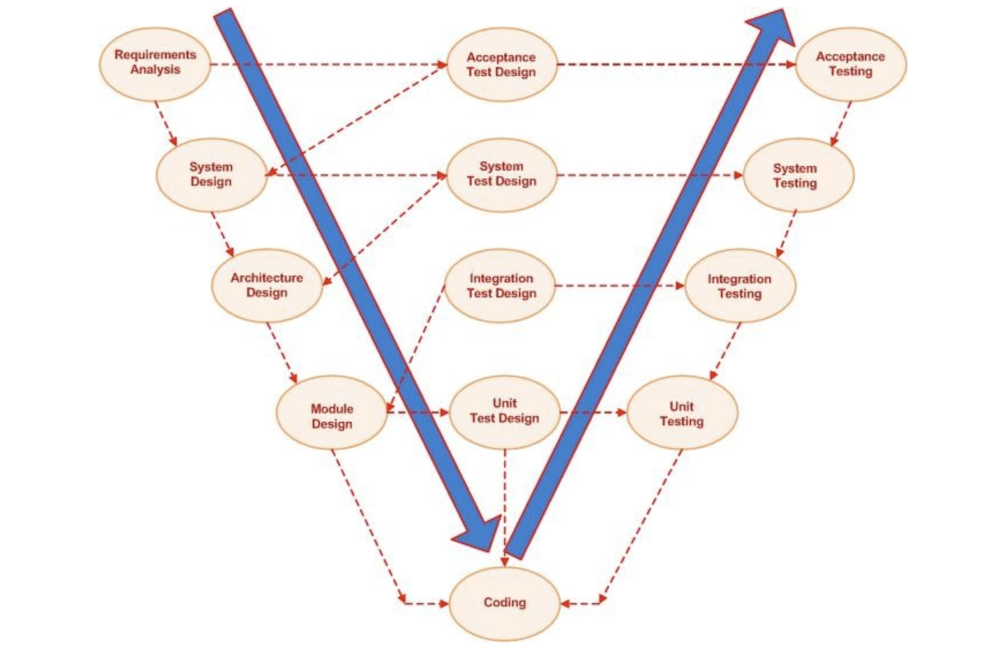
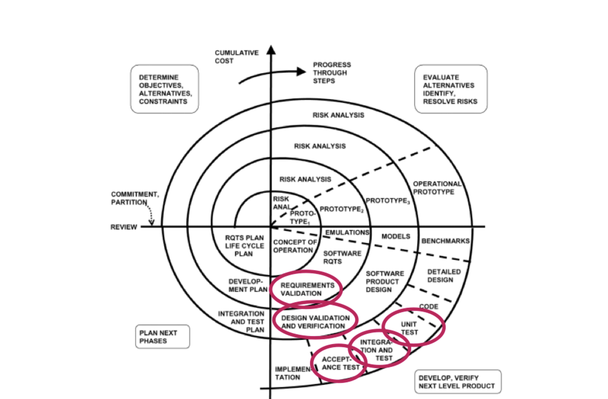
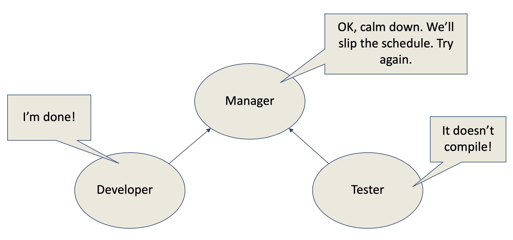
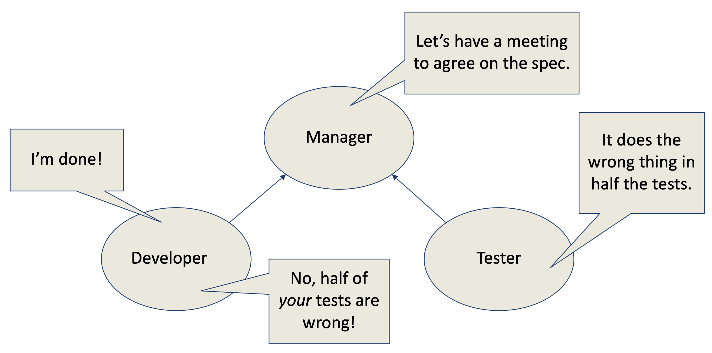
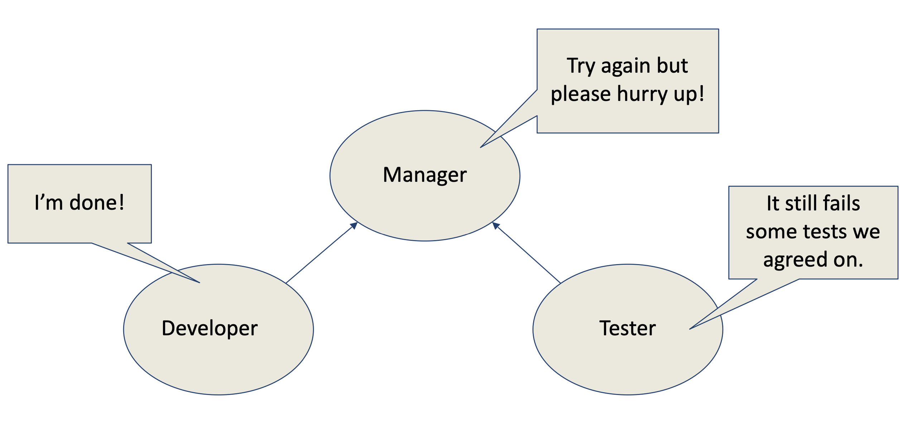
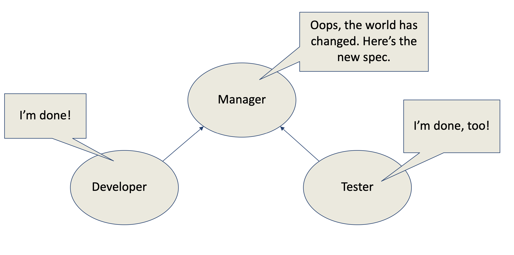

# Lecture 2

## A *new kind* of engineers

- In a bad way
	- Over 2,500 years less experience
	- CS is simply less mature than other engineering fields
	- Many more moving parts
	- Focus on discrete behavior over continuous analysis (less math)
	- Many radically different designs rather than a few set and proven methods
- In a good way
	- Patching code is much easier than patching a bridge or space shuttle
	- We know how to use computers to help us do our jobs
	- *We have much more ability to test*

## Quality assurance fundamentals

### Software qualities

- External properties (can be verified)
	- Timeliness
	- Interoperability
- Process oriented (internal) properties
	- Maintainability
	- Reusability
	- Modularity
- Dependability properties
	- Correctness
	- Robustness
	- Safety
	- Reliability
- External properties (can be validated)
	- Usability
	- Elegance

### Verification vs. validation

- Verification: "Are we building the machine right?"
- Validation: "Are we building the right machine?"



## Evolution of the role of quality assurance over time

### Waterfall model (1970)



- Quality assurance is a dedicated step and occurs once throughout the process

### V-model



- Testing becomes more common place as a sub-step of every other step of the process

### Spiral model (1988)



- Testing focused in a portion of the process
- Process is repeated until acceptance, meaning that multiple testing phases are now likely

## Software development today

### A typical scenario








### Key observations

- *Specification* must be explicit
- Independent development and testing
- Resources are finite
- *Specifications* evolve over time

## Defining testing

### What is testing

- Running a program in order to find faults (defects, errors, flaws, faults, bugs)
- The term "bug" comes from the time a moth was stuck in a relay on an early machine

### What isn't testing

- Purely static analysis: examining source code in order to find bugs, but not running the program
- Still important, but this is not consider testing

## Why testing?

- Ideal: logically *prove* the code is correct using formal mathematical techniques
	- Extremely difficult for trivial and small programs
	- Not practical to use on larger code bases -- even for safety or mission critical code
	- Even if done, code should still be tested as the prove is seldom directly tied to the actual running code
- Nearly ideal: use symbolic or abstract *model checking* to prove the system correct
	- Automatically extracts a mathematical abstraction from a system
	- Proves properties over all possible executions
	- Works well of simple properties, but not so with complex properties

## Why is testing hard?

- There is no way to be sure a program has no bugs without running all possible executions
- That is not possible
- Consider a filesystem with the following operations
	- `mkdir`
	- `rmdir`
	- `creat`
	- `open`
	- `close`
	- `read`
	- `write`
- Most operations take a filename (string) or a numeric argument, or both
- If the parameters are limited to a length of 10, then there are $266^{10}$ executions to try
- That will take $10^{12}$ years of testing (not realistically possible)
- So how do we select a small set of executions out of a very large set
	- This is a fundamental problem of software testing
	- The answer is open for specific cases, and essentially unsolved in the general case

## Mistakes, faults, and failures

- Mistakes: made by the software developers; exist in the mind and can result in one or more faults in the source code
- Faults: flaws in the source code, and can be a product of more or more mistakes; can lead to failures during execution
- Failures: symptoms of a fault and consist of incorrect or out-or-spec behavior; may remain hidden until a certain set of conditions is met

## Writing tests

Consider the following interface

```C++
// returns 1 and adds to c if n not in c, otherwise returns 0
int put(int n, Container* c);

// returns 1 if n is in c, 0 otherwise
int get(int n, Container* c);

// returns 1 if n was in c; after return n is not in c
int remove(int n, Container* c);

// returns a new container if memory available
Container* newContainer();
```

- We want to write a suite of tests that will determine if the program behaves as expected
	- Test(case): one execution of the program that may expose a bug
	- Test suite: a *set* of executions of a program grouped together

### Unit tests

```C++
c = newContainer();

r = put(0, c);
ASSERT_EQ(r, 1);

r = put(0, c);
ASSERT_EQ(r, 0);

r = get(0, c);
ASSERT_EQ(r, 1);

r = remove(0, c);
ASSER_EQ(r, 1);

r = get(0, c);
ASSERT_EQ(r, 0);
```

- This probably tests very little of the execution space
- We could write more to cover more, but how do we know when we're done?
- Writing numerous sequence of operations to test is tedious
	- Patience will run thin
	- Each test takes along time to write
	- Perhaps the computer could help out a little?

### Random tests

```C++
c = newContainer();

for (int i = 0; i < NUM_TESTS; i++) {
	op = random(3);
	v = random(MAX_VALUE);
	if (op == 0)
		r1 = put(v, c);
	if (op == 1)
		r1 = get(v, c);
	if (op == 2)
		r1 = remove(v, c)
}
```

- Since no assertion are made, this testing will only detect failures (resulting from a crash)

### Differential tests

- The container program acts similar to a set
- There are other set implementations available
- Comparing our tested system to the other implementation, we can be pretty sure the container program is correct

```C++
c = newContainer();
ref = newBinaryTree();
for (int i = 0; i < NUM_TESTS; i++) {
	op = random(3);
	v = random(MAX_VALUE);
	if (op == 0) {
		r1 = put(v,c);
		r2 = bt_put(v, ref);
	}
	else if (op == 1) {
		r1 = get(v, c);
		r2 = bt_get(v, ref);
	}
	else if (op == 2) {
		r1 = remove(v, c);
		r2 = bt_remove(v, ref);
	}
	ASSERT_EQ(r1, r2)
		
}
```