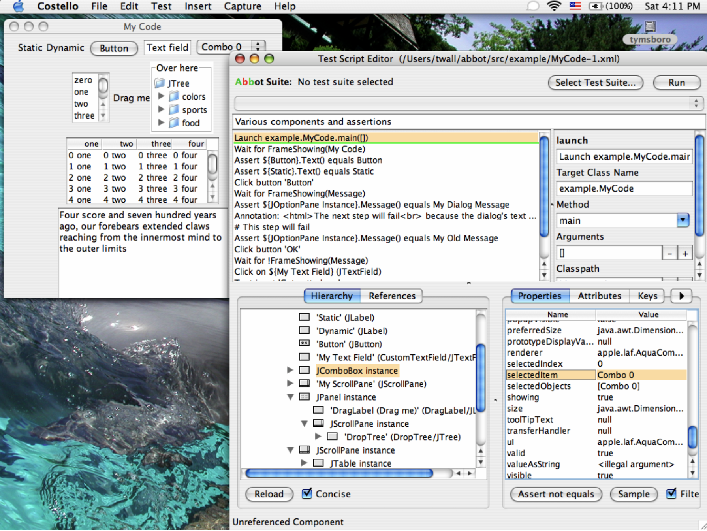
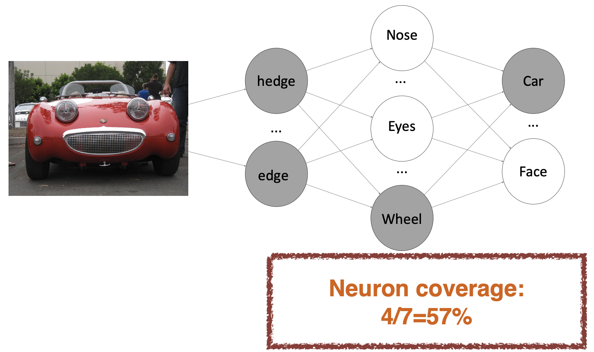
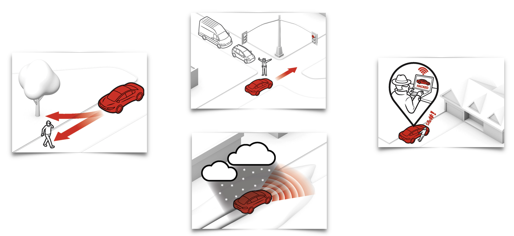
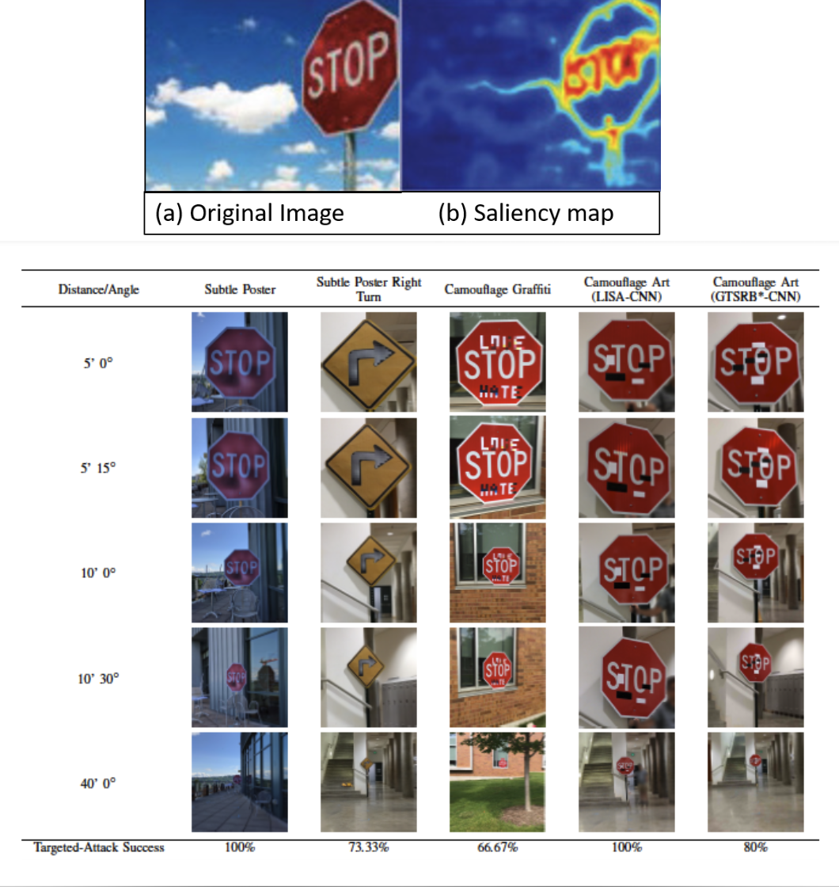

# Lecture 15

## Automated testing

- UI automation: simulate usage of a product's UI in code
	- "Record" usage and play back later
	- Write code to simulate mouse clicks

### Selenium

- Records and plays back automated "test cases" of walking through a web app's UI
- Can assert various aspects of the web page state to make sure the page looks right
- Tests can be saved as HTML or be written in
	- Java
	- Ruby
	- Python

### Android UI testing

- UI automator viewer: allows you to inspect current sate of an on-screen UI
- UI automator test case: a specialized JUnit test that can construct and interact with UI controls
- UI automator monkey: simulates pseudo-random UI interactions to test robustness and stress testing

```Java
import com.android.uiautomator.core.*;
import com.android.uiautomator.testrunner.*;

public class LaunchSettings extends UiAutomatorTestCase {
	public void testDemo() throws UiObjectNotFoundException {
		getUiDevice().pressHone();
		
		// simulate a user bringing up the All Apps screen
		UiObject allAppsButton = new UiObject(new UiSelector().description("Apps"));
		allAppsButton.clickAndWaitForNewWindow();

		// simulate the user bringing up the Apps tab
		UiObject appsTab = new UiObject(new UiSelector().text("Apps"));
		appsTab.click();

		// simulate a user swiping until they come to the settings app icon
		UiScrollable appViews = new UiScrollable(new UiSelector().scrollable(true));
		appViews.setAsHorizontalList();

		// simulate a user click to launch the app
		UiObject settingsApp = appViews.getChildByText(
			new UiSelector().className(android.widget.TextView.class.getName(), "Settings")
			);
		settingsApp.clickAndWaitForNewWindow();

		// validate that the package name is the expected one
		UiObject settingsValidation = new UiObject(
			new UiSelector().packageName("com.android.settings")
		);
		assertTrue("Unable to detect Settings", settingsValidation.exists());
	}
}
```

### Java swing UI testing

> Abbot: function UI testing for Java desktop app GUIs



### Complications to GUI capture/replay

- Capture of pixels means layout changes can cause troubles
- All environment events can play a part in test behavior 
	- Mouse
	- Keyboard
	- Network
	- Clock
	- Hardware devices
	- Databases
- Timing can play a part in test behavior. Speeding up may create more problems, but slowing down takes longer time

## Lessons learned in software testing

### The testing role

> Lesson: "You are the headlights or the project"

- A software project is like driving off-road in rugged terrain, at night
- The tester lights the way!
- Testing is about *finding information*

> Lesson: "Find important bugs fast"

- In most cases, finding "killer" bugs is part of the tester's key mission
	- Test changed code before stable code
	- Test critical functions before rarely used things
	- Test for catastrophic problems before problems users can work around
- Test things someone will definitely care about before you test things you aren't sure anyone will care about at all

### Thinking like a tester

> Lesson: "Testing requires inference, not just comparison of output to expected results"

- Must design tests and (usually) infer from a general spec the specific output that should result
- There is no universal table from inputs -> outputs
- Must infer which other behaviors are "also tested" by each test

> Lesson: "Use heuristics to quickly generate ideas for tests"

- Test boundaries and corner cases
- Test error messages/conditions
	- Rip out the hard drive
	- Unplug the network
- Test unusual configurations
- Run the tests that are annoying to run
- Avoid redundancy, do not duplicate

> Lesson: "When you miss a bug, check whether the miss is surprising or just the natural outcome of your strategy"

- Anyone can get unlucky
- Make sure you aren't systematically going to "get unlucky" in this particular way

### Testing techniques

> Lesson: "Testing combines techniques that focus on testers, coverage, potential problems, activities, and evaluation"

- *Who* does the testing
- *What* gets tested
- *Why* you're testing
- *How* you test
- *How* to tell pass/fail

### Report bugs and working with others

> Lesson: "Take the time to make your bug reports valuable"

- Bug reports are the main "product" of testers
	- Bug reports:testers as source code:developers
	- In heavily automated testing, your test code may also be a critical product, but it had better contribute to bug reports at some point
- If reports aren't understandable and informative, it is like producing bad, buggy code

> Lesson: "Never assume that an obvious bug has already been filed"

- Everyone may make this assumption
- And the bug will never get filed

### Planning and strategy

> Lesson: "Three basic questions to ask about test strategy are 'why bother?', 'who cares?', and 'how much?'"

- Why is this test ing being done?
- Who is the customer for test results?
- How much is needed?

> Lesson: "Use the test plan to express choices about strategy, logistics, and work products"

- The test plan expresses goals
- It is only valuable in that it helps organize and get testing done
- Not useful in and of itself

## Future of software testing

### Testing of ML systems

- Generating reliable **test oracles**
	- Outputs of ML models are predictive in nature
	- Optimized models give different results
	- Different algorithms give different results
- Generating **effective corner cases** is difficult
- Millions of **parameters**

### Neuron coverage

- Important to ensure that the sample set involves as many distinct neurons as possible
- Same idea as code coverage for regular programs
- All possible branches in the code must be visited at least once
- Neuron coverage = number of neurons activated / number of total neurons



### Differential testing for DNN

- Comparing two DNN's outputs
	- Must have at least two DNNs with the same functionality
	- Can only detect an erroneous behavior if at least one DNN produces different results

### Testing for autonomous vehicles



### Simulating robust physical perturbations

- Adversarial testing meets mutation testing
- Mutating inputs to each subsystem
- Identifying important regions of the image using saliency map

