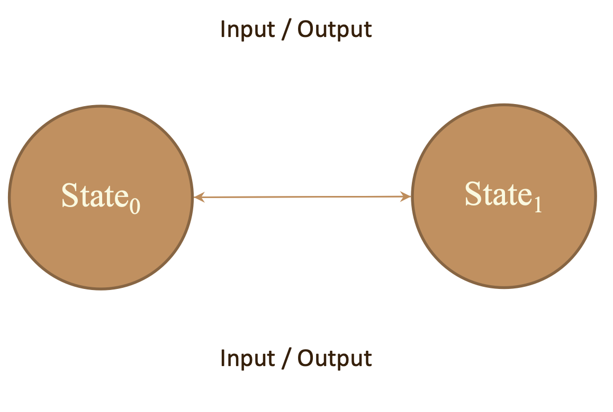
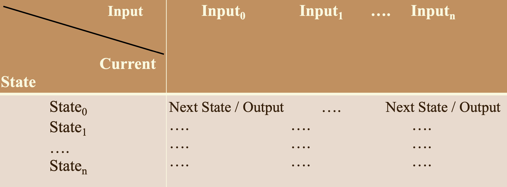
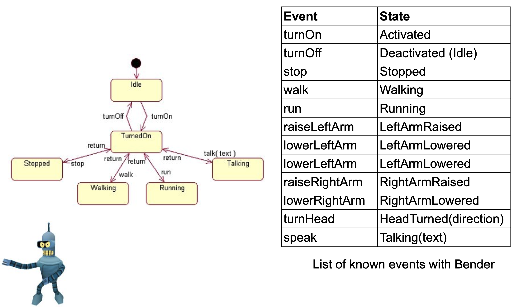
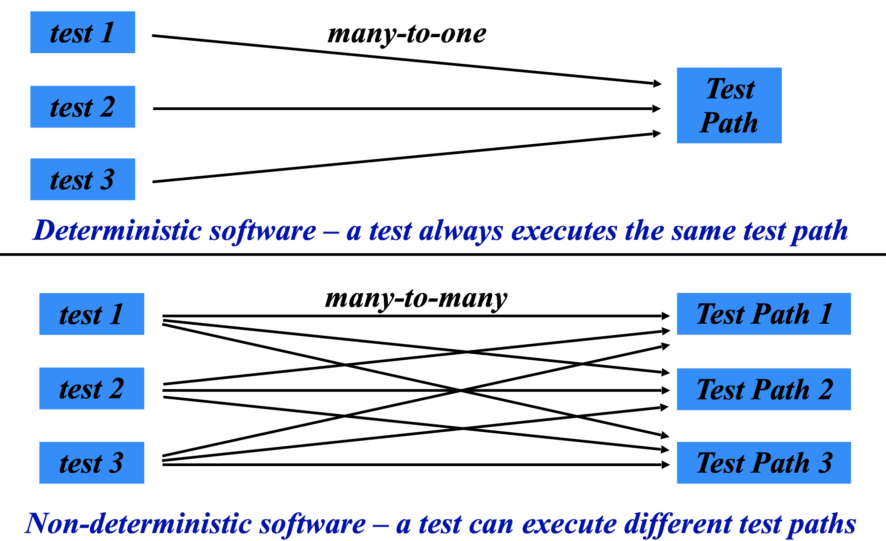
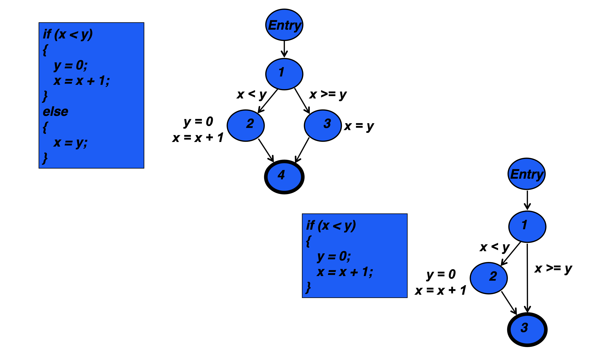
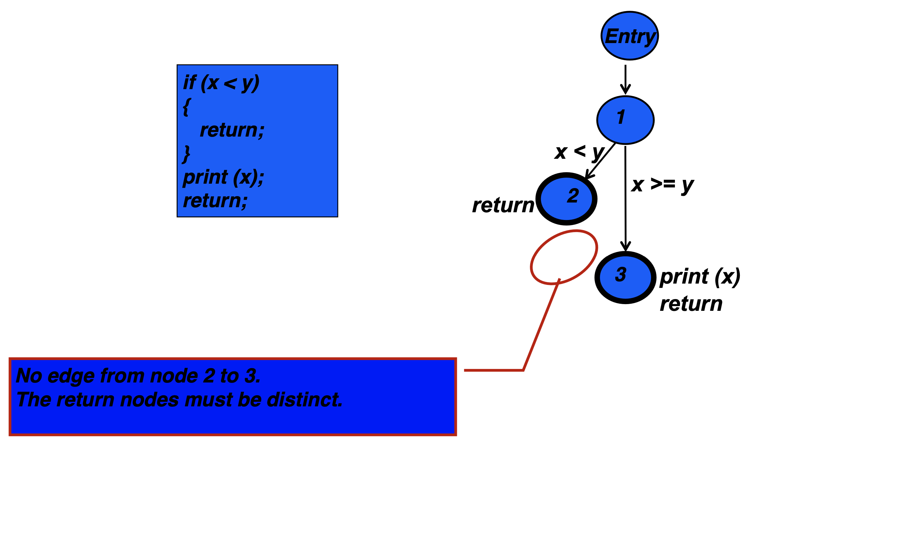
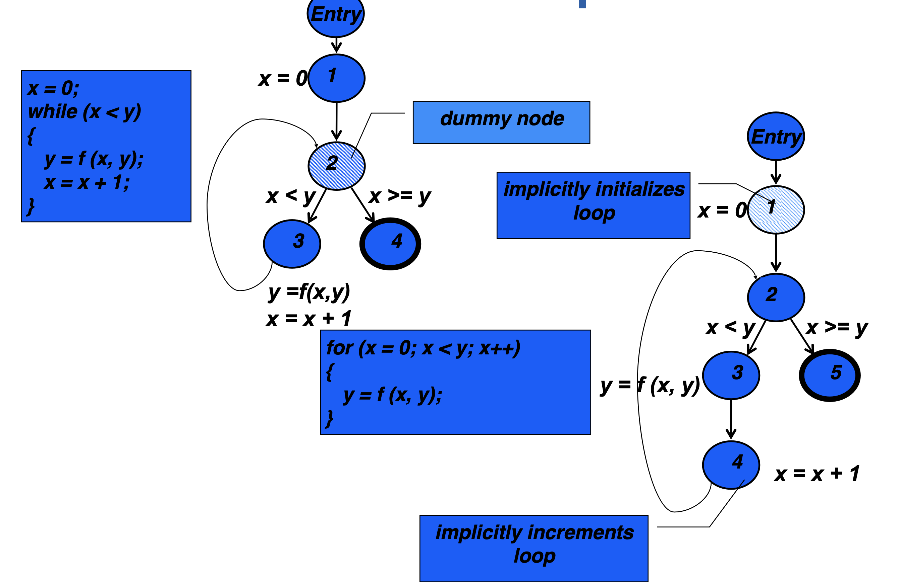

# Lecture 5

## Behavior driven development (BDD)

- A more verification-focused form of acceptance testing -- an attempt to anticipate and automate user validation
- A re-framing of "testing" to put "behaviors" at the center -- a focus on the behavior of the program rather than the behavior of the tester
- Helps as a reminder that the **tester isn't the main actor**, and his/her environment and goals aren't the main ones

### Motivations

> Programmers needed help with TDD

- Knowing where to start
- What to test
- What not to test
- How much to test
- What to call their test cases
- How to understand why a test fails

### Method

- Test method names should be sentences
	- An expressive test name is helpful when a test fails
	- A simple sentence template keeps test methods focused
- Behavior is a more useful word than test
	- Emphasize behavior over testing
	- Process
		1) Determine (or define) the next most important behavior
		2) Implement functionality for behavior
		3) Test functionality against behavior
		4) Iterate

### Compared to TDD

- BDD often considered more high-level than TDD (which is generally thought of at a smaller unit-test level)
- Difference is mainly in focus/mindset

### Forms

- User stories
- Scenario

## Finite state machines

- Finite state machines (FSM) are graphs
	- Nodes represent state
	- Edges represent transitions among states
- Four elements
	1) State: define behavior and may produce actions
	2) State transitions: movement from one state to another
	3) Rules/conditions: must be met to allow a state transition
	4) Input events: externally or internally generated, may possibly trigger rules and lead to state transitions

### Representations

- State diagrams

- Transition table

### Present and next state

For any given state, there is a finite number of possible next states. One of the possible next states becomes the new present state, depending on the input

On a well-drawn state diagram, all possible transitions will be visible, including loops back to the same state.

### A robot example

## Modeling software

### Input domains

- The **input domain** for a program contains all possible inputs to that program
- For even small programs, the input domain is so large that it might as well be **infinite**
- Testing is fundamentally about **choosing finite sets** of values from the input domain
- **Input parameters**
	- Parameters to a method
	- Data read from a file
	- Global variables
	- User level inputs

#### Partitioning the input domain

- **Partition scheme** $q$ of domain $D$ defines a **set of blocks** $b_{1}, \, b_{2} ,\, \dots ,\, b_{q}$
- The partition must be *pairwise disjoint* (no overlap) and the union of all partitions *cover* domain $D$
- Coverage means using at least one input from each of the partitions
- Choosing partitions
	- Seems easy, but is easy to get wrong
	- Consider the characteristic "order of file $F$"
	- Possible partition
		- $b_{1}$ is sorted in ascending order
		- $b_{2}$ is sorted in descending order
		- $b_{3}$ is in an arbitrary order
	- Issue
		- File of length 1 would be present in all 3 blocks
		- Disjointness is not satisfied
	- Solution
		- Each characteristic should address just one property
		- $C1$: file $F$ sorted ascending
			- $C1.b1$ is true
			- $C1.b2$ is false
		- $C2$: file $F$ sorted descending
			- $C2.b1$ is true
			- $C2.b2$ is false

#### Testing with equivalence partitions

> An **equivalence partition** is a range of discrete values for an input or an output, for which the specification states equivalent processing

- Consider a range of acceptable values: $1 \dots 10$
- If tests with inputs $2 \dots 9$ produce the same result, we only need one test from this range
- Start with the natural range for a value, then narrow it down to what specification state is valid

#### Testing with boundary values analysis

- Boundary values are the minimum and maximum values for each equivalence partition
- Having identified the partitions, identifying the boundary values is straightforward: pick the values at the boundaries of partitions

> A **boundary value** is the value at the boundary of an equivalence partition. Each equivalence partition has exactly two boundary values

### Graphs

- Graphs are the most commonly used structure for testing
- Graphs can come from may sources
	- Control flow
	- Design structure
	- FSMs and statecharts
	- Use cases
- Tests usually are intended to "cover" the graph is some way
- A graph is defined as
	- A nonempty set of $N$ nodes
	- A set of initial nodes $N_{0}$
	- A set of final nodes $N_{f}$
	- A set of edges from one node to another $E$

#### Paths in graphs

- Path: a sequence of nodes from a starting node to a destination node
- Length: the number of edges in a path
- Subpath: a subsequence of nodes in some path
- Reach: subgraph that can be reached from a given node $n$

#### Test paths

- Test path: a path that state at an initial node and ends at a final node
- Test paths represent execution of test cases
	- Some test paths can be executed by many tests
	- Some test paths cannot be executed by *any* tests
- SESE graphs: all test paths start at a single node and end at another node
	- **S**ingle-**E**ntry, **S**ingle-**E**xit
	- $N_{0}$ and $N_{f}$ have *exactly* one node

#### Basic blocks

- A **basic block** is a sequence of consecutive statements in which flow of control enters at the beginning and leaves at the end without halt or possibility of branch, except at the end
- Single entry node, single exit node -- may be multiple paths (edges) into entry and out of exit -- but each is at only one point
- A sequence of statements such that if the first statement is executed, all statements will be (no branches)

#### Computing control flow

##### The `if` statement

##### The `if`-`return` statement

##### `while` and `for` loops

