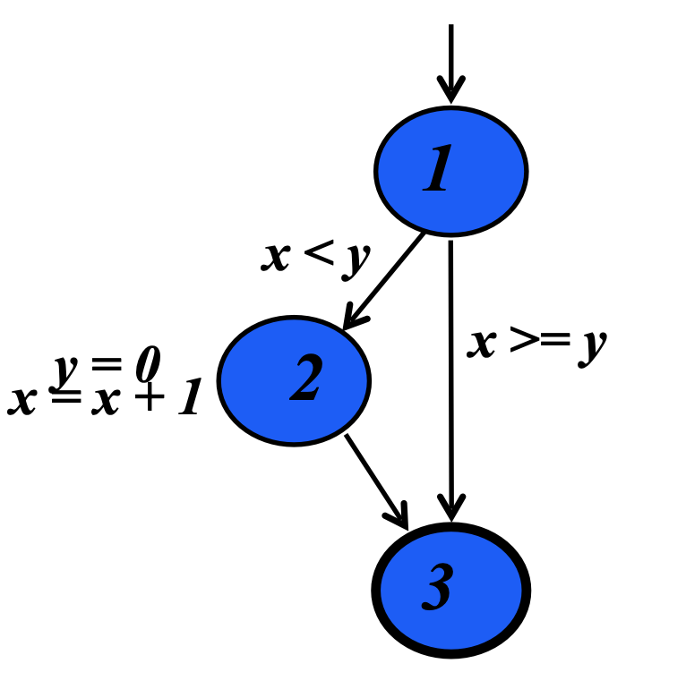
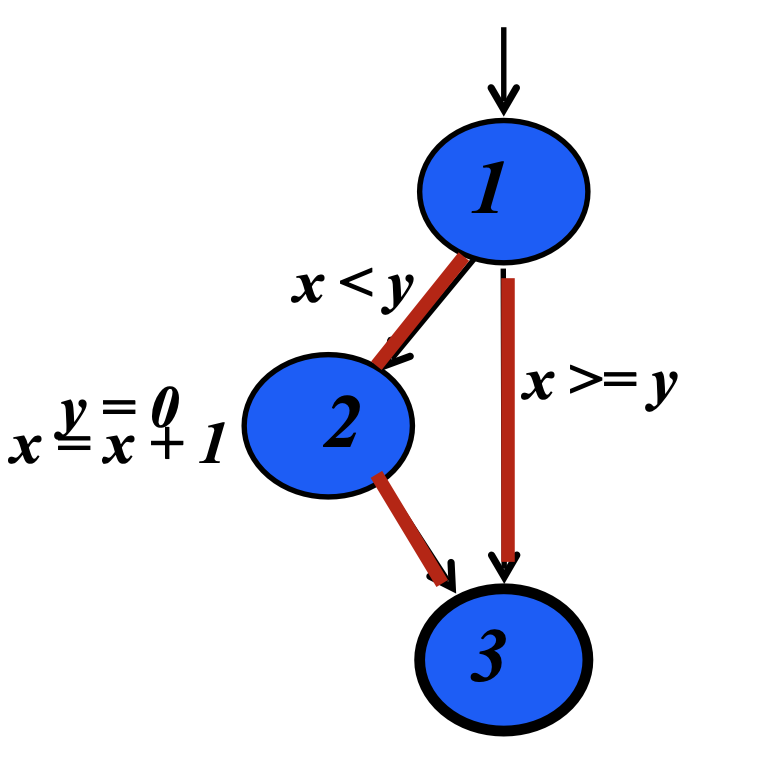
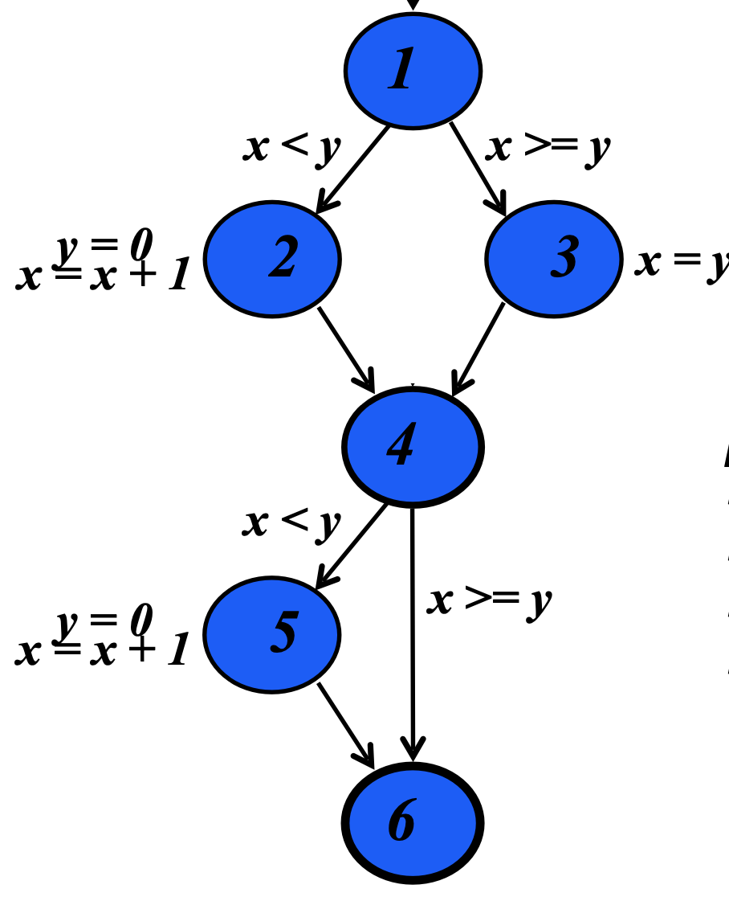
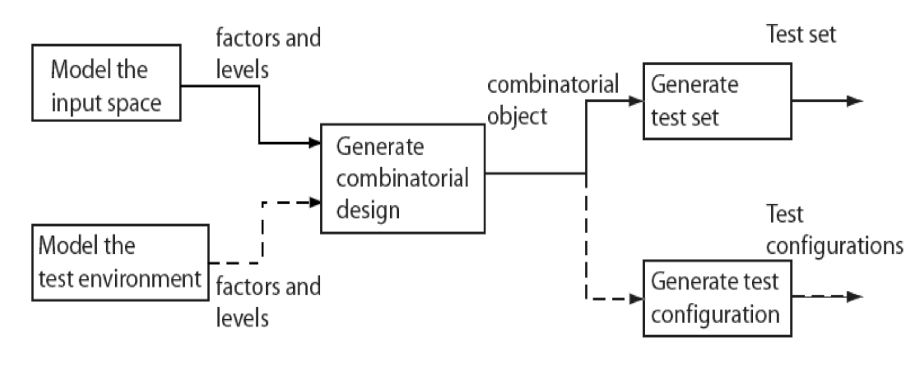
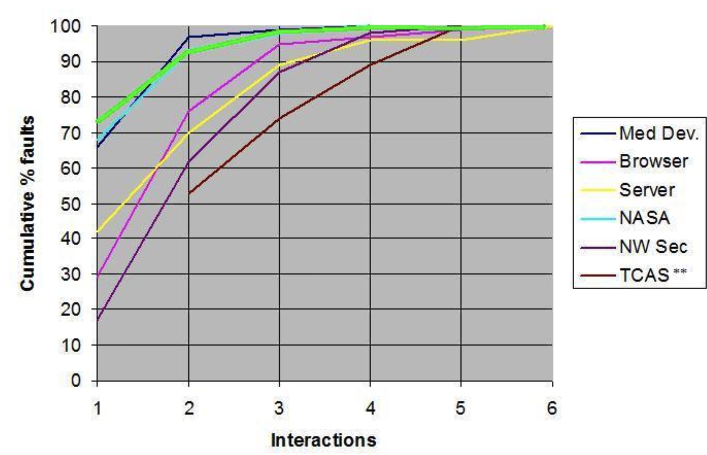
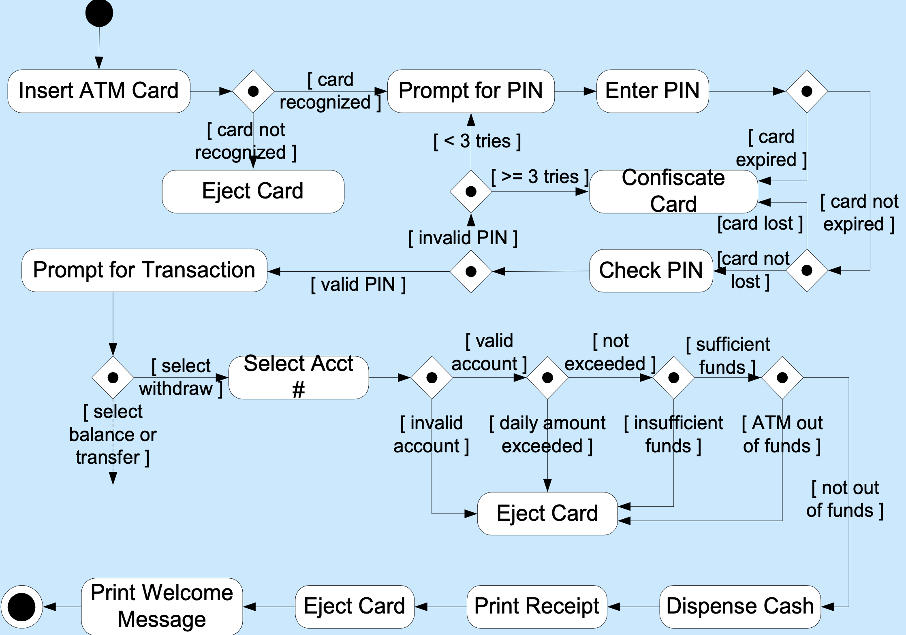

# Lecture 6

## Software modeling: coverage

### Statement (basic block) coverage

- Statement coverages visits every node of a graph
- Nodes represent basic blocks, so multiple statements may be executed when visiting a node

```C
if (x < y) {
	y = 0;
	x = x + 1;
}
```

- Achieving statement coverage would require a single test case where the `if` condition is true



### Branch coverage

- Involves traversing through all edges
- May involve visiting all nodes of the graph as well

```C
if (x < y) {
	y = 0;
	x = x + 1;
}
```

- Achieving branch coverage here requires tests that trigger *and* skip the `if` condition



### Statements vs branches

- Traversing all edges of a graph cases all nodes to be visited
	- Test suites that satisfy the branch adequacy criterion also satisfy the statement adequacy criterion
- The converse is not true
	- A statement-adequate test suite may not be branch adequate
- This means that the branch criterion **subsumes** the statement criterion

### Path coverage

- We can also explore sequences of branches (paths) in control flow
- Often many more paths than branches and requires a pragmatic compromise

```C
if (x < y) {
	y = 0;
	x = x + 1;
}
else {
	x = y;
}

if (x < y) {
	y = 0;
	x = x + 1;
}
```



- First determine how many tests are needed for statement coverage
	1) `1 -> 2 -> 4 -> 5 -> 6`
	2) `1 -> 3 -> 4 -> 6`
- This test suites also provides branch coverage
- Now, determine the number of test cases needed for path coverage if the previous tests are already included
	1) `1 -> 2 -> 4 -> 6`
	2) `1 -> 3 -> 4 -> 5 -> 6`
- In general: the number of paths is exponential in the number of conditional branches

### Data flow (def-use) coverage

- Annotate the program with locations where variables are defined and use (very basic static analysis)
- Def-Use pair coverage requires execution of all possible pairs of nodes where a variable is
	1) First defined
	2) Used without any intervening re-definitions
- There may be many pairs, some of which are not actually executable

```C
x = 3;                // Def(x)
y = 3;                // Def(y)

if (w) {
	x = y + 2;        // Def(x) and Use(y)
}

if (z) {
	y = x - 2;        // Def(y) and Use(x)
}

n = x + y             // Use(x) and Use(y)
```

To obtain Def-Use coverage

1) Test executes line 1 and line 9
2) Test executes line 1 and line 12
3) Test executes line 2 and line 5
4) Test executes line 2 and line 12
5) Test executes line 5 and line 9
6) Test executes line 5 and line 12
7) Test executes  line 9 and line 12

### Logic coverage

- Branch coverage will guarantee that we cover all edges, but does not guarantee we will do so for all logical outcomes
- What if we anted to test the logic of the `if` statement itself?

```C
if (((a > b) || G)) && (x < y)) {
	y = 0;
	x = x + 1;
}
```

#### MC/DC

- Stands for **m**odified **c**ondition / **d**ecision **c**overage
- Every condition in the decision has taken all possible outcomes at least once
- Every **condition** in the decision *independently* affects the decision's outcome

#### Active clause

- Force all values except for one to take on a non-determining value
- Allow a single condition's values to determine the value of the entire predicate

### Method-level coverage

- Method coverage
	- Each method is executed at least one
	- Comes "for free" with unit testing
- Method call coverage: each method bay be called from multiple call sites, and each call site can call many methods
- Method exit testing: method may have multiple exit point (multiple returns, exception exit points)

## Combinatorial testing

### Test configuration

- Software applications are often designed to work in a variety of *environments*. 
- Combinations of *factors* such as the OS, network, and hardware lead to a variety of environments
- An environment is characterized by combinations of hardware and software
- Each environment corresponds to a given set of values for each factor, known as a **test configuration**

| Config | OS | CPU | Protocol |
|:---------:|:--:|:---:|:--------:|
| 1 | Windows | Intel | IPv4 |
| 2 | Windows | AMD | IPv6 |
| 3 | Linux | Intel | IPv6 |
| 4 | Linux | AMD | IPv4 |

> The number of such configurations could be exorbitantly large, making exhaustive testing impossible

### Factors and levels

- Consider program $P$ that takes $n$ inputs corresponding to variables $X_{1},\, X_{2},\, \dots X_{n}$
	- We refer to the inputs as **factors**
	- The inputs are also referred to as **test parameters** or as **values**
- Let us assume that each factor may be set at any one from a total of $c_{i}$ values where $1 \le i \le n$
	- Each value assignable to a factor is known as a **level**
	- The notation **IFI** refers to the number of levels for factor $F$

### Test design process

> Modeling of input space or the environment is not **exclusive** and one might apply either one or both depending on the application under test



### Factor combinations

- A set of values, one for each factor, is known as a **factor combination**
- For example, suppose the program $P$ has two input variables $X$ and $Y$
	- During an execution of $P$, $X$ and $Y$ may each assume a value of from the sets `{a, b, c}` and `{d, e, f}` respectively
- Thus, we have **2 factors** and **3 levels** for each factor
	- This leads to a total of $3^{2} = 9$ factor combinations

$$
\{
	(a, d),\,
	(a, e),\,
	(a, f),\,
	(b, d),\,
	(b, e),\,
	(b, f),\,
	(c, d),\,
	(c, e),\,
	(c, f)
\}
$$

- In general, for $k$ factors with each factor assuming a value from a set of $n$ values, the total number of factor combinations is $n^{k}$
- Suppose that each factor combination yields one test case
	- The number of test cases generated could be *exorbitantly large*
	- Executing that many tests is impractical for many software applications

#### All combinations

- Every possible combination of values of the parameters must be covered
- If we have three parameters
	1) $P_{1} = \{ A,\, B \}$
	2) $P_{2} = \{ 1,\, 2,\, 3 \}$
	3) $P_{3} = \{x,\, y \}$
- All combinations coverage requires 12 tests

#### Each choice combinations

- Each parameter value must be covered in at least one test case
- If we have three parameters
	1) $P_{1} = \{ A,\, B \}$
	2) $P_{2} = \{ 1,\, 2,\, 3 \}$
	3) $P_{3} = \{x,\, y \}$
- The following test set satisfies each choice coverage: $\{ (A, 1, x),\, (B, 2, y),\, (A, 3, x) \}$

#### Pairwise combinations

- Will test all possible combinations of the pairs of inputs
- If we have three parameters
	1) $P_{1} = \{ A,\, B \}$
	2) $P_{2} = \{ 1,\, 2,\, 3 \}$
	3) $P_{3} = \{x,\, y \}$
- The following selections will satisfy pairwise combinations
	- $P_{1}$ and $P_{2}$: `{(A, 1), (A, 2), (A, 3), (B, 1), (B, 2), (B, 3)}` with $P_{3}$ randomized
	- $P_{2}$ and $P_{3}$: `{(1, x), (1, y), (2, x), (2, y), (3, x), (3, y)}` with $P_{1}$ randomized
	- $P_{1}$ and $P_{3}$: `{(A, x), (A, y), (B, x), (B, y)}` with $P_{2}$ randomized

#### T-wise combinations

- Given any $t$ parameters, every combination of values of these $t$ parameters must be covered in at least one test case
- Note that all combinations, each choice, and pairwise coverage can be considered to be special cases of $t$-wise coverage

### Subsumption relation

> All combination > T-wise > Pairwise

## Fault model

- Faults aimed at by the combinatorial design techniques are known as **interaction faults**
- We say that an interaction fault is **triggered** when a certain combination of $t \ge 1$ input values causes the program containing the fault to enter an invalid state

### Interaction faults

- Faults triggered by some value of an input variable regardless of the values of other input variables are known as **simple faults**
- For $t = 2$, the faults are known as **pairwise interaction** faults
- In general, for any arbitrary value of $t$, the faults are known an **t-way interaction faults**

```C
// Example pressure < 10 and volume > 300 (2-way interaction)
if (pressure < 10) {
	// do something
	if (volume > 300) {
		// faulty code. BOOM!
	}
	else {
		// good code, no problem
	}
}
else {
	// do something else
}
```

### Compared to failure data



> The maximum interactions for fault triggering for these applications was **6**

- Study of Mozilla web browser found 70% of defects with 2-way coverage, 90% with 3-way and 95% with 4-way
- US DFA uncovered 97% of flaws with 2-way coverage when testing 109 software-controlled medical devices

### Use case models

- UML use cases are often used to express software requirements
- They help express computer application workflow
- Actors: humans or software components that use the software being modeled
- Use cases: shown as circles or ovals
- Node coverage: try each use case at least once

> Use case graphs, by themselves, are not useful for testing

### Elaboration

- Use cases are commonly elaborated (or documented)
- Elaboration is first written textually
	- Details of operations
	- Alternatives model choices and conditions during execution
- Remember to find a graph and then cover it. 
- UML has a graphical representation for use cases in the form of activity diagrams

### Activity diagrams

- Activity diagrams indicate flow among activities
- Activities should model user level steps
	- Action states
	- Sequential branches
- Use case descriptions become action states
- Alternatives are sequential branches
- Flow among steps are the edges
- Activity diagrams usually have some helpful characteristics
	- Few loops
	- Simple predicates
	- No obvious DU pairs

