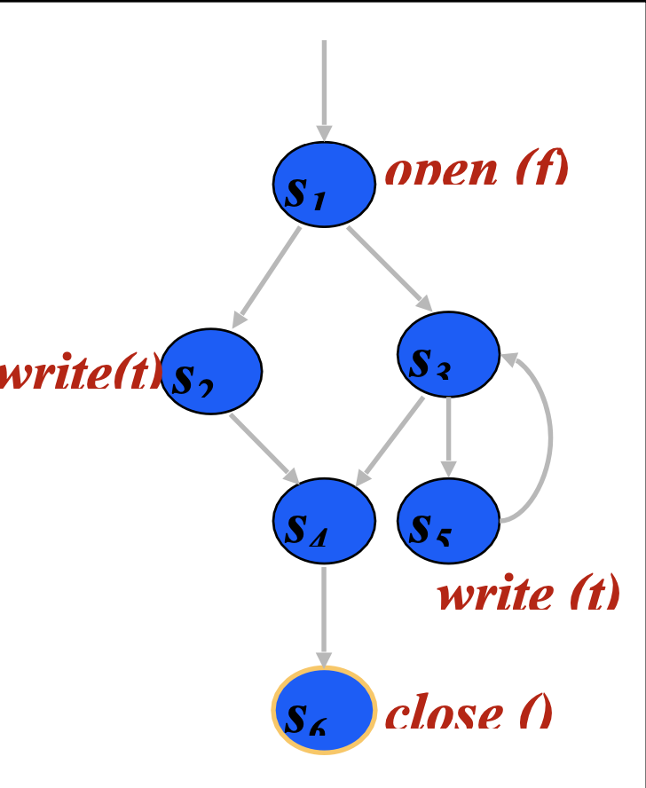
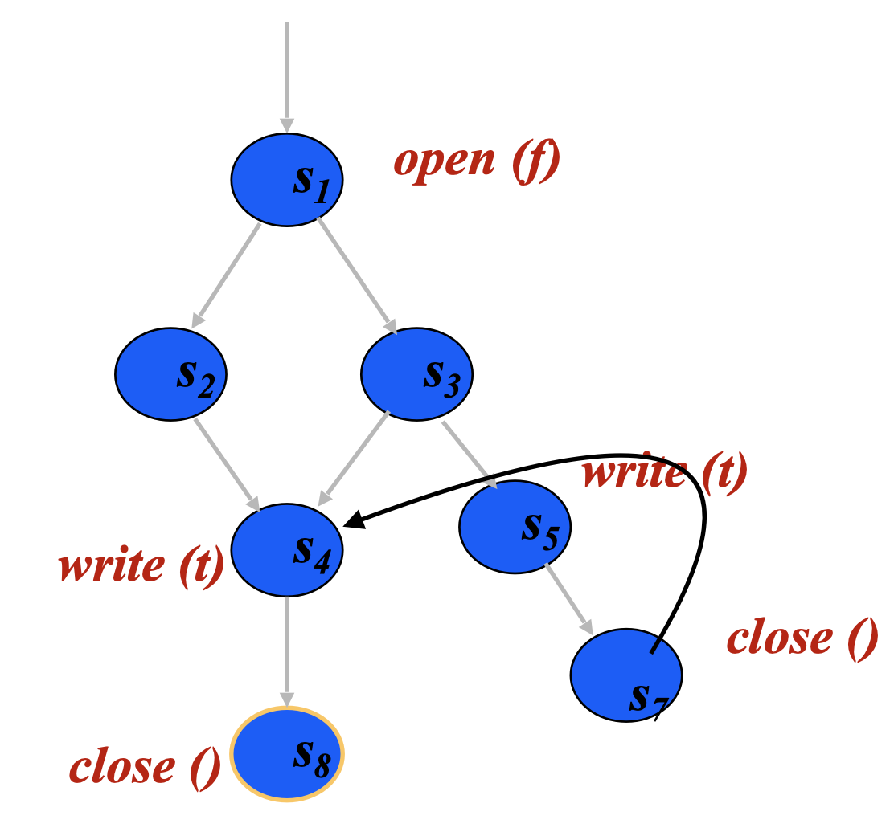
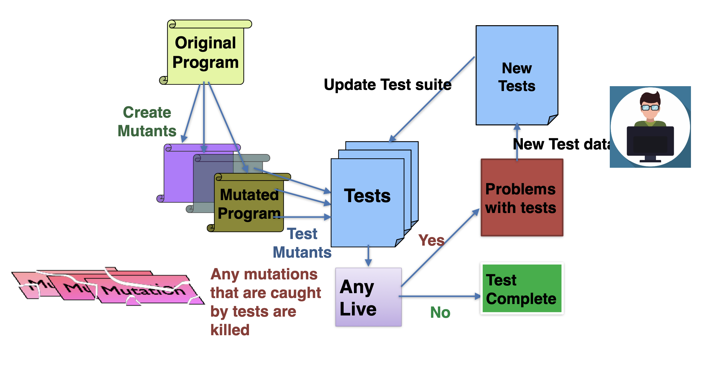
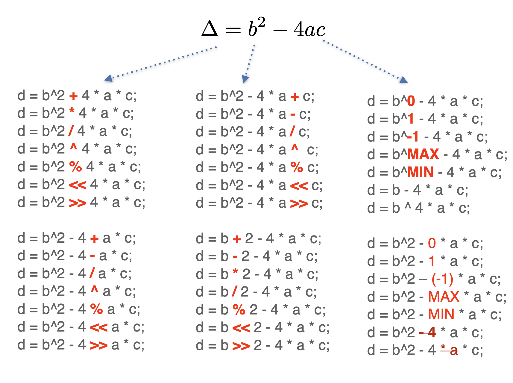

# Lecture 7

## Software modeling: constraints

### Sequencing constraints

- Rules that impose constraints on the order in which methods may be called
- Can be encoded as preconditions or other specifications

```Java
public class Stack {
	public void pupsh(Object o) { ... }
	public Object pop() { ... }
	public boolean isEmpty() { ... }
}
```

- `push` should be called before `pop` or it should know how to handle an empty `Stack`
- Tests can be created for these classes as sequences of method calls
- Sequencing constraints give an easy and effective way to choose which sequences to use

```Java
public class FileADT {
	public File open(String fName) { ... }
	public void close() { ... }
	public int write(String textLine) { ... }
}
```

The following would be valid sequencing constraints for the above class

1) An `open` must be executed before every `write`
2) An `open` must be executed before every `close`
3) A `write` may not be executed after a `close` unless there is an `open` in between
4) A `write` should be executed before every close

Visually, the sequencing constraints look like



### Static checking

> Is there a path that violates any of the sequencing constraints?

- Is there a path to a `write` that does not go through an `open`? No
- Is there a path to a `close` that does not go through an `open`? No
- Is there a path from a `close` to a `write`? No
- Is there a path from an `open` to a `close` that does not go through a `write`? No

Consider the following graph



The edge 7 -> 4 creates a path where a `write` occurs after `close` without `open` in between

## Random testing

- Feed a program a set of random inputs
- Observe where the program "behaves" correctly on each input
	- If pre- and post-conditions exists, then we can check whether the execution satisfies the specification
	- If not, we can simply check that the execution does not crash
- Select inputs independently at random from the program's input domain
	1) Identify the input domain of the program
	2) Map random numbers to that input domain
	3) Select inputs from the input domain according to some probability distribution
	4) Determine if the program achieves the appropriate outputs on those inputs
- Random testing can provide probabilistic guarantees about the likely faultiness of the program

### Why use it?

- It's cheap, assuming you solved the oracle problem
	- May need more tests to find the same number of faults, but generating tests is very easy
- Can calculate the reliability of an application using established probability theory
- Useful complement to partition testing

### When to use it?

- Lack of domain knowledge makes it difficult or meaningless to partition input into equivalence classes
- When large volumes of data are necessary
	- Load testing
	- Stress testing
	- Robustness testing
	- Reliability calculations
- To complement partition testing

> Infinite monkey theorem: a monkey hitting keys at random on a keyboard will produce any given text such as the complete works of Shakespeare, with probability approaching 1 as time increases

### Challenges for random testing

- Selecting or sampling the input space
	- Uniform distribution: uniform random selection
	- Equispaced: unsampled gaps are the same size
	- Proportional sampling: sample according to subdomain distribution
	- Adaptive sampling: take the pattern of previously-identified failure-causing inputs into consideration in sample strategy

### Criticisms of random testings

- Corner faults might escape detection
- Prediction problems
	- Uniform-distribution based predictions can be easily wrong
	- Domain based analysis does not account for program size, only for the number of test points
- The oracle problem: a test case is an input, an expected output, and a mechanism for determining if the observed output is consistent with the expected output
- Root cause analysis: how to debug using a randomly generated input

## Modeling software: syntax

### Syntax-based coverage

- Usually known as *mutant testing*
- Bit different kind of creature than other coverages
- Idea: generate many syntactic *mutants* of the original program
- Coverage: how many mutants does a test suite kill (detect)?

### Mutation analysis

- Address the oracle problem
- Mutants look like real bugs



### Assumptions of mutation testing

- The **finite neighborhood** assumption
	- Programmers make simple mistakes and create programs that are close to being correct
- The **coupling effect** assumption
	- Faults rarely interact and if they interact, they become easier to detect (kill)
	- Test cases that distinguish a faulty program differing from a correct one by only simple errors is sensitive enough to distinguish more complex errors

### Mutation operator

- Mutation is as good as the **mutation operators**
- Arithmetic operator replacement: each occurrence of arithmetic operators is replaced by each of the other operators
- Unary operator insertion: each unary operator is inserted in front of each expression

### Cost of mutation analysis

- It is costly, a simple operator can generate many incorrect version of a given program



### Limitations of mutation analysis

- Not all mutants are unique
	- Equivalent mutant: `d = (-b)^2 - 4*a*c`
	- Redundant mutant: `d = b^2 - (-4)*a*c`
- Not all mutants are equally important
	- Generating mutants in the parts of the code which is barely executed
- Explosion in runtime
	- Need to run through all tests for each mutant

### Improving mutation analysis

- Do fewer: selective mutation, mutant sampling
- Do smarter: distributed execution, different process
- Do faster: separate compilation, saving state to avoid initialization, equivalent mutant detection