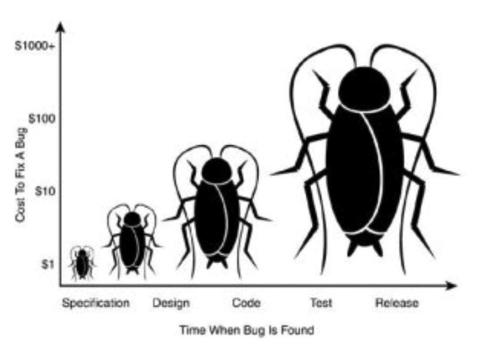

# Lecture 10

## Static bug detection



- An approach for software quality assurance
	- Easy to start (no build, setup, install)
	- Sometimes can guarantee the software to be free of certain kinds of bugs
	- Ne need for debugging
- Compared to testing
	- Works for specific kinds of bugs
	- Sometimes not scalable
	- Generates false positives

### Specifications

- Type specific detection: fixed specification and improvement is provided
	- Null pointer, memory leak, unsafe cast, injection, buffer overflow, dynamic SQL errors, racing/deadlocks, dead loop, HTML errors, UI inconsistencies
	- Most of them have severe limitation preventing them from practical usage
- Specification based detection: model checking, symbolic execution, theorem proving
	- Requires a description of correct software behavior
	- Value specification
		- Values of one or more variables must satisfy a certain constraint
		- `final_exam_score <= 100`
	- Temporal specification
		- Two events (or series of events) must happen in a certain order
		- `lock()` -> `unlock()`
	- Data flow specification
		- Data from a certain source must/must not flow to a certain sink
		- Password -> encryption -> internet
		- Mainly for security usage
	- General specification
		- Common behaviors for all software
		- `a/b` when `b != 0` (divide by zero)
		- `a.field` when `a != null` (null pointer reference)

### Static bug detection tools

- Findbugs
	- A tools developed by researchers
	- Widely used in industry for code checking before commits
- Lint
	- A code style enforcing tool for C language
	- Finds bad coding styles and raises warning

### How it works

> Use "bug patterns" to detect potential bugs

```Java
Address address = client.getAddress();
if ((address != null) || (address.getPostCode() != null)) { // NullPointerException (maybe meant &&?)
	...
}
```

```Java
public class ShoppingCart {
	private List<Item> items;
	public addItem(Item item) {
		items.add(items); // Uninitialized field
	}
}
```

### Patterns to checked

- Bad practice / dodgy code: hackish code, not stable and may harm future maintenance

```Java
boolean Equals(Object o) {
	Myclass my = (Myclass) o;
	return my.id = this.id;
}
```

- Code patterns that may result in vulnerability or security issues

```Java
String str = "select" + bb + " ddd" + ...; // SQL query generated from non-constant string
server.execute(str); // Code writes an HTTP parameter to JSP output allowing XSS vulnerability
Para p = request.getParameter(key);
out.print(p);
```

- Code patterns that may harm the performance of the software

```Java
String s = "";
for (int i = 0; i < field.length; i++) {
	s = s + field[i]; // concatenates strings using + in a loop
}
```

### False positives

- 5% - 10% precision on open source and industry projects
- Developers want to make sure they do not waste effort on false positive
- Usually many more bugs than developers can fix

### Bug ranking

- Rank bugs by category
- Some categories are more likely to be bugs than others
- Ranking categories
	- Check large number of issues in the history of software
	- What proportion of issues were fixed?

## Code reviews/software inspections

- A constructive review of a fellow developer's code
- Requires sign-off from another team member before a developer is permitted to check in changes or new code

### Why?

- More than 1 person has seen every piece of code: prospect of review raises quality threshold
- Forces code authors to articulate their decisions
- Hands-on learning experience for rookies without hurting code quality
- Team members involved in different parts of system
- Author and reviewer both accountable for committing code

### Mechanics of code reviews

- Who: original developer and reviewer, sometimes in person, sometimes offline
- What: reviewer gives suggestions for improvement on a logic and/or structural level
	- Feedback leads to refactoring, followed by a second cod review
	- Eventually reviewer approves code
- When: code author has finished a coherent system change that is otherwise ready for check-in
	- Changes shouldn't be too large or too small
	- Before committing the code to a repository or incorporating it into the new build

### Types of code reviews

#### Informal

- Ad hoc "look at this"
- Peer desk check  "pass around"
- Pair programming

#### Formal

- Code reading: reviewers look at code by themselves (possibly with no actual meeting)
- Walkthrough: informal discussion of code between author and a single reviewer
- Inspection: a more formalized code review
	1) Planning
		- How much to review?
		- How long should the review last?
	2) Preparation
		- Give materials to reviewers
		- Time expectations prior to the meeting
		- Understand the roles of participants
		- Training for team members on their various roles
		- Expected end product
	3) Meeting
		- Team participants
			- Must be actively engaged
			- Must understand the bigger picture
		- Team psychology
			- Stress
			- Conflict resolution
			- Perceived relationship to performance reviews
		- Objectives
			- Understand the purpose of the review
			- Raise issues, but **do not** resolve them
		- Roles
			- Author
			- Moderator
			- Reader
			- Reviewer
			- Recorder (optional)

### Best practices and etiquette for code reviews

- Best practices
	- Review small portions of code at a time
	- Record all feedback
	- Review code independently before gathering to discuss
	- Use checklists
- Etiquette
	- Code reviews can be unpleasant experiences for the reviewee
	- Keep it professional and about the code (not the developer)
	- Remember to notice and mention the good choices and well as the critique
- Avoid
	- Participants who don't understand the review process
	- Reviewers critique the produces, not the product
	- Reviews that are not planned
	- Review meetings drift into problem solving
	- Reviewers who are not prepared
	- Allowing the wrong people to participate
	- Focusing on style over substance

### Github workflow

1) Create a repository
	- Master branch should be working and ready to deploy at any time
2) Make a branch
	- Branches are created so that you have an environment to try out new things and make changes to your code without wrecking master
3) Add commits
	- Add to **your** branch
	- Helps you keep track of progress
4) Open a pull request
	- Initiates discussion about your commits
	- Notifies project maintainers about changes you'd like them to consider
5) Discuss and review changes
	- Allows reviewers to ask questions or leave comments
6) Merge and deploy

### Automated code reviews

- Class of tools called static analyzers that can perform some code review features
- Considered pessimistic analysis (may mention issues that are not actual problems)