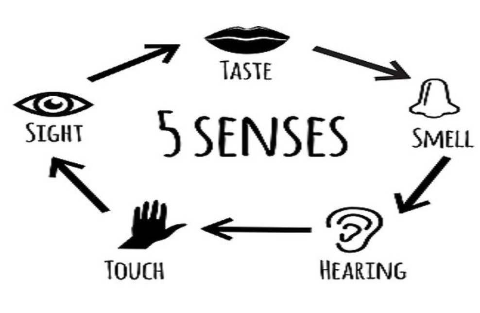
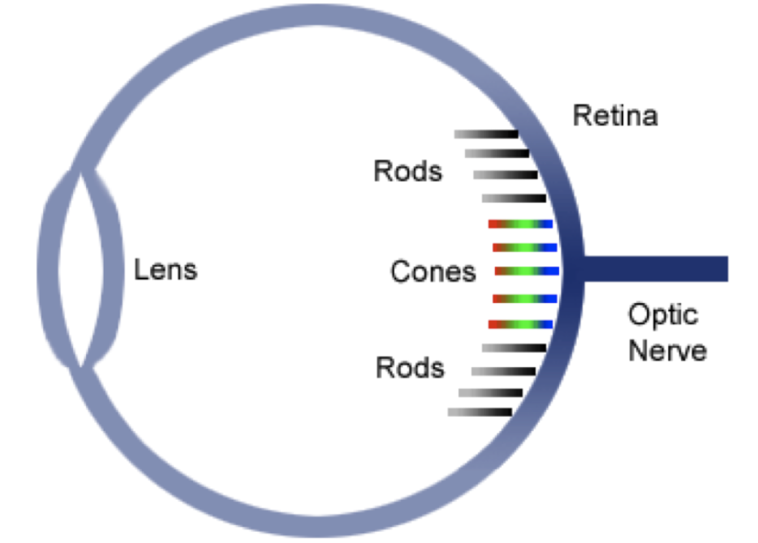
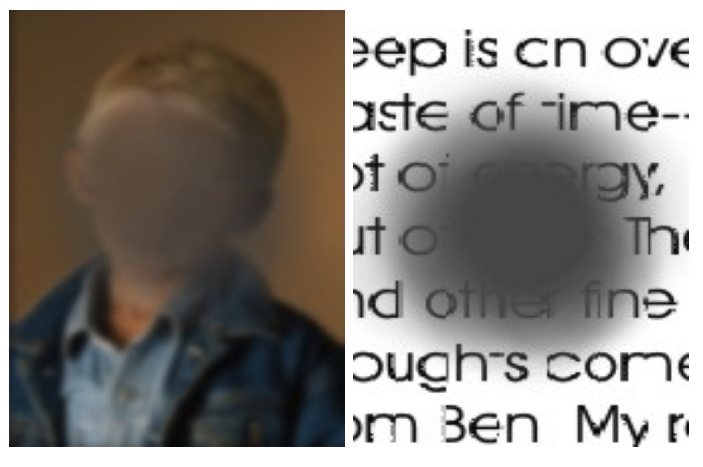
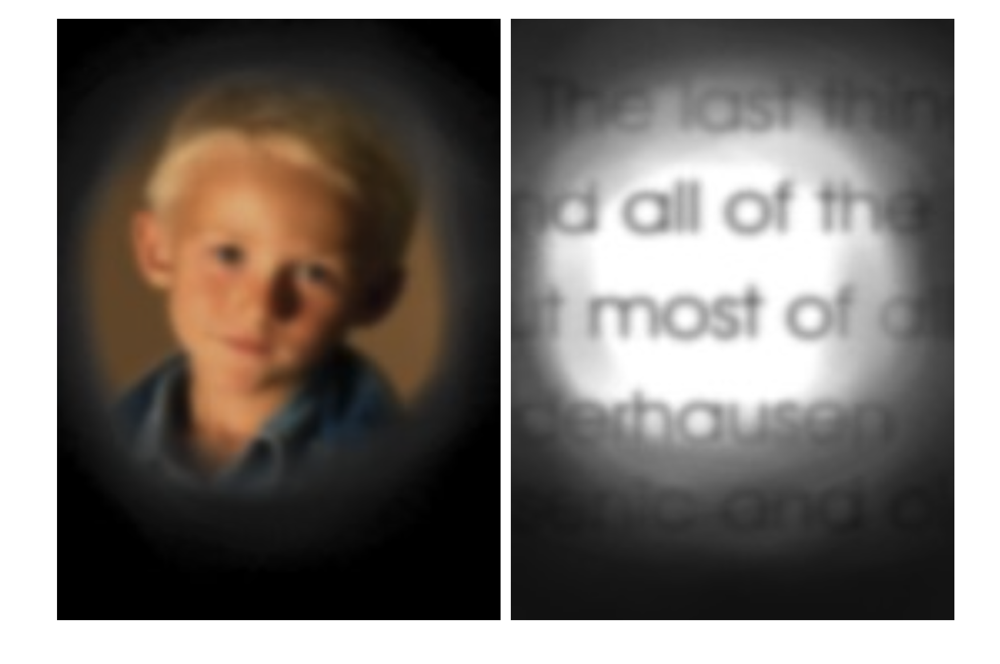
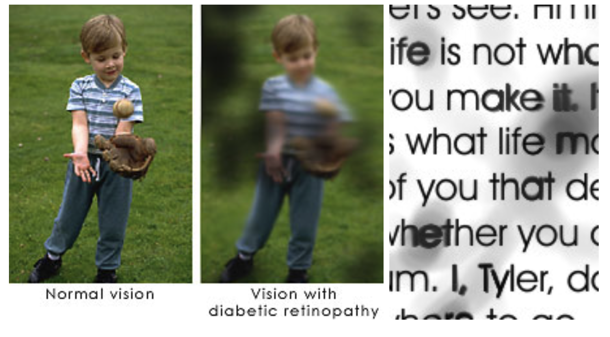
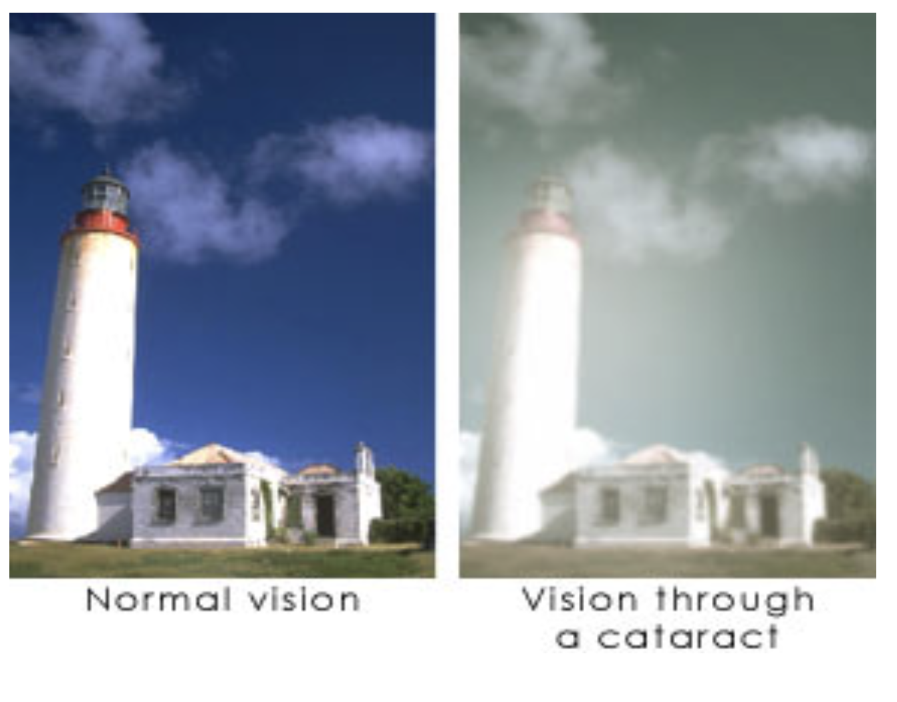
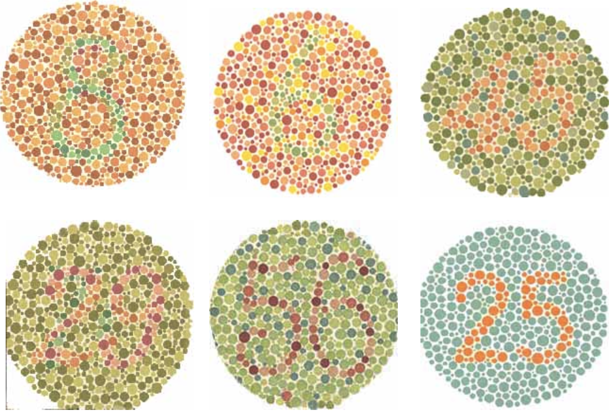
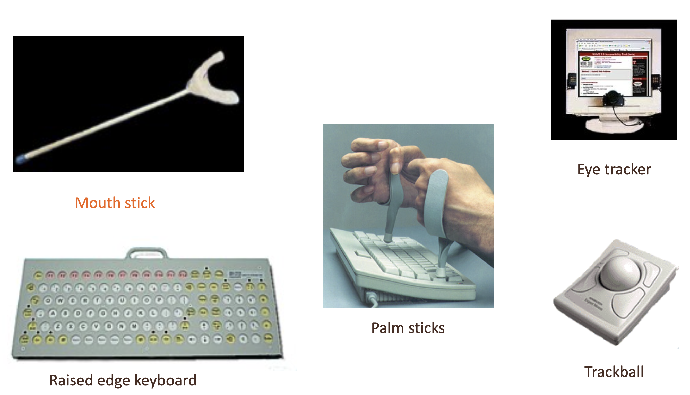

# Lecture 11

## Why accessibility?

- Drives innovation
	- Typewriter -> telephone -> punch cards -> text-to-speech -> email -> voice controls
	- Initially meant to include those with a disability
- Increase market reach
	- At least 1 billion people (15% of world population) have a recognized disability
	- As the population ages, more acquire disability and yet do not identify as disabled
	- In countries with life expectancies of 70 years, people spend 11.5% of their lifespan with a disability
	- In the US, the annual discretionary spending of people with disabilities is more than $200 billion
	- The global estimate of the disability market is nearly $7 trillion

## Human ability

### Senses

#### Vision

- Rods: best at detecting brightness
- Cones: 3 different types, which respond to different wavelengths

##### Visual impairments: resolution and clarity

> Macular degeneration: gradual thinning or sudden damage of the macula, which is at the center of the retina, at the back of the eye. Loss of central vision

> Glaucoma: increase in pressure of the fluids inside the eye, due to a problem with the drainage structures at edge of iris. Loss of peripheral vision, blurring of central vision

> Diabetic retinopathy: one of the effects of long-term diabetes can be leaking of retinal blood vessels, causing dark patches in the field of vision where the leaks occur

> Cataracts: areas of opacity in the lens, causes blurred or hazy effect. It's worse in bright light (like at a computer)

##### Visual impairments: age-related vision loss

- More likely for an older adult to have some kind of vision impairment
	- Myopia: near-sightedness
	- Presbyopia: far-sightedness
- Leading age-related cause of vision loss in US is macular degeneration (cataracts internationally)
- Over time, lens harden, accommodation slows, and becomes more difficult for someone to focus
- Clouding of fluid in eye increases problems with glare in bright light, leading to a decline in
	- Number of hues distinguishable
	- Contrast sensitivity

##### Visual impairments: color sensitivity

- About 8% of caucasian male population is color deficient
- Red/green insensitivity is most common
- Everyone loses color vision in low light
- Possible to acquire color blindness through damage to the retina, optic nerve or brain
- Some migraine sufferers experience it prior to headache

#### Hearing

##### Impairment

- Hearing loss: person's insensitivity to sound intensity and sound frequency
	- Sound intensity (loudness) is measured by units known as decibels
	- Sound frequency (pitch) is measured using hertz units
- Deafness and hard of hearing
	- Deaf: profound or total loss of auditory sensitivity and little if any auditory perception
		- Primary information input is through vision
	- Hard of hearing: partial hearing
		- Residual hearing (with amplification) that is sufficient to process language

##### Prevalence

- Difficult to count since it is difficult to determine what is hard-of-hearing or deaf
- 1% of the total population experiences hearing loss
	- 5% of those are under the age of 17
	- 43% of those are over the age of 65
	- Men are more likely to experience hearing loss
	- Hearing loss decreases as family income and education increase
- Over 70,000 students who've received specialized services in public schools have hearing impairments

#### Touch: tactile/haptic

- Provides important feedback about environment
- May be key sense for someone who is visually impaired
- Some areas are more sensitive (fingers)

##### Importance

- Mobile devices, mouse and keyboard
- Beepers that vibrate
- Feedback from buttons or switches
- Force-feedback mouse

##### Tactile disorders

- Dysfunctional tactile system may lead to a misperception of touch and/or pain
- Loss of spatial or pressure resolution can be the result of injury, skin conditions, or other neurological disorders.
- Can affect the use of fine-motor user-interfaces or small buttons

#### Smell

- Not commonly used in user-interfaces/software ... yet

### Motor system impairments

- Various forms of physical disability from a diversity of causes
- Can be difficult to generalize
- Paralysis
- Muscle control, dexterity, strength
- Control of the speech and vocal organs
- Seizure disorders

### Cognitive impairments

- Impairments in attention, long term memory, short term memory, perceptual memory, perceptual processing
- Language impairments: aphasias
- Developmental disabilities: mental retardation or autism
- Learning disabilities: dyslexia, dyscalculia
- Dementia

## Accessibility on the web

### Tools

#### Screen readers

- Software that converts text into synthesized speech so blind people can listen to web content or other text on a computer
- Does more than just read the screen
	- Must "read" toolbars, menus, etc.
	- Provides keyboard-based controls of computer
	- It has to decide the *sequence* in which to read a webpage
	- Sometime webpages are difficult to linearize or don't make sense when you do
- Window: JAWS($4000); Mac: VoiceOver (built-in)

#### Screen magnification software

- Enlarge page
- Smooth fonts
- Split screen or enlarge area under mouse
- Change colors
- These users prefer pages with narrow columns or re-wrapable text
- Many also prefer webpages that allow colors or font sizes to be changed

#### Alternative input methods

### Guidelines

#### Web content accessibility guidelines (WCAG)

- Perceivable
	- Provide text alternatives for non-text content
	- Provide captions and other alternatives for multimedia
	- Create content that can be presented in different ways, including by assistive technologies, without losing meaning
	- Make it easier for users to see and hear content
- Operable
	- Make all functionality available from a keyboard
	- Give users enough time to read and use content
	- Do not use content that causes seizures or physical reactions
	- Help users navigate and find content
	- Make it easier to use inputs other than a keyboard
- Understandable
	- Make text readable and understandable
	- Make content appear and operate in predictable ways
	- Help users avoid and correct mistakes
- Robust: maximize compatibility with current and future user tools

#### Accessible rich internet applications (WAI-ARIA)

- The WAI-ARIA specification defines a set of specialize "landmark" roles
- Provide a method to programmatically identify commonly found sections of web page content in a consistent way
- Can be used in all flavors of (X)HTML
- Allows assistive technologies to provide users with features which they can use to identify and navigate to sections of page content

### Testing for accessibility

- Free [WAVE](https://wave.webaim.org) tool
	- Website will analyze other webpages for you, adding icons to a version of the page that represents structural, content, and accessibility features or problems
	- Has a toolbar for web browsers for quick accessible features
	- Turns off images and style/formatting on the page to display it as a screen reader would interpret it
- Simulators
	- [Distractibility Simulator](http://webaim.org/simulations/distractability)
	- [Dyslexia Simulation](http://webaim.org/simulations/dyslexia)
	- [Color Blindness Simulator](http://www.iamcal.com/toys/colors)

### Designing for accessibility

#### Alternate text

- Screen reads can't describe images (on their own)
- They rely on text in the document that serves as an alternative
- Good "alt" text conveys *purpose* or *function* of the image; appearance is less critical

#### Table headings

- Reading aloud left-to-right, top-to-bottom, data tables can be confusing
- Big tables are difficult to recall, even if read aloud
- Good webpages label the top cell in each column as a "table header" cell

#### Forms

- Ensure users can complete and submit all forms
- Ensure that every form element has a label and make sure that label is associated to the correct form element using the `<label>` tag
- Also make sure the user can submit the form and recover from any errors, such as the failure to fill in all required fields

#### Meaningful link text

- Screen readers users skim a page to get a sense of its structure by jumping from link to link
- Every link should make sense if the underlined link text is read by itself

#### Captions and transcripts

- Avoid websites with heavy sound/voice use
- Deaf users rely on videos, animations, and audio on websites to be captioned

#### Other file formats

- Ensure accessibility of non-HTML content by include PDFs, Word documents and PowerPoint presentations

#### Semantic structure

- Put codes in the file to indicate that some words are "headings" `<h1>` or "subheadings" `<h2>`
- Blind people using screen readers can't skim the entirety of a web page as a sighted user can
- Blind users like to navigate web pages by structure

#### Keyboard and navigation

- Screen reader users use their keyboard as their primary means of navigating the computer
- Many people with motor disabilities also use input devices that simulate keyboard-only, not mouse
- Elements of a webpage that depend on clicking or movement of the mouse will be problematic
	- Menus which require you to aim your mouse on top of them before the options appear
	- Animated/moving elements on the screen which someone must click
- To ensure accessibility, use either a device-independent event handler or use both mouse-dependent and keyboard-dependent handlers
	- Combine `onMouseOver` and `onFocus`
- Good pages allow users to skip menus or other elements that repeat on every page
	- Usually accomplished by providing a "skip to main content" link at the top of the page
	- Sometimes you can't see this link on the page, but it is still read by a screen readers so users can click it

#### Color coding

- Don't rely on color alone to convey meaning
- Use of color can enhance comprehension, but do not use color alone to convey information
- Information may not be available to a person who is colorblind and will be unavailable to screen reader users

#### Readability level of text

- Keep the complexity level of the text on your website as simple as possible
- Be careful of no-literal text like sarcasm or text which requires lots of inferences
- Online tools available for scoring a text's difficulty level
- More people will be able to use the website the simpler the text

#### Cognitive disabilities

- Any kind of reminder of the overall context of a website can help people with memory deficits
- Lengthy interactive processes, such as those required to purchase items online, should be kept as simple and brief as possible
- To focus the users' attention on specific tasks, the interaction should probably be broken up into separate pages, but help users keep track of their progress so they do not get lost in the process

#### Conforming to standards

- Making sure that your website follows the official HTML format will make it more likely that users with disabilities will be able to access your site, because their tools will interact with it in expected ways

#### Site maps and site search

- For users of screen readers who may have a hard time browsing through your site to quickly identify topics of interest, a well-designed site map or search feature can save a lot of time and effort
- Users with cognitive disabilities may also benefit from being able to locate relevant information
- Users with learning disabilities would benefit from a search tool with a built-in spellcheck