# Lecture 14

## Delta debugging

One we have reproduced a program failure, we must find out what is relevant

- Does failure really depend on 10,000 lines of code?
- Does failure really require this exact schedule of events?
- Does failure really need this sequence of function calls?

### Why simplify?

- Ease of communication: a simplified test case is easier to communicate
- Easier debugging: smaller test cases result in smaller states and shorter executions
- Identify duplicates: simplified test cases subsume several duplicates

### Binary search

- Throw away half the input and see if the output is still wrong
- If not, go back to the previous state and discard the other half of the input


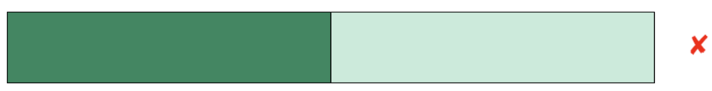

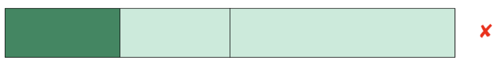

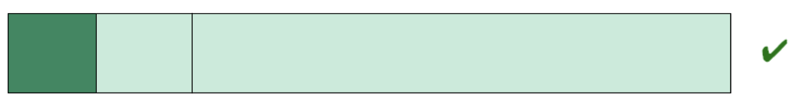

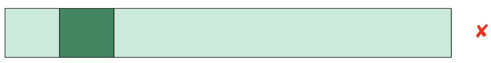

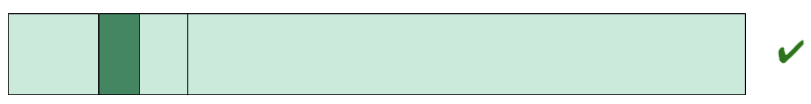

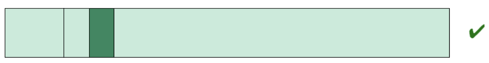


### Summary

- Delta debugging is a technique, not a tool
- Bad news: probably must be re-implemented for each significant system to exploit knowledge changes
- Good news
	- Relatively simple algorithm, big payoff
	- It is worth re-implementing

## Debugging rulles

### 1) "Understand the system"

- READ THE MANUAL
- Debugging something you don't understand is pointlessly hard
- Just as with testing, subject knowledge matters --  here you need knowledge of the source code as well

### 2) "Make it fail"

- You can't debug what you can't produce
- Find a way to reliably make a system fail
- Record everything, and look for correlation
- Don't assume something "can't" be a cause

### 3) "Quit thinking and look"

- Don't hypothesize *before* examining the failure in detail -- examine the evidence, *then* think
- Engineers like to think, don't like to look nearly as much (instrumentation and running a debugger both look like *work*)
- "If is is doing $X$, must be $Y$" -- maybe (but must check)

### 4) "Divide and conquer"

- Heart of delta-debugging
- Narrow down the source of the problem
- "Does it still fail if this factor is removed?"
- Use a debugger to check system state at checkpoints; if everything is ok, you're before the problem

### 5) "Change one thing at a time"

- A common very bad debugging strategy:
	- It could be one of $X$, $Y$, or $Z$. Let's change all three and run it again
- Isolate factors, because that's how you get experiments that tell you something
- If code worked before last check-in, maybe you should look at *just those changes*

### 6) "Keep an audit trail"

- Don't rely on your perfect memory to remember everything you tried
- Don't assume only you will ever work on this problem
- Rule of thumb: log every 20 minutes

### 7) "Check the plug"

- Question assumptions
- Don't always trust the debugger
- Don't trust your tests

### 8) "Get a fresh view"

- It's OK to ask for help
- Experts can be useful
- Explain what happens, not what you think is going on

### 9) "If you didn't fix it, it ain't fixed"

- Once you "find the cause of a bug" confirm that changing the cause actually removes the defect
- A bug isn't done until the fix is in place and confirmed to actually fix the problem
	- You might understand the symptom, but not the underlying problem

## Fault localization

- An effort to automatically find (one of the) causes of an observable failure
- It is inherently difficult because there are many causes of the failure that are not the fault
	- We don't mind seeing the chain of cause and effect reaching back to the fault
	- But the fact that we reached the fault at all is also a cause!

### Spectrum based localization

- Collect *spectra* of executions, rather than the full executions
- Just count the number of times each source statement executed

### The tarantula approach


- A "statistical" approach to fault localization
- Originally conceived of as a visualization approach: produces a picture of all source in program, colored according to how "suspicious" it is
	- Green: not likely to be faulty
	- Yellow: a little suspicious
	- Red: very suspicious, likely fault
- How do we score statements from this approach
	- Assume we have a large set of tests, some passing, some failing
	- Coverage entity $e$ (e.g. statement)
		- $failed(e)$: number of tests covering $e$ that fail
		- $passed(e)$: number of tests covering $e$ that pass
		- $totalfailed$, $totalpassed$ is what you'd expect
	- Suspiciousness is computed as: $suspiciousness(e) = \frac{\frac{failed(e)}{totalfailed}}{\frac{passed(e)}{totalpassed} + \frac{failed(e)}{totalfailed}}$
	- Not very suspicious: appears in almost every passing test and almost every failing test
	- Highly suspicious: appears much more frequently in failing than passing tests
- Benefits
	- No problem if the fault is reached in some successful test cases
	- Doesn't depend on having any successful tests that are similar to the failing test(s)
	- Provides a *ranking* of every statement, instead of just a set of nodes -- directions on where to look next
		- Numerical, even -- how *much* more suspicious is $X$ than $Y$
	- The pretty visualization may be quite helpful in seeing relationships between suspicious statements
	- Is it less sensitive to accidental features of random tests, and to test suite quality in general?

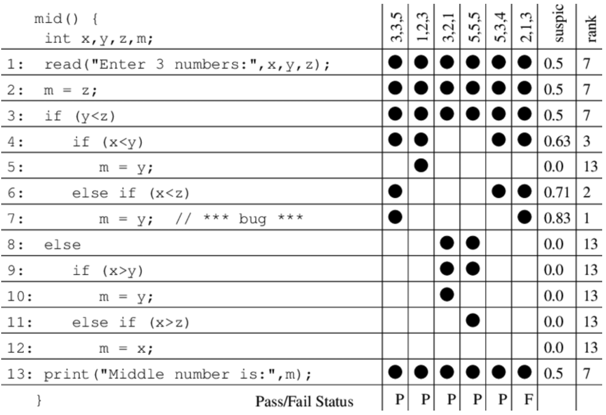

### Other approaches

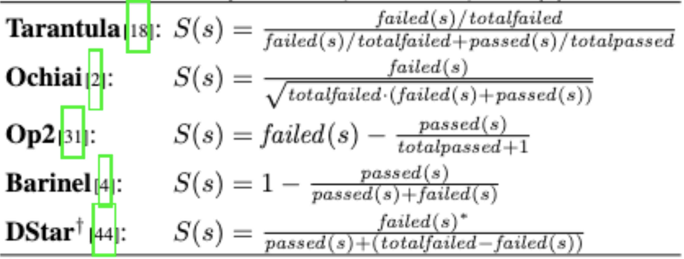

## Static analysis

- Developed to identify **future** maintainability problems
- Neither syntax errors nor compiler warnings
- **Symptoms** of poor design or implementation choices
- Issue with design of the code

### Code smells

#### God class

> God class tends to concentrate functionality from several unrelated classes

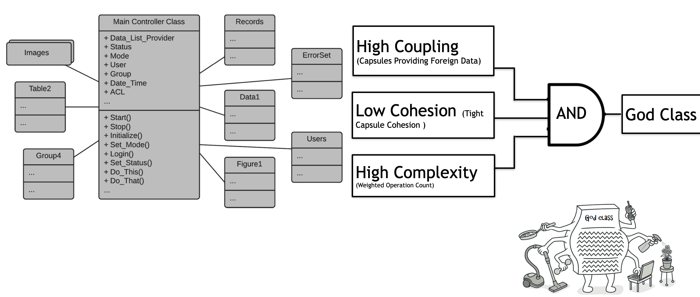

#### Internal duplication

```Java
public double ringSurface(Ring r1, Ring r2) {
	// calculate the surface of the first circle
	double surf1 = bigCircleSurface(r1);
	// calculate the surface of the second circle
	double surf2 = smallCircleSurface(42);
	return surf1 - surf2;
}

private double bigCircleSurface(Ring r1) {
	pi = 4 * (Math.arctan(1 / 2.0) + Math.arctan(1 / 3.0));
	return pi * Math.sqrt(r1);
}

private double smallCircleSurface(Ring r2) {
	pi = 4 * (Math.arctan(1 / 2.0) + Math.arctan(1 / 3.0));
	return pi * Math.sqrt(r2);
}
```

#### Data class

> Class that have fields, getting and setting methods for the fields: data holders but Objects should have data *and* behavior

```Java
public class Bottle {
	int hieght;
	int diameter;
	Cap capType;

	public double getDiameter();
}
```

```Java
void selectShippingContainer(Bottle bottle) {
	if (bottle.getDiameter() > MAX_DIMENSION) {
		shippingContainer = WOODEN_CRATE;
	}
	else {
		shippingContainer = CARDBOARD_BOX;
	}
}
```

### Test smells

Bad programming practices in unit test code

- How test cases are organized?
- Implemented
- Interact with each other

#### Assertion roulette

> Developer does not provide a explanation message for each assert statement

```Java
@MediumTest
public void testCloneNonBareRepoFromLocalTestServer() throws Exception {
	Clone cloneOp = new Clone(false, integrationGitServerURIFor("small-repo.early.git"), helper().newFolder());
	Repository repo = executeAndWaitFor(cloneOp);
	assertThat(repo, hasGitObject("ba1f63e4430bff267d112b1e8afc1d6294db0ccc"));
	File readmeFile = new File(repo.getWorkTree(), "README");
	assertThat(readmeFile, exists());
	assertThat(readmeFile, ofLength(12));
}
```

#### Eager test

> Developer calls multiple methods of the production class

```Java
@Test
public void NmeaSentence_GPGSA_ReadValidValues() {
	NMeaSentence nmeaSentence = new NmeaSentence("$GPGSA,A,A,3,04,05,,09,12,,,24,,,,,2.5,1.3,2.1*39");
	assertThat("GPGSA - read PDOP", nmeaSentence.getLatestPdop(), is("2.5"));
	assertThat("GPGSA - read HDOP", nmeaSentence.getLatestHdop(), is("1.3"));
	assertThat("GPGSA - read VDOP", nmeaSentence.getLatestVdop(), is("2.1"));
}
```

#### Magic number test

> Use of numeric literals

```Java
@Test
public void testGetLocalTimeAsCalendar() {
	Calandar localTime = calc.getLocalTimeAsCalandar(BigDecimal.valueOf(15.5D), Calendar.getInstance());
	assertEquals(15, localTime.get(Calendar.HOUR_OF_DAY));
	assertEquals(30, localTime.get(Calendar.MINUTE));
}
```

## Regression testing

**Performed on modified software** to provide confidence that

- The changed parts behave as intended
- The unchanged parts are not adversely affected by the modifications

**Applied**

- To new versions of the software
- After nightly builds
- During development (could be with each commit)
- Particularly advocated by agile practices

### Testing strategies

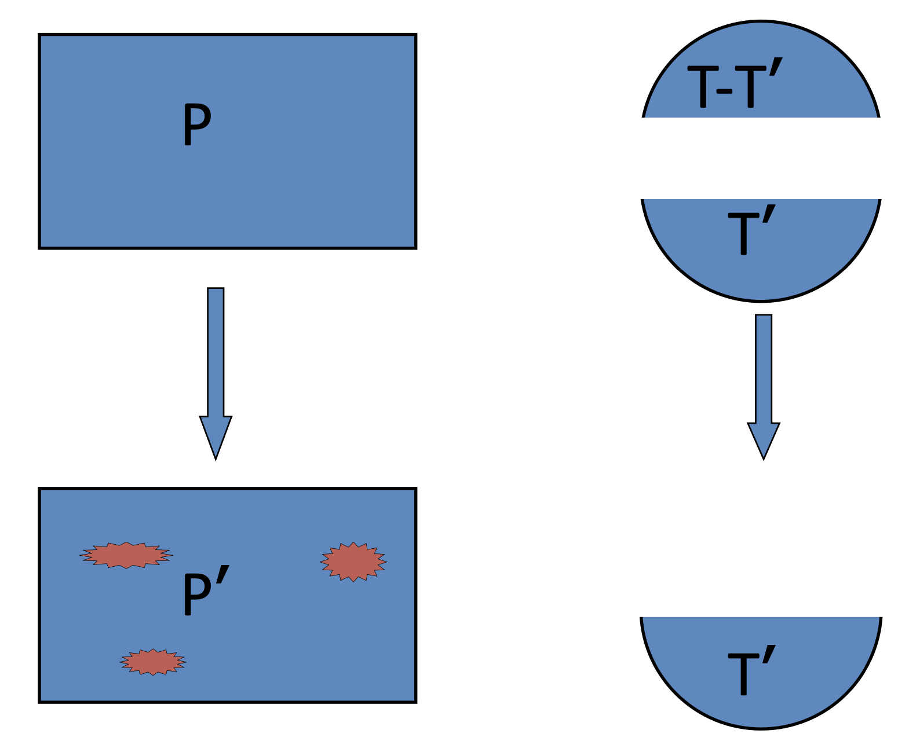

- Record branch coverage on the old version
- Walk the old and new CFGs simultaneously in depth-first order
- Whenever a difference is encountered, mark the traversing edge on the old CFG as a "dangerous edge". Cease walking forward on this path and continue the walk on other paths
	- Or equivalently bubble up this mark to the guarding branch and mark it as the "dangerous branch"
- Assess any test cases that traversed the dangerous edge/branch as needing to be rerun

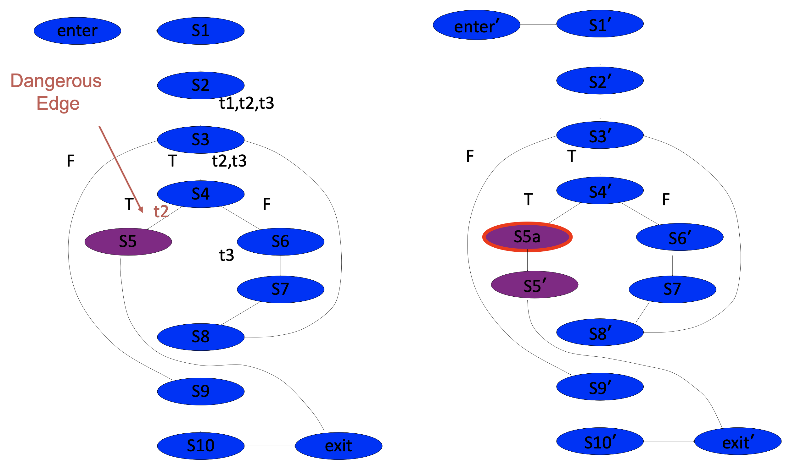

> Tests to rerun: $T' = \{ t_{2} \}$

### Test minimization

- What if $T'''$ ($T' + T''$) grows too big as new tests are added?
- Weight test cases in $T'''$ according to some criterion $C$, where $C$ is usually coverage, and then also consider
	- Cost
	- Importance
	- Error-proneness
	- Or some combination

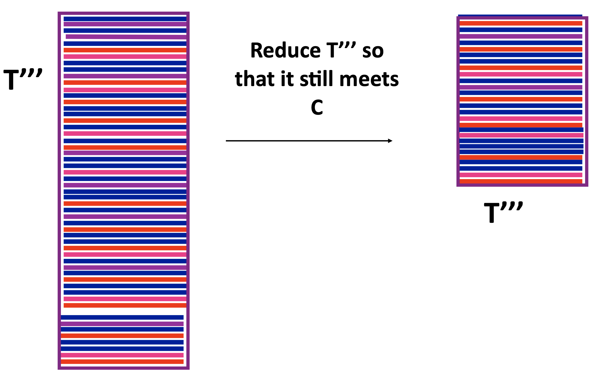

Possible technique:

1) Choose a test case that has the most coverage
2) Choose another test case that has the most additional coverage
3) Repeat step 2 until there is no additional coverage
4) All chosen test cases constitute the minimized test suite

### Test prioritization

- What if $T'$ is still too big to run in the time allowed?
- Weight test cases in $T'$ according to criterion $C$ where $C$ is 
	- Coverage
	- Cost
	- Importance
	- Error-proneness
	- Or some combination

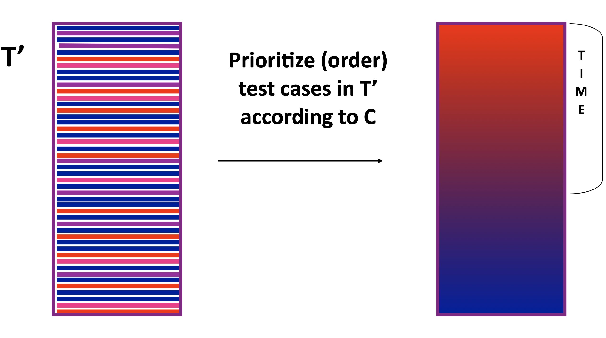

Possible technique: 

1) `i = 0`
2) `tc[i] = ` test case that has the most coverage
3) `tc[++i = ` test case that has the most additional coverage
4) Repeat step 3 until there is no additional coverage, reset coverage tracking
5) Repeat steps 2-4 until all test cases in the original suite have been utilized