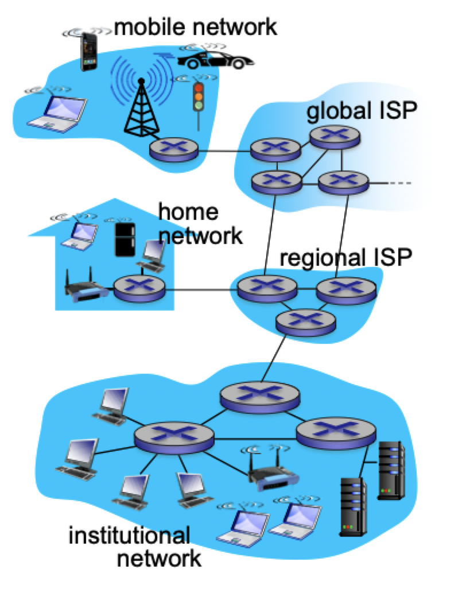
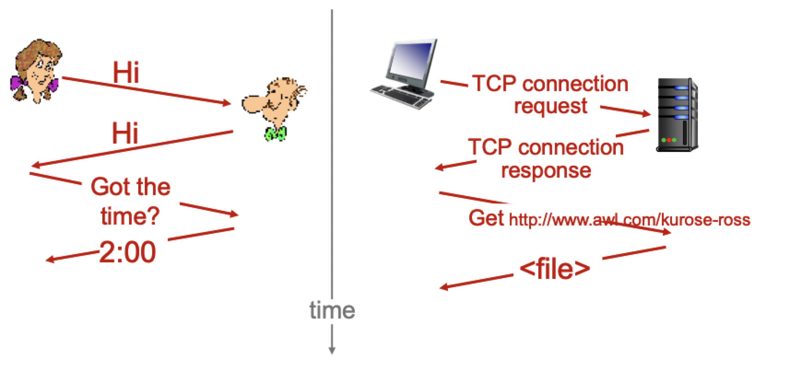

# What is the internet

## Internet introduction

### Nuts and bolts view

- Billions of connected computing devices
	- *host* = end system running network apps
- Communication links
	- Fiber
	- Cooper
	- Radio
	- Satellite
- Bandwidth: transmission rate
- Packet switches: forwards packets (chunks of data)
	- Can be done by routers and switches

### Abstracting the internet

- "network of networks"
- Provides services and programming interfaces to applications
	- Web, VoIP, email, games, e-commerce, social nets
- How applications talk? *protocols*
	- Control sending and receiving of messages
		- TCP
		- IP
		- HTTP
		- Skype,
		- 802.11
	- *Internet standards*
		- RFC: *request for comments*
		- IETF: *Internet engineering task force*

## Protocol

> A *protocol* define **format, order and messages sent and received** among network entities and **actions taken** on message transmission or reception

## Network structure

- Network edge: hosts (clients and servers)
- Access networks, physical media: wired, wireless communication links
- Network core: interconnected routers