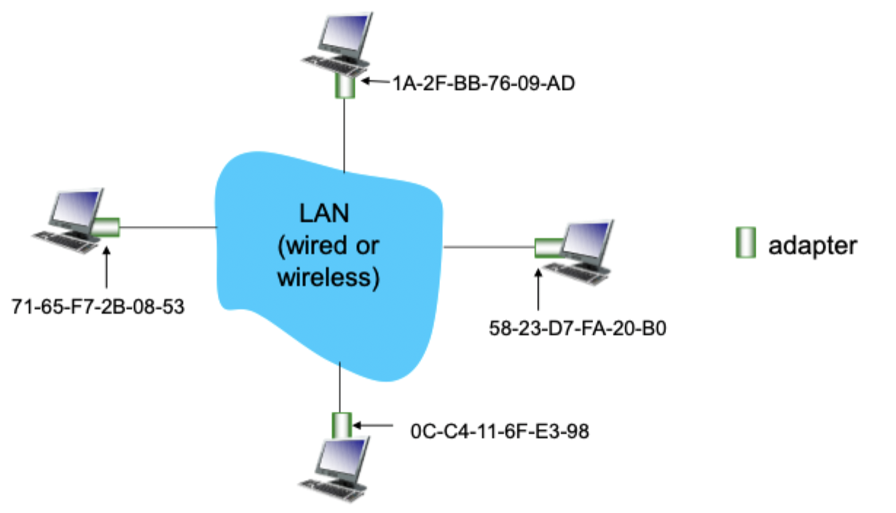
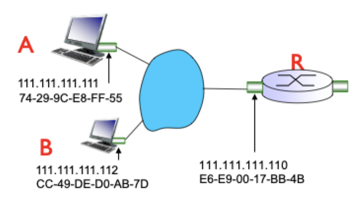
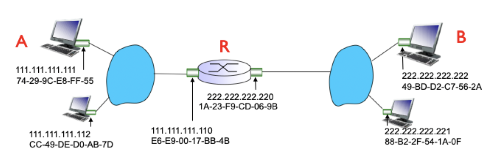
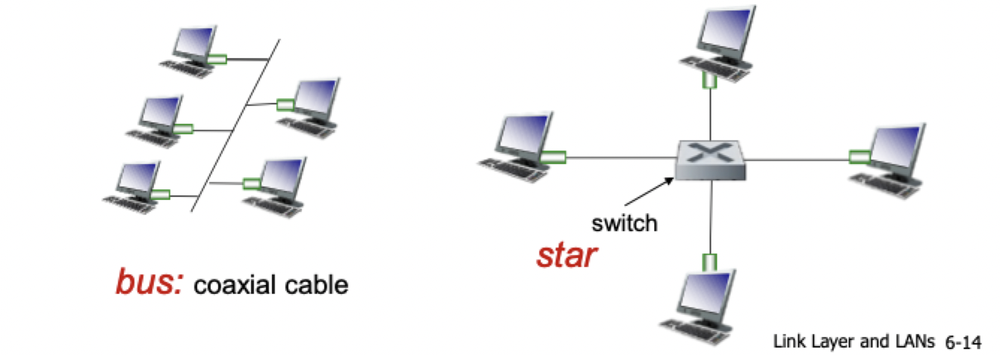

# ARP, MAC, and ethernet

## MAC addresses

- Used locally to get frame from one interface to another physically connected interface
- Interfaces are part of the same network (in IP subnet/addressing sense)
- 48 bits long, typically burned into NIC ROM, but sometimes settable with software
- Written in hexadecimal
- Allocation administered by IEEE
	- Manufacturers buy portions of MAC address space
- Helpful analogies
	- MAC address is like a social security number
	- IP address is like a postal address
- MAC address are portable
	- Can move LAN card from one LAN to another
- IP hierarchical addresses are *not* portable
	- Depends on IP subnet node that is attached
- Each adapter on a LAN has a unique MAC address



## ARP: address resolution protocol

> How can we determine an interface's MAC addresses, knowing its IP address?

- **ARP table**: each IP node (host or router) *on same LAN* has a table
- IP/MAC address mappings for some LAN nodes
- TTL (time to live): time after which address mapping will be forgotten (typically 20 min)
- Comparable to DNS

### Same LAN

- Host A wants to send a datagram to host B
	- B's MAC address is not in A's ARP table
- Host A *broadcasts* ARP query packet, containing B's IP address
	- Destination MAC address: = `FF-FF-FF-FF-FF-FF`
	- All nodes on LAN receives ARP query
- Host B receives ARP packet, replies to A with its own MAC address
	- Frame sent to A's MAC address (unicast)
- A caches  IP-to-MAC address pair in its ARP table until mapping times out
	- "Soft state": information that times out (goes away) unless refreshed
- ARP is "plug-and-play"
	- Nodes create their ARP tables *without intervention from net administrator*
- ARP is above the link layer
	- ARP queries and responses encapsulated in link layer frames



### Another LAN

- Host A creates IP datagram with IP source A, destination B
- A creates link layer frame with R's MAC address as destination address, frame contains A-to-B IP datagram
- Frame sent from A to R
- Frame received at R, datagram removed, passed up to IP
- R forwards datagram with IP source A, destination B
- R creates link-layer frame with B's MAC address as destination address, frame contains A-to-B IP datagram



## Ethernet

- "Dominant" wired LAN technology
- Single chip, multiple speeds
- First widely used LAN technologies
- Simple and cheap
- Has kept up with the speed race

### Physical topology

- *Bus*: popular through the mid 90's
	- All nodes in same collision domain (can collide with each other)
- *Star*: prevails today
	- Active *switch* in center
	- Each spoke runs a (separate) ethernet protocol (nodes do not collide with each other)



### Frame structure

- Preamble
	- 7 bytes with pattern 10101010 followed by one byte with pattern 10101011
	- Used to synchronize receiver, sender clock rates
- Addresses: 6 byte source, destination MAC addresses
	- If adapter receives frame with matching destination address, or with broadcast address, it passes data in frame to network layer protocol
	- Otherwise, adapter discards frame
- Type: indicates higher level protocol
	- Mostly IP but others possible
- CRC: cyclic redundancy check at receiver
	- Error detected -> frame is dropped

### Standards

- Connectionless: no handshaking between sending and receiving NICs
- Unreliable: receiving NIC doesn't send ACKs or NACKs to sending NIC
	- Data in dropped frames recovered only if initial sender uses higher layer RDT, otherwise dropped data is lost
- Ethernet's MAC protocol
	- Unslotted CSMA/CD with exponential backoff
- Many different ethernet standards
	- Common MAC protocol and frame format
	- Different speeds
	- Different physical layer media

## Switches

- Link layer device: takes an *active* role
	- Store, forward ethernet frames
	- Examine incoming frame's MAC address, selectively forward frame to one-or-more outgoing links 
	- Uses CSMA/CD to assess segments
- Transparent: hosts are unaware of presence of switches
- Plug-and-play
	- Switches do not need to be configured
	- Self-learning

### Multiple simultaneous connections

- Hosts have dedicated, direct connection to switch
- Switches buffer packets
- Ethernet protocol used on each incoming link, but no collisions
- Full duplex: each link is its own collision domain
- *Switching*: A-to-A' and B-to-B' can transmit simultaneously without collisions
- Switched ethernet is no longer a broadcast medium

### Forwarding table

- Each switch has a table
	- MAC address
	- Interface
	- TTL
- Looks like a routing table, but is much simpler than a routing protocol

### Self-learning

- Switch *learns* which hosts can be reached through which interfaces
- When frame received -> learns location of sender (incoming LAN segment)
- Records sender/location pair is switch table

### Frame filtering/forwarding

```
Record incoming link, MAC address of sending host
Index switch table using MAC destination address
if entry found for destination:
	if destination on segment from which frame arrived:
		drop frame
	else:
		forward frame on interface indicated by entry
else:
	flood on all interfaces except arriving interface
```

### Interconnecting switches

- Can be connected together
- Self-learning allows forwarding frames destined to other LANs via multiple switches
- Process exactly like single switch LANs

## Switches vs. routers

- Both are store-and-forward
	- *Routers*: network layer devices
	- *Switches*: link layer devices
- Both have forwarding tables
	- *Routers*: compute tables using routing algorithms, IP addresses
	- *Switches*: learn forwarding table using flooding, learning, MAC addresses

| Switches | Routers |
| -------- | ------- |
| Switching tables: `<dest MAC, outgoing linkg>` | Forwarding tables: `<dest IP, outgoing link`
| Self learning | Requires configuration
| Layer-2: fast processing in hardware | Layer-3: slower processing in hardware and software |
| Isolation via forwarding/filtering | Isolation among subnets |
| Susceptible to broadcast storms | No broadcast storms |
| Topology: spanning tree | Topology can be anything (routing is intelligent) |
| Support for 100's of end hosts | Support for 1000s of end hosts |
