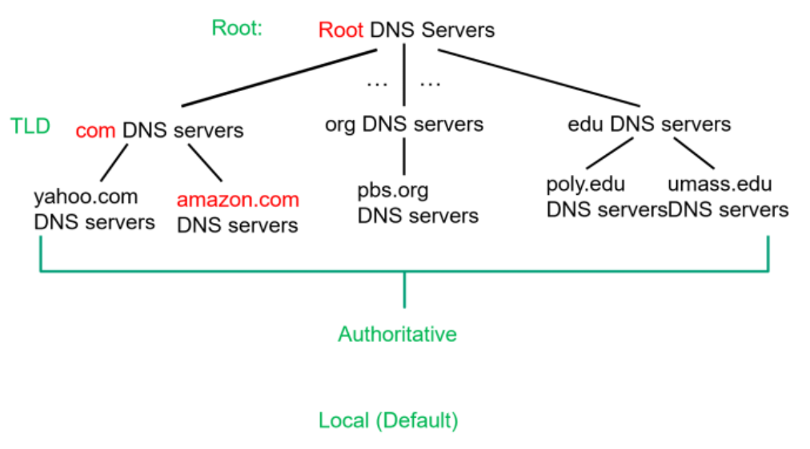

# DNS: domain name system

## Services

- Hostname to IP address translation
- Host aliasing: canonical vs. alias names
- Mail server aliasing
- Load distribution
	- Replicated web servers: set of IP addresses for one canonical name
	- Rotating

## Distributed and hierarchical database

1) Client queries root server to find top level domain server
2) Client queries top level domain server for a domain
3) Client queries local domain server to get IP address



### Root name servers

- Contacted by local name server that cannot resolve name
- Root name server
	- Contacts authoritative name server if name mapping not known
	- Gets mapping
	- Returns mapping to local name server
- Limited number of logical servers, but each can be replicated many times

### Top-level domain servers

- Responsible for .com, .net, .org, and all top-level country domains (.uk, .fr, .ca)
- Operates beneath the root DNS servers

### Authoritative DNS servers

- An organization's own DNS server(s), providing authoritative hostname to IP mappings for organization's named host
- Can be maintained by organization or service provider

### Local DNS name servers

- Each ISP has one (the default name server for most hosts)
- When a host makes a DNS query, it is sent to this server
	- Has a local **cache** of recent name-to-address translation pairs (may be out-of-date)
	- Acts as proxy, forwarding query into hierarchy and updates cached records
- This server is typically specified in `/etc/resolv.conf` and can by edited using network settings

### Resolution examples

#### Iterated query

- Contacted server replies with 
	- An answer
	- The name of the server to contact if no answer is available

> I don't know this name, but ask this server


#### Recursive query

- Puts burden of name resolution on the contacted name server
- Each server keeps asking other servers on behalf of the server that asks them

## DNS records

- DNS is a distributed database storing resource records (RR) with the following schema

$$
	(\text{name},\, \text{value},\, \text{type},\, \text{ttl})
$$
- Type dictates the other fields
- `type=A`
	- **name** is a hostname
	- **value** is an IP address
- `type=NS`
	- **name** is a domain
	- **value** is the hostname of an authoritative name server for this domain
- `type=CNAME`
	- **name** is an alias name for some canonical (the real) name
	- **value** is the canonical name
- `type=MX`
	- **value** is the name of a mail server associated with **name**
- `ttl` is the amount of time the RR record can be cached for

### Inserting records

- Example: new startup "Network Utopia"
- Register name `networkutopia.com` at DNS registrar
- Provide names and IP addresses of authoritative name servers
- Registrar will verify uniqueness and add it to the database for a small fee

### Querying records

> Visiting the website: `www.networkutopia.com`

1) Host sends query to local DNS server
2) Local DNS server asks TLD or root server if request not in cache
3) TLD server provides A and NS records for request

```
(networkutopia.com, dsn1.networkutopia.com, NS)
(dsn1.networkutopia.com, 212.212.212.1, A)
```

4) Local DNS sends query to authoritative server
5) Authoritative name server provides type A record

```
(www.networkutopia.com, 212.212.212.3, A)
```

6) Local DNS server returns this info to host (and caches RR for future use)
7) Host establishes TCP/HTTP connection to (IP: 212.212.212.3, port: 80)

### Caching and updating record

- Once (any) name server learns a mapping, it *caches* it
	- Cached entries timeout (disappear) after its TTL (time-to-live) elapses (2 days by default)
	- TLD servers typically cached in local name servers
- Cached entries may be *out-of-date*
	- If name host changes IP address, may not be known internet wide until all TTLs expire
- Records in the database
	- Updated statically or manually
	- Update and notify mechanism in RFC 2136

## DNS protocol

- *Query* and *reply* messages share the same message format

### Messages

- Message header
	- Identification: a 16 bit number used for query, reply use the same number
	- Flags
		- Query or reply
		- Recursion desired
		- Recursion available
		- Reply is authoritative
- Message body
	- Name and type fields for a query
	- One or more RR for a query in a response
	- One or more RR for authoritative name servers
	- A section for additional information that might be useful

### Load balancing

- DNS may return many resource records in same response
- Clients
	- By default, choose the first
	- Could choose not to, but this is not part of the standard
- Order of multiple records is **unspecified**
	- Round robin most often used to prevent overwhelming of a particular resource
	- A static or numerical preference for "closer" networks is also viable
	- 