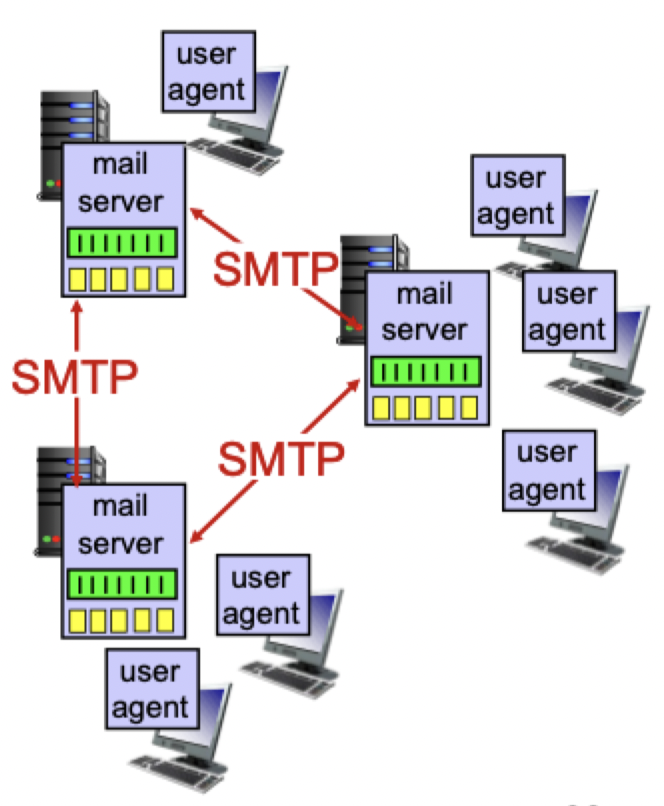
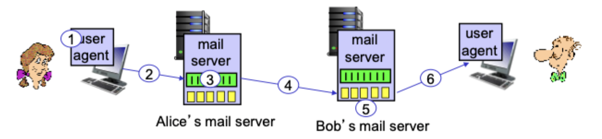
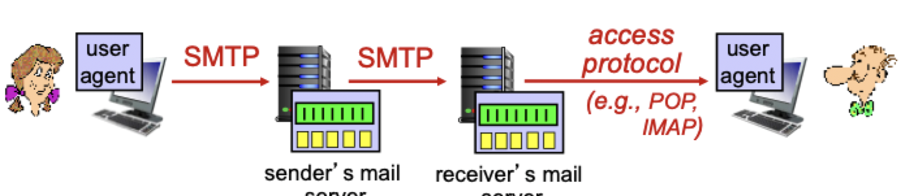

# Email

## Mail servers

- *Mailbox* contains incoming messages for user
- *Messaging queue* of outgoing (to be sent) mail messages
- *SMTP protocol* occurs **between mail servers** to send email messages
	- Client: sending mail server
	- Server: receiving mail server



## SMTP

- Uses TCP to reliably transfer email messages from client to server (on port 25)
- Direct transfer: server to receiving server
- Three phases of transfer
	1) Handshake (greeting)
	2) Transfer of message (in 7 bit ASCII)
	3) Closure
- Messages: command/response
	- **commands**: ASCII text
	- **Response**: status code and phrase

### Scenario: sending a message

1) Alice uses UA to compose message to `bob@someschool.edu`
2) Alice's UA sends message to her mail server; message placed in message queue
3) Client side of SMTP opens TCP connection with Bob's mail server
4) SMTP client sends Alice's message over the TCP connection
5) Bob's mail server places the message in Bob's mailbox
6) Bob invokes his user agent to read message



### Sample interaction

```
SERVER: 220 hamburger.edu
CLIENT: HELO crepes.fr
SERVER: 250 Hello crepes.fr, pleased to meet you
CLIENT: MAIL FROM: <alice@crepes.fr>
SERVER: 250 alice@crepes.fr ... Sender OK
CLIENT: RCPT TO: <bob@hamburger.edu>
SERVER: 250 bob@hamburger.edu ... Recipient OK
CLIENT: data
SERVER: 354 Enter mail, end with "." on a line by itself
CLIENT: Do you like ketchup?
CLIENT: How about pickles?
CLIENT: .
SERVER: 250 Message accepted for delivery
CLIENT: QUIT
SERVER: 221 hamburger.edu closing connection
```

- Never seen by the user if well encapsulated
- Beware of email spoofing (protocol address $\ne$ message address)

## SMTP vs HTTP

| SMTP | HTTP |
|------|------|
| Transfer messages (files) | Transfer webpages (files) |
| **Push based** | **Pull based** |
| Persistent connections | Persistent or non-persistent |
| SMTP requires messages (header & body) to be in 7-bit ASCII | Also have ASCII command/response interaction, status codes |
| SMTP: multiple object sent in multipart message | HTTP: each object encapsulated in its own response message |
| SMTP server uses `\r\n.\r\n` to determine end of message | HTTP terminates with `\r\n\r\n`

## Mail access protocols

- SMTP does not allow users to read messages
- Mail access protocols allow users to retrieve from the server



### POP3

- POP: **P**ost **O**ffice **P**rotocol

#### Authorization phase

- Client commands
	- `user`: declare username
	- `pass`: password
- Server responses
	- `+OK`
	- `-ERR`

#### Transaction phase

- `list`: list message numbers
- `retr`: retrieve message by number
- `dele`: delete message
- `quit`

#### Modes

- Download and delete: cannot reread message from different clients
- Download and keep: copies of messages stored on different clients

### IMAP

- Keep all messages in one place: at server
- Allows users to organize messages in folders
- Keeps user state across sessions
- Essentially an extended version of POP

### HTTP

- Mail through HTTP like gmail
- Typically encapsulates another mail access protocols