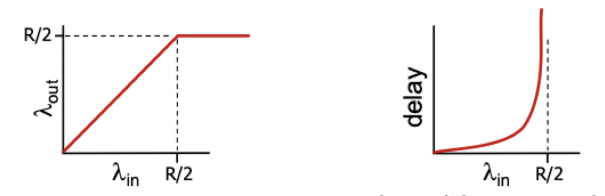
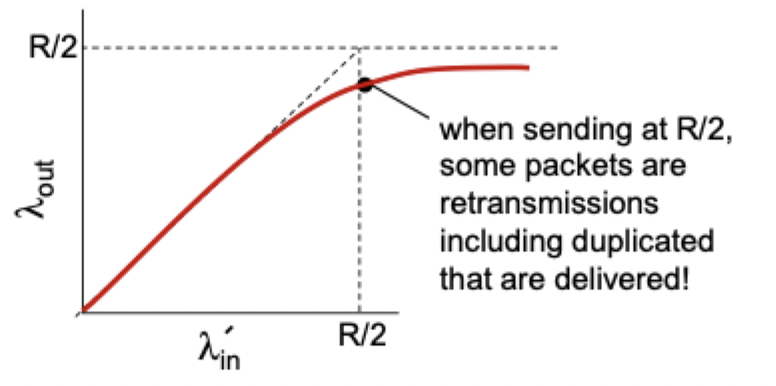
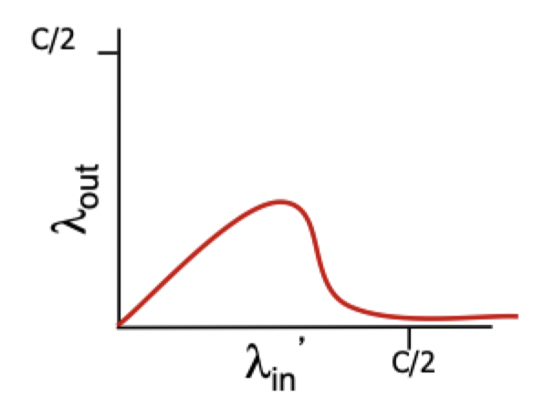
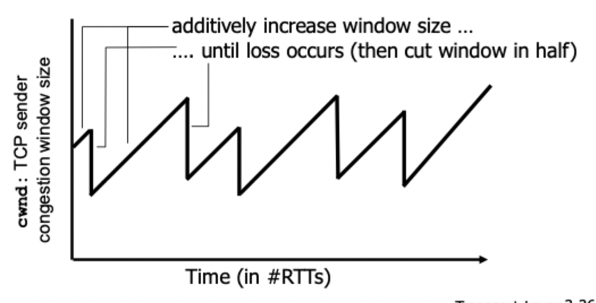

# Congestion control

## What is it?

- Informally: too many sources sending too much data too fast for *network* to handle
- Manifestations
	- Lost packet (buffer overflow at routers)
	- Long delays (queueing in routers buffers)
- **Not** the same as flow control

## Causes and costs

### Scenario 1

- Two senders, two receivers
- One router, infinite buffers
- Output link capacity: $R$
- No retransmission
- Maximum **per-connection** throughput: $R/2$
- Large delays as arrival rate $\lambda_{\text{in}}$ approaches capacity

### Scenario 2

- One router, *finite* buffers
- Sender retransmission of timed-out packets
	- Application layer input = Application layer output
	- Transport layer input includes *retransmissions*
- Queues in router fill up and packets get dropped
- Retransmission *adds* more packets to the network
- Ideally, sender has perfect knowledge of packet loss
	- Should send packets *if and only if* buffer space is available
- Realistically, two copies are delivered
	- More work for a given "goodput"
	- Uneeded retransmissions decreases "goodput"

### Scenario 3

- 4 senders
- Multihop paths
- Timeout/retransmit
- When packet is dropped, any "upstream transmission" capacity used for that packet was **wasted**

## Control and avoidance

### End-to-end congestion control

- No explicit feedback from network
- Congestion inferred from end-system observed loss delay
- Approach taken by TCP (adapts the sending window)

### Network assisted congestion control

- Routers provide feedback to end systems
- Single bit indicating congestion
- Explicit rate for sender to send at

### Congestion avoidance

- Additive increase multiplicative decrease (AIMD)
- Approach: sender increases transmission rate (window size), probing for usable bandwidth until loss occurs
	- Additive increase: increase `cwnd` by 1 max-segment-size every round-trip-time until loss is detected
	- Multiplicative decrease: cut `cwnd` in half after a loss

