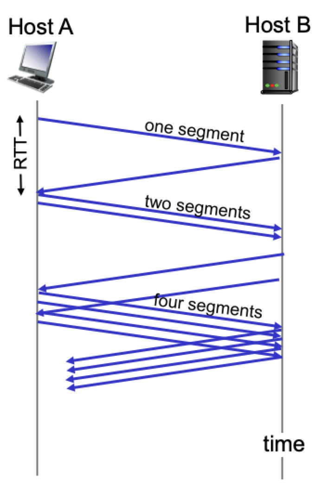

# Congestion control

## What is it?

- Informally: too many sources sending too much data too fast for *network* to handle
- Manifestations
	- Lost packet (buffer overflow at routers)
	- Long delays (queueing in routers buffers)
- **Not** the same as flow control

## Causes and costs

### Scenario 1

- Two senders, two receivers
- One router, infinite buffers
- Output link capacity: $R$
- No retransmission
- Maximum **per-connection** throughput: $R/2$
- Large delays as arrival rate $\lambda_{\text{in}}$ approaches capacity

### Scenario 2

- One router, *finite* buffers
- Sender retransmission of timed-out packets
	- Application layer input = Application layer output
	- Transport layer input includes *retransmissions*
- Queues in router fill up and packets get dropped
- Retransmission *adds* more packets to the network
- Ideally, sender has perfect knowledge of packet loss
	- Should send packets *if and only if* buffer space is available
- Realistically, two copies are delivered
	- More work for a given "goodput"
	- Uneeded retransmissions decreases "goodput"

### Scenario 3

- 4 senders
- Multihop paths
- Timeout/retransmit
- When packet is dropped, any "upstream transmission" capacity used for that packet was **wasted**

## Control and avoidance

### End-to-end congestion control

- No explicit feedback from network
- Congestion inferred from end-system observed loss delay
- Approach taken by TCP (adapts the sending window)

### Network assisted congestion control

- Routers provide feedback to end systems
- Single bit indicating congestion
- Explicit rate for sender to send at

### Congestion avoidance

- Additive increase multiplicative decrease (AIMD)
- Approach: sender increases transmission rate (window size), probing for usable bandwidth until loss occurs
	- Additive increase: increase `cwnd` by 1 max-segment-size every round-trip-time until loss is detected
	- Multiplicative decrease: cut `cwnd` in half after a loss

### Slow start

> Rationale: initial rate is slow but ramps up exponentially fast

- At connection start `cwnd = 1 MSS`
- Double `cwnd` every `RTT`
- Can be done by incrementing `cwnd` for each ACK received

### Detecting and reacting to loss

- Indicated by timeout
	- `cwnd` set to 1 MSS
	- Window grows exponentially to a threshold, then grows linearly
- Indicated by triple ACK
	- Duplicate ACKs indicate network can deliver some segments
	- `cwnd` is cut in half then grows linearly

### Fast recovery

> Main idea: infer successful transmission even from duplicate ACK

- Rationale
	- Every ACK (even duplicates) is triggered by some new packet that made it (even out of order)
	- Keep the number of packets in the pipeline constant
- Action
	- Fast retransmit upon triple duplicate
	- Inflate window: increase by 1 MSS per every duplicate ACK received
	- Deflate window: when new (non-duplicate) ACK received
- Fast recovery recommended, but not required
	- Not implemented in TCP Tahoe
	- Implemented in TCP Reno

## Throughput and fairness

### Average throughput

- Average throughput as a function of window size
- Ignore slow start, assume always data to send
- $W$: window size (measured in bytes) where loss occurs
	- Average window size (# in-flight-bytes) is $\frac{3}{4}W$
	- Average throughput is $\frac{3}{4}W$ per `RTT`

### Fairness

> Goal: if $K$ TCP sessions share the same bottleneck link of bandwidth $R$, each should have an average rate or $\frac{R}{K}$

#### Why TCP is fair?

- Additive increase gives slope of $1$, as throughput increases
- Multiplicative decrease decreases throughput proportionally

#### Violation is practice

- Fairness and UDP
	- Multimedia apps often do **not** use TCP
	- Do not want rate throttled by congestion control
	- Pump audio/video at constant rate, tolerating packet loss
- Fairness and RTT
	- Flows with longer RTTs get lower rate
- Fairness and parallel TCP connections
	- Nothing prevents an app from opening parallel connections between 2 hosts
	- Web browsers do this
- Fairness and multi-hop paths
	- Flows that go over multiple hops compete with more flows