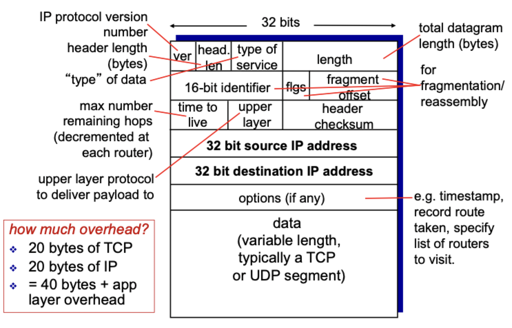
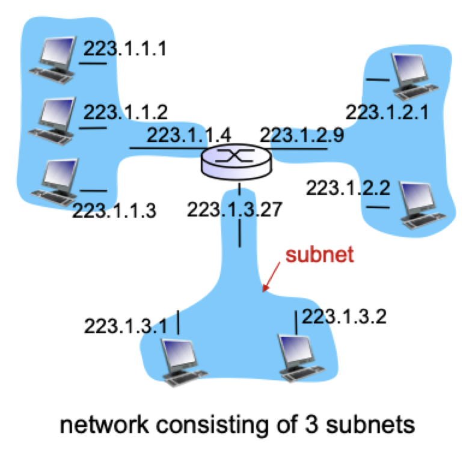
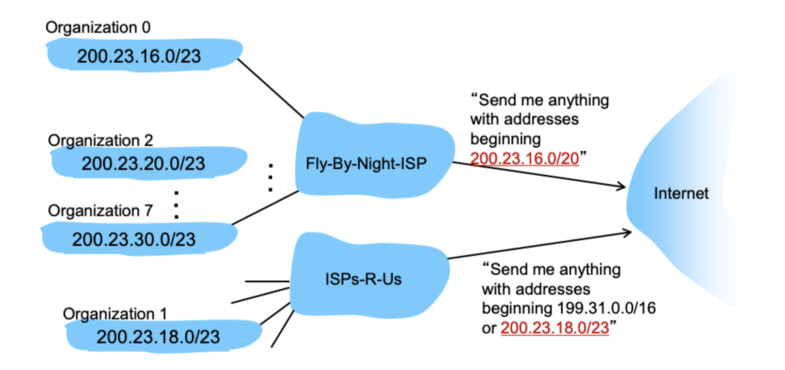

# Internet protocol (part 1)

## Datagram format

> Segment size should be larger than overhead to utilize resource efficiently

## Fragmentation

### Disassembly

- When IP receives datagram larger than maximum transmission unit, it is broken into smaller datagrams
- Done at the routers

### Reassembly

- Combines smaller datagrams into larger ones
- Done at the final destination

## IP addressing

> IP address: a 32 bit identifier for a host

- IP addresses typically associated with an *interface*
	- Connection between host and router
	- Routers can have multiple interfaces
		- Wired (ethernet)
		- Wi-Fi
	- IP addresses associated with *each* interface

### Subnets

- Subnet part of an IP address is the higher order bits
- Host part of an IP address is the lower order bits
- Device interfaces with same subnet part can reach each other *without intervening router*

- To determine subnets
	- Detach each interface from its host or router
	- Each isolated network is called a *subnet*
- Historic classful network architecture

| Class | Starting with | Range of first byte | Network ID format | Host ID format | Number of networks | Number of hosts |
| ----- | ------------- | ------------------- | ----------------- | -------------- | ------------------ | --------------- |
| A | 0 | 0 - 127 | `a` | `b.c.d` | $2^{7} = 128$ | $2^{24} = 16777216$ |
| B | 10 | 128 - 191 | `a.b` | `c.d` | $2^{14} = 16384$ | $2^{16} = 65536$ |
| C | 110 | 192 - 223 | `a.b.c` | `d` | $2^{21} = 2097152$ | $2^{8} = 256$ |

### CIDR

> CIDR: **C**lassless **I**nter**D**omain **R**outing

- Subnet portion of address of arbitrary length
- Address format: `a.b.c.d/x`, where $x$ is the number of bits in subnet portion of address
- Since $x$ is variable, no need for classes

### Special IP addresses

- All 1's means "all hosts on this subnet"
- All 0's means "this subnet"
- Localhost: 127.0.0.1
- Multicast: 224.0.0.0/8 - 239.0.0.0/8
- Private networks
	- Not routed, typically used through NATs
	- 24 bit block and 8 bit prefix
	- 20 bit block and 12 bit prefix
	- 16 bit block and 16 bit prefix

## How to get one?

- Hard coded by system admin in a file
	- Windows: Control Panel -> Network -> Configuration -> TCP/IP -> Properties
	- UNIX: `/etc/rc.config`
	- Mac: `/etc/resolv.conf`
- DHCP: **D**ynamic **H**ost **C**onfiguration **P**rotocol: dynamically get address from a server

### DHCP

> Goal: allow host to *dynamically* obtains its IP address from network server when it joins network

- Can renew its lease on address in use
- Allows reuse of address (only holds address while connected)
- Support for mobile users who want to join the network
- Overview
	- Host broadcast "DHCP discover" message
	- DHCP server responds with "DHCP offer" message
	- Host requests IP address with "DHCP request" message
	- DHCP server sends address with "DHCP acknowledgement" message
- DHCP can return more than just the allocated IP address on subnet
	- Address of first-hop router for client
	- Name and IP address of DNS server
	- Network mask (indicating network versus host portion of address)

### Hierarchical addressing

- ISPs-R-Us has more specific route to organization 1
- Longest prefix match preferred

### A scarce source

- How does *an ISP* get a block of addresses?
- ICANN: **I**nternet **C**orporation for **A**ssigned **N**ames and **N**umbers
	- Allocates address
	- Manages DNS
	- Assigns domain names, resolves disputes
	- Delegates to regional registries
- More devices than IP addresses
	- 1970: $2^{32}$ was plenty of addresses
	- 2010: 1 billion computers and 5 billion phones
	- 2022: 12 billion mobile-only connected devices
- Bad utilization
	- Some prefixes are full
	- Some are reserved and unused