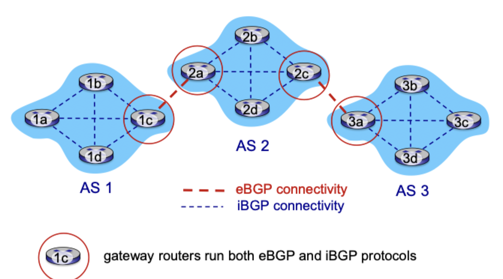
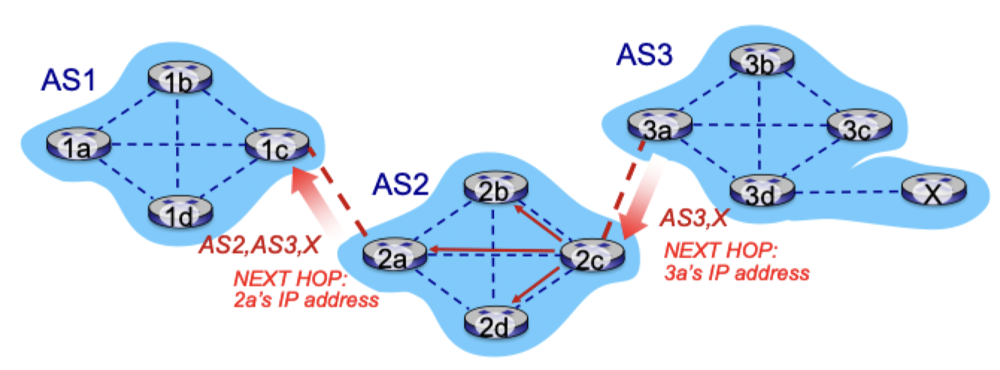
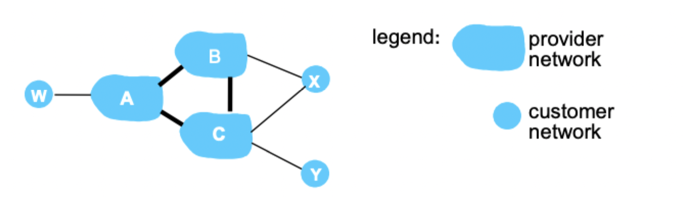
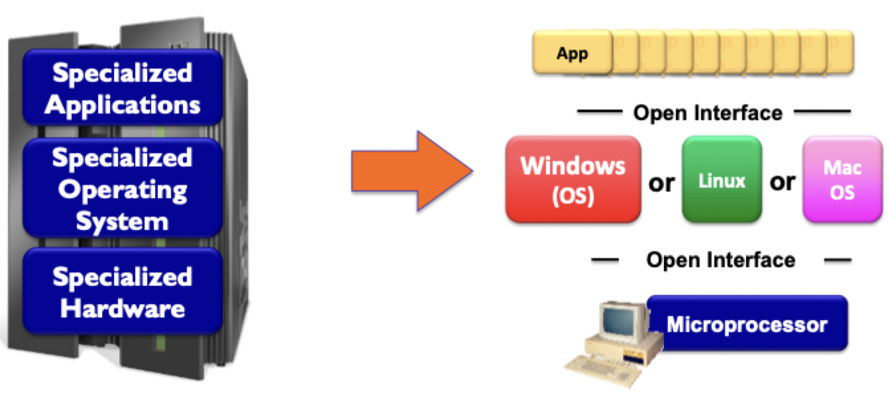

# Inter-domain routing

## Inter-AS routing

- BGP (border gateway protocol): *the* de facto inter-domain routing protocol
	- "The glue that holds the internet together"
- BGP provides AS'es a means to:
	- eBGP: obtain subnet reachability information to all AS internal routers
	- iBGP: propagate reachability information to all AS internal routers
	- Determine "good" routes to other networks based on reachability information and *policy*
- Allows subnets to advertise its existence to the rest of the internet

### Connections

## BGP

### Basics

- *BGP session*: two BGP routers exchange BGP messages over semi-pernament TCP connections
	- Advertise paths to different destination network prefixes
	- BGP is a "path vector" protocol
- When AS3 gateway router 3a advertises path AS3, X to AS2 gateway router 2c
	- AS3 *promises* to AS2 it will forward its datagrams towards X

### Path attributes

- Advertise prefix includes BGP attributes
	- Prefix + attributes = "route"
- Two important attributes
	- `AS-PATH`: list as AS'es through which prefix advertisement has passed
	- `NEXT-HOP`: indicates specific internal AS router to next-hop AS
- *Policy based routing*
	- Gateway receiving route advertisement uses *import policy* to accept or decline a path
	- AS policy also determines whether to *advertise* path to other neighboring AS'es

### Path advertisement

- AS2 router 2c receives advertisement AS3, -> X (via eBGP) from AS3 router 3a
- Based on AS2 policy, AS2 router 2c accepts path AS3 -> X, propagates (via iBGP) to all AS2 routers
- Based on AS2 policy, AS2 router 2a advertises (via eBGP) path AS2 -> AS3 -> X to AS1 router 1c
- Gateway routers may learn *multiple* paths to destination
	- AS1 gateway router 1c learns path AS2 -> AS3 -> X from 2a
	- AS1 gateway router 1c learns path AS3 -> X from 3a
	- Based on policy, AS1 gateway router 1c chooses path AS3 -> X and advertises path within AS1 via iBGP

### Forwarding table entries

- Q: how does router set forwarding table entry to distant prefix?
- A: Go to where the path to destination was learned from

## Route selection

> Router may learn about more than one route to destination AS, selects route based on following criteria

1) Local preference value attribute: policy decision
2) Shortest `AS-PATH`
3) *Closest* `NEXT-HOP` router: "hot potato routing"
4) Additional criteria

### Policy via advertisements

> Suppose an ISP only want to route traffic to/from its customer networks and does not want to carry transit traffic between other ISPs

- A would advertise A -> w to B and C
- B *chooses not to advertise* B -> A -> w to C
	- B gets no "revenue" for routing C -> B -> A -> w, since none of C, A, w are B's customers
	- C does not learn about  C -> B -> A -> w path
- C will route C -> A -> w (not using B) to get to w

### Why different routing

- Policy
	- inter-AS admin wants control over how its traffic is routed, who routes through its network
	- intra-AS: single admin, so no policy decision needed
- Scale
	- Inter-AS: critical
	- Intra-AS: less of a concern, hierarchical routing saves table size and reduces update traffic
- Performance
	- Inter-AS: policy may dominate over performance
	- Intra-AS: focuses on performance

## Software defined networking (SDN)

- Easier network management
	- Avoid router misconfigurations
	- Greater flexibility of traffic flows
- Data plane: still table-based forwarding
- OpenFlow API allows "programming" routers
	- Centralized "programming" easier: compute tables centrally and distribute
	- Distributed "programming": more difficult: computes tables as result of distributed algorithm (protocol) implemented in each and every router
- Open (non-proprietary) implementation of the control plane

### Analogy: mainframe to PC evolution

> Vertically integrated, closed and proprietary -> slow innovation, small industry

> Horizontal, open interfaces -> rapid innovation, huge industry

### Traffic engineering

- How can we specify routes?
	- Define link weights so traffic routing algorithm computes desired routes
	- Link weights are only implicit control knobs
- How can we use a specific route?
	- Can't do it
- How can we accomplish load balancing?
	- Can't do it
	- Requires a new routing algorithm

### SDN perspective

- Data plane switches
	- Fast, simple, commodity switches implementing generalized data-plane forwarding in hardware
	- Switch flow table computed, installed by a controller
	- API for table-based switch control (defines what is controllable and what is not)
	- Protocol for communicating with controller
- SDN controller (network OS)
	- Maintain network state information
	- Interacts with network control applications "above" via northbound API
	- Interacts with network switches "below" via southbound API
	- Implemented as a distributed system for performance, scalability, fault-tolerant, and robustness
- Control applications
	- "Brains" of control: implement control functions using lower-level services, API provided by SDN controller
	- *unbundled*: can be provided by a third party (distinct for routing vendor or SDN controller)

### SDN controller

- Communication layer: communicate between SDN controller and controlled switches
- Management layer
	- State of network links, switches, and services
	- A *distributed database*
- Interface layer: API and abstractions of the other two layers

## OpenFlow protocol

- Operates between controller and switch
- TCP used to exchange messages (optional encryption)

### Controller-to-switch

- *Features*: controller queries switch features, switch replies
- *Configure*: controller queries/sets switch configuration parameters
- *Modify-state*: add, delete, modify flow entries in the OpenFlow tables
- *Packet-out*: Controller can send the packet out of specific switch port

### Switch-to-controller

- *Packet-in*: transfer packet (and its control) to controller
- *Flow-removed*: flow table entry deleted at switch
- *Port-status*: inform controller of a change on a port

### SDN interaction example

1) S1, experiencing a link failure using OpenFlow port status message to notify controller
2) SDN controller receives OpenFlow message, updates link status info
3) Dijkstra's routing algorithm application has previously registered to be called when ever link status changes. It is called
4) Dijkstra's routing algorithm accesses network graph info, link state info in controller, computes new routes
5) Link state routing app interacts with flow-table-computation component in SDN controller, which computes new flow tables needed
6) Controller use OpenFlow to install new tables in switches that need updating