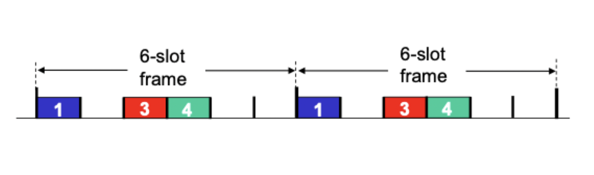
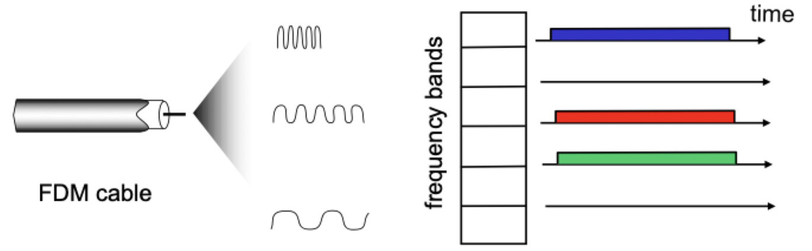
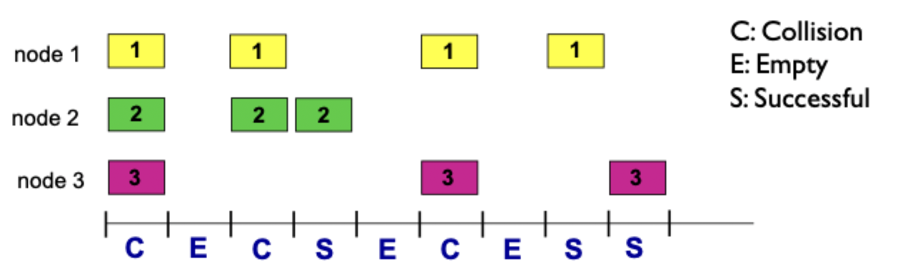
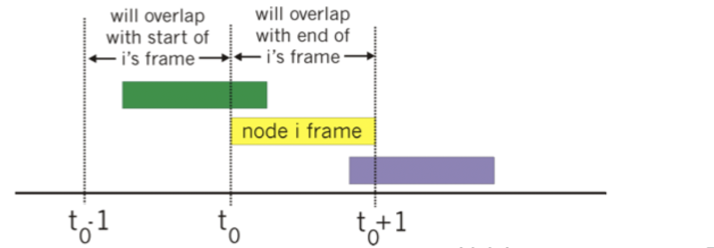
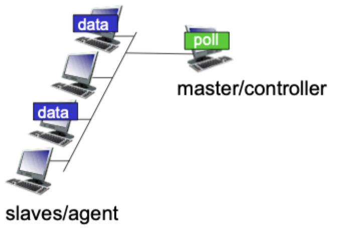
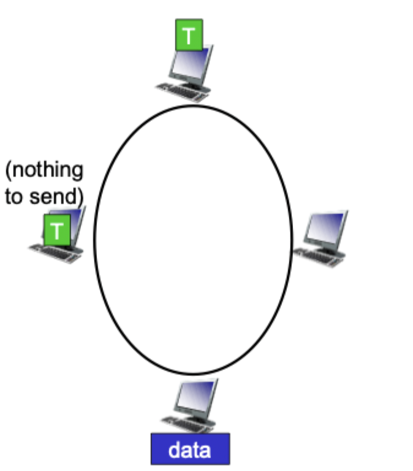

# Multiple access protocols

## Link types

- Point-to-point
	- PPP for dial up access
	- Point-to-point link between ethernet switch and host
- Broadcast (shared wired or medium)
	- Old fashioned ethernet
	- Upstream HFC
	- 802.11 wireless LAN

## Motivation

- Single shared *broadcast* channel
- Two or more simultaneous transmission by nodes
- Collisions occur if node receives two or more signals at the same time
- Multiple access protocols are distributed algorithms that determine how nodes share a broadcast channel
- Communication about channel sharing must use the channel itself

## Desired protocol

- Properties
	1) When one node wants to transmit, it can send it at rate $R$
	2) When $M$ nodes want to transmit, each can send  at average rate $\frac{R}{M}$
	3) Fully decentralized
		- No special node needed to coordinate transmissions
		- No synchronization of clocks or slots
	4) Remain simple
- Ideal performance
	1) No idle time (when there is traffic waiting)
	2) No wasted time (collisions)
	3) No access delay

## Channel partitioning

- Divide channel into smaller "pieces"
- Allocate piece to node for exclusive use

### TDMA: time division multiple access

- Access to channel in "rounds"
- Each station gets fixed length slot (length = packet transmission time) in each round
- Unused slots go idle
- No interference between access

### FDMA: frequency division multiple access

- Channel spectrum divided into frequency bands
- Each station assigned a fixed frequency band
- Unused transmission time in frequency bands go idle

### CDMA: code division multiple access

- Each station is assigned a different code
- Use assigned code to encode data bits
- Stations can transmit simultaneously
- Widely used in wireless

### Pros and cons

| Pros | Cons |
| ---- | ---- |
| No collisions | Reserver resources can remain idle even if traffic is waiting
| Perfectly fair | May get denied, even if resources available
| | A-priori coordination between nodes needed |

## Random access

- When a node has to send a packet
	- Transmit at full channel data rate $R$
	- No *a priori* coordination among nodes
- Two or more transmitting nodes -> "collision"
- **Random access MAC protocol** specifies:
	- How to *detect* collisions
	- How to *recover* from collisions

### Slotted ALOHA

- Assumptions
	- All frames are the same size
	- Time divided into equal size slots (time to transmit 1 frame)
	- Nodes start to transmit **only at slot beginning**
	- Nodes are synchronized
	- If 2 or more nodes transmit in a slot, all nodes **can detect collision** by the end of the slot
- Operation
	- When node obtains fresh frame, transmits in next slot
	- *if success* -> node can send new frame in next slot
	- *if collision* -> node **retransmits** frame in each subsequent slot **with probability** $p$ until success

#### Pros and cones

| Pros | Cons |
| ---- | ---- |
| Single active node can transmit at full rate of channel | Collisions -> wasting slots |
| Highly decentralized: only slots in nodes need to be in sync | Idle slots -> wasting slots |
| Simple | Clock synchronization |
| | Nodes may be able to detect collision in less than time to transmit packet

#### Input and output scenarios

- Input
	- $N = 1, \dots$ number of nodes with many frames to send
	- Each node transmits in slot with probability $p \in [0,\, 1]$
	- *Total offered load*: $Np$
- Output
	- Throughput based on long-term fraction of successful slots
	- Efficiency dependent on probability for one given slot to lead to a successful transmission
- Load load
	- Nodes can transmit with *low probability* $p$
	- Throughput is based on the offered load
		- No collision, almost all packets get through first time
		- Will be many idle slots
- Congested
	- Nodes can transmit with *high probability* $p$
	- Will be low throughput because
		- Many (re)transmissions than slots available
		- Many collisions
		- Almost no packets will get through

#### Efficiency

- Suppose there are $N$ nodes with many frames to send, each transmits in a slot with probability $p$
- Probability that a given node has success in a slot: $p(1 - p)^{N - 1}$
- Probability that *any* node has success in a slot : $Np(1 - p)^{N - 1}$
- Max efficiency: we find the value of $p$ that maximizes the probabilities is $p = \frac{1}{N}$
- For many nodes: $\lim \limits_{N \to \infty} N(\frac{1}{N})(1 - \frac{1}{N})^{N - 1} = \frac{1}{e}$, the channel is useful only $37\%$ of the time

### Pure ALOHA

- Simpler, no synchronization
- When first frame arrives -> transmit immediately
- If messages collides, try sending "later"
	- Wait a random time
- No other nodes can transmit in order for a frame to succeed

#### Efficiency

- $P(\text{success by given node}) =$
	- $P(\text{node transmits}) *$
	- $P(\text{No other nodes transmits in } [t_{0} - 1, t_{0}]) *$
	- $P(\text{No other nodes transmits in } [t_{0}, t_{0} + 1]) *$

$$
	P = p(1 - p)^{2(N -1)}
$$

- Choosing the optimum $p$ and letting $n \to \infty$

$$
	\frac{1}{2e} = 0.18
$$

- Only about half as effective as slotted ALOHA
- But does avoid any synchronization costs, leading to a simple implementation

### CSMA: carrier sense multiple access

- "Listen" before transmitting
- *If channel sensed idle*: transmit entire frame
- *If channel sensed busy*: defer transmission
- Does **not** eliminate collisions
	- Protocol requires other users to synchronize
	- The act of sensing is not instantaneous

#### Reacting to collisions

- Persistent: defer transmission until channel becomes idle
- Non-persistent: defer transmission and sense again after a random time
- P-persistent
	- Wait for channel to become idle
	- Transmit with probability $p$ or defer to next slot
	- $p$ should depend and throughput and delay

#### Collision detection

- Collisions *detected* within a short time
- As soon as you detect a collision -> do not complete transmission, abort -> reduces channel waste
- Easy in wired LANs, more difficult in wireless LANs

#### Ethernet CSMA/CD algorithm

1) NIC receives datagram from network layer, creates frame
2) If NIC senses channel idle, starts frame transmission. If NIC senses busy, wait until channel idles and then transmit
3) If NIC transmits frame without detecting collision -> done!
4) If NIC detects another transmission while transmitting, aborts and sends jam signal
5) After aborting, NIC enters *exponential backoff* and then tries again
	- After 1 collision wait 1 second
	- After 2 collisions wait 2 seconds
	- After 3 collisions wait 4 seconds
	- ...

#### Efficiency

- $t_{\text{prop}}$ is the max propagation delay between 2 nodes in a LAN
- $t_{\text{trans}}$ is the time to transmit the max-size frame

$$
	\text{efficiency} = \frac{1}{1 + 5\frac{t_{\text{prop}}}{t_{\text{trans}}}}
$$

- Efficiency approaches 1 when
	- $t_{\text{prop}} \to 0$
	- $t_{\text{trans}} \to \infty$
- Better performance than ALOHA
- Is simple, cheap, and decentralized

## Taking turns

> The best of channel partitioning and random access protocols

### Polling

- Master (controller) nodes "invites" slave nodes to transmit in turn
- Typically used with "dumb" slave (agent) devices
- Concerns
	- Polling overhead
	- Latency
	- Single point of failure (master)

### Token passing

- Control *token* passed from one node to next sequentially
- Node with token is allowed to send with full channel rate
- Removes the central party (master/contoller), but keeps nodes coordinated
- Concerns
	- Token overhead
	- Latency
	- Single point of failure (token)

