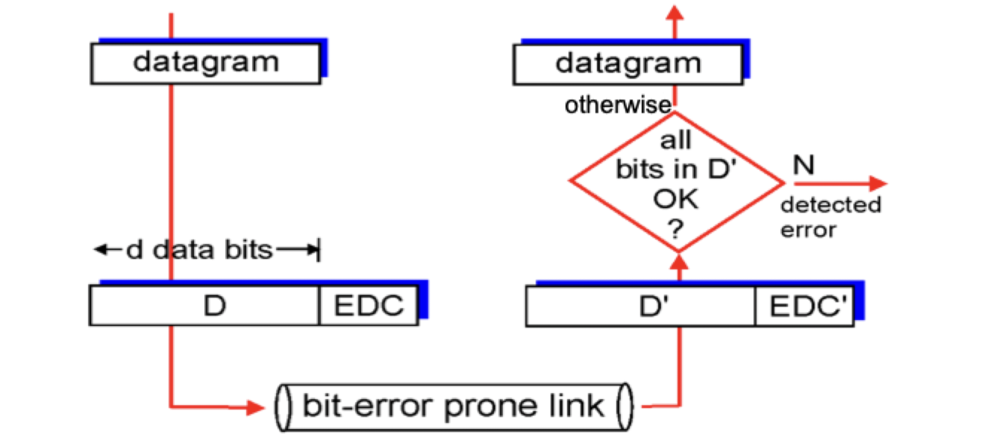

# Link layer

## The link layer

### Terminology

- Hosts and routers: *nodes*
- Communication channels that connect adjacent nodes along a path: *links*
	- Wired links
	- Wireless links
	- LANs
- Layer-2 packet: frame (encapsulates a datagram)

> *Data-link layer* has the responsibility of transferring datagram from one node to *physically adjacent* node over a link

### Context

- Datagram transferred by different link protocols over different links
- Each link protocol provides different services
- Transportation analogy
	- Trip from Princeton to Lausanne
		- Limo: Princeton to JFK
		- Plane: JFK to Geneva
		- Train: Geneva to Lausanne
	- Tourist is the diagram
	- Transportation segment is a communication link
	- Transportation mode is a link layer protocol
	- Travel agent is the routing algorithm

### Services

- Framing and link access
	- Encapsulate datagram into frame, adding. header and tailer
	- Channel access if shared medium
	- MAC addresses used in frame headers to identify source and destination
- Reliable delivery between adjacent nodes
	- Essentially RDT, but occurs between nodes rather than the end-host systems
	- Wireless might have RDT, but may come with high error rates
- Flow control: pacing between adjacent sending and receiving nodes
- Error detection
	- Errors caused by signal attenuation or noise
	- Receiver detects presence of errors
	- Signals sender for retransmission or drops the frame
- Error correction: receiver identifies *and corrects* bit error(s) *without resorting to retransmission*
- Half-duplex: both nodes can transmit, but not at the same time
- Full-duplex: both nodes can transmit, potentially at the same time

### Implementation details

- Implemented in each and every host
- Typically implemented on a *network interface card* or on-board a chip
	- Ethernet cards, 802.11 cards, or ethernet chipset
	- Controller (single chip) implements the link and physical layer
- Attaches to host system's buses (looks like any I/O device)
- Combination of hardware, software, and firmware
- Adaptor communicating
	- Sending side
		- Encapsulates datagram in frame
		- Adds error checking bits, RDT, flow control, etc
	- Receiving side
		- Looks for errors, RDT, flow control, etc
		- Extracts datagram, passes to upper layer at receiving side

## Error detection and correction

- EDC = **E**rror **D**etection and **C**orrection bits (redundancy)
- D = **D**ata protected by error checking, may include header fields

- Error detection is not 100% reliable
- Protocol may miss some errors, but only rarely
- Larger EDC field yield better detection and correction

### Parity checking

- Single bit parity
	- *Detects* single bit errors
	- Cannot correct them
- Two-dimensional bit parity
	- Detect **and** correct single bit errors
	- Can detect 2 errors as well

### Internet checksum

> Goal: detect "errors" in transmitted packet

- Sender
	- Treat segment contents as a sequence of 16 bit integers
	- Checksum: addition (1's complement sum) of checksum contents
	- Sender puts checksum value into UDP checksum field
- Receiver
	- Compute checksum of received segment
	- Check if computed checksum equals checksum field value
		- No -> error detected
		- Yes -> no error detected (could still have an error though)

### Cyclic redundancy check

- More powerful error detection coding
- **View bits of data, $D$, as a binary number or polynomial**
- Choose $r + 1$ bit pattern (generator), $G$, starting with 1
- Goal: Choose $r$ CRC bits, $R$, such that
	- $\langle D, \, R \rangle$ is exactly divisible by $G$ (modulo 2)
	- Receive knows $G$ and performs the division
		- Non-zero remainder -> error detected
	- Can detect all burst errors less than $r + 1$ bits in length
- Widely used in practice
- Formula: $D * 2^{r} \text{ XOR } R$
- The longer $G$, the stronger the protection, the higher the overhead and computation
- Typically
	- CRC: 32 bits, generators standardized
	- Needs dedicated hardware
	- Used at the link layer
