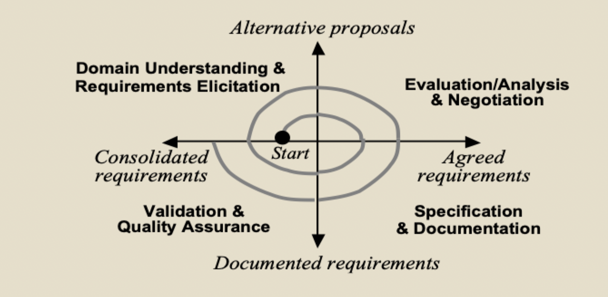
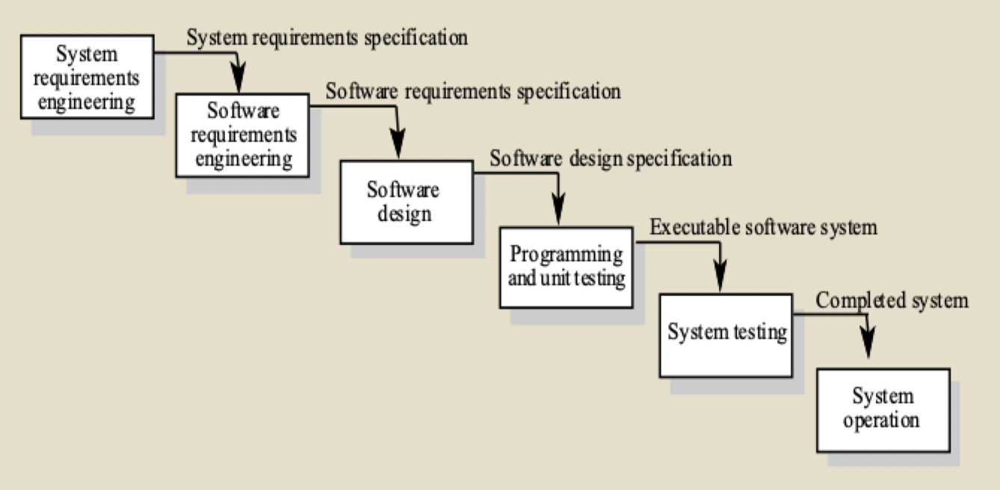
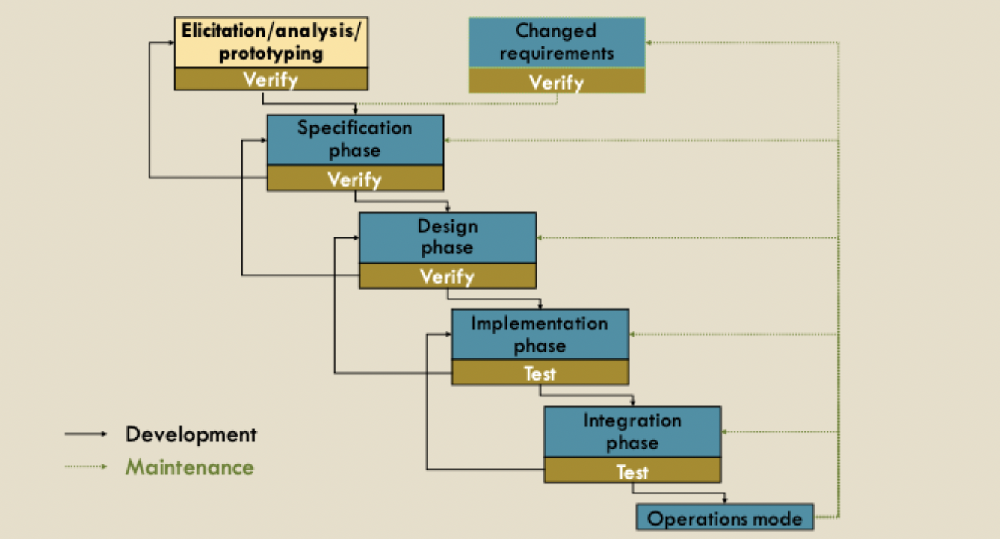

# Requirements engineering

## Terminology

### Requirements

#### [INF43 definition](../../../fall-2020/in4matx-43/week2/lecture-3.md)

> **What** the software should do without saying **how** it should do it

#### INF113 definition

1) A condition or capacity needed by a user (or other stakeholder) to solve a problem or achieve an objective
2) A condition of capability that must be met or possessed by a system or system component to satisfy a contract, standard, specification, or other formally imposed documents
3) A documented representation of a condition or capability as in (1) or (2)

- A requirement is a statement that
	- States system functionality (a capability)
	- Can be validated
	- Must be met or possessed by a system
	- Achieves a customer objective
	- Is qualified by measurable conditions and bounded by constraints

#### Types of requirements

- Very general requirements (high level description)
- Functional requirements (describes a behavior of the system)
- Process requirements (how the system should be developed)
- Non-functional requirements (quality attributes)
	- Execution
	- Evolution
	- Implementation

### Stakeholders

- A stakeholder is a group of individual
	- Affected by the system to be
	- May influence the way this system is shaped
	- Has some responsibility in its acceptance
- Basic types of stakeholder
	- System engineers
	- System end-users
	- Managers of system end-users
	- External regulators
	- Domain experts
	- Developers
	- ... many more

## Goals, processes, and problems

### Goals

- Understanding stakeholders' needs
- Achieve agreement
- Create the same mental model among all system stakeholders
- Structure and manage requirements-based activities

> Creating a RE artifact is rarely an end in itself; rather it is a means to reach the project's goals

### Process

#### Variability

- Processes vary radically from one organization to another based on
	- Technical maturity
	- Organizational culture
	- Application domain
- Therefore, there is no 'ideal' requirements engineering process

#### Waterfall

> Requirements engineering is the *first* step

#### Rapid prototyping

> Requirements gathered for a working prototype, then more gathered

#### Agile development

- Early / continuous delivery of functionality to customer
	- Reduces the requirements-to-code distance
- Short, incremental RE cycles, each followed by short implementation cycle
- Requirements evaluation/specification/consolidation phases often shortcutted
- Requirements often represented as user stories
- Requirements often driven by key business metrics

### Problems

1) Natural language problems
2) Domain understanding
3) Business needs not adequately considered
4) Dealing with complexity
5) Incompleteness
6) Inconsistency
7) Incorrectness
8) Over-completeness (gold-plating)
9) Limited user / stakeholder involvement / communication
10) Poor requirements management

#### Mitigating

- Be organized
- Have experience throughout the software engineering cycle
- Understand the problem domain
- Know when to be general/specific
- Stand up to the customer when necessary
- Manage requirements, listen to customers, negotiate requirements

## Importance of requirements

- Establishing stakeholder needs is the single hardest phase of system development
- 55% of software faults can be traced to the requirements / design phase
- Half of top software failures causes have to do with faulty requirements
- Helps to reduce costs
- Can help improve customer satisfaction
- In critical system, can improve overall safety

### Obstacles to good practices

- RE efforts need to be spent before the contract is signed
- Pressure of tight schedules, short-term costs, leveraging technology
- Lack of quantitative data on RE economics
- Requirements documents viewed as cumbersome