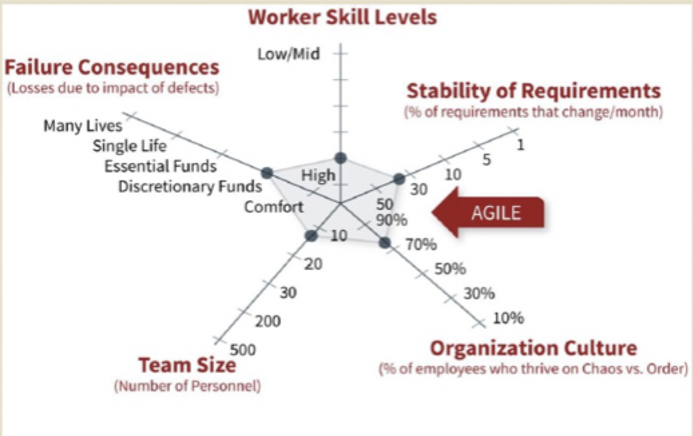
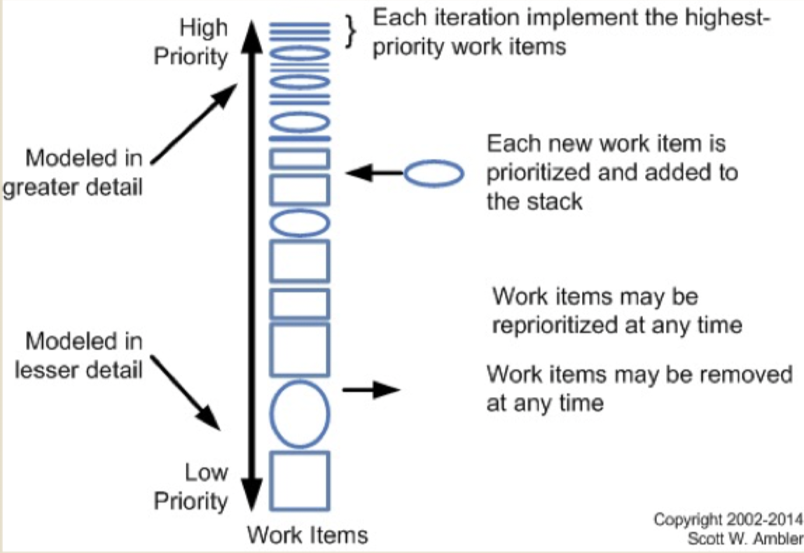

# Agile methodologies

## Agile process review

### Traditional software development process limitations

- Change management difficult
- Big upfront planning required
- Functional silos
- Delays due to hand-offs
- Heavy documentation overheads
- Late availability of working software
- Delayed customer feedback
- Blame game
- Cannot handle VUCA situations

### The agile manifesto

- Individuals and interactions > processes and tools
- Working software > comprehensive documentation
- Customer collaboration > contract negotiation
- Responding to change > over following a plan

### Some agile principles

- Welcome change in requirements
- Face-to-face conversation is the best way to convey information
- Working software is the primary measure of progress; documentation is just a means to an end
- Business people and developers work together daily throughout the project
- The best architectures, requirements, and designs emerge from self-organizing teams
- Models, plans, and documentation are important and have their value, but only exist to support the development of working software

### Assumptions for successful agility

- All stakeholder roles are reducible to one single ("User/Customer" that is on-site)
- Projects small enough for one small co-located development team
- Functionality can be provided quickly, consistently, and incrementally from essential to less important
- Non-functional aspects, environment assumptions, objectives, alternative options, risks may receive little attention
- Little documentation required for work coordination and maintenance
	- Requirements precision is not required
	- Verification before coding is less important than early release
- Requirements changes are not likely to require major code refactoring

### When to use agile?

### Why not just agile?

- Majority of projects nowadays are managed with agile processes
- Some still follow traditional processes, especially when **doing requirements engineering right is a life or death matter**
- Even with agile, a good understanding of requirements is still needed

## Requirements engineering in agile processes

### Product backlog

- A list of all desired work on the project requirements
- Items estimated by the team
- Re-prioritize at the start of each iteration/sprint
- Ideally expressed such that each item has value to the users/customers
- Traditional requirements analysis methods are often used to gain the initial backlog

### User stories

- User stories are the most common way to express requirements in agile processes
- Can be used to derive formal requirements, use cases, and other artifacts
- Formulated as a one or two sentence story
	- Must be small enough to **complete** in one iteration/sprint
	- Acts as an informal statement of a requirement where **acceptance testing procedures** are absent or lacking
- Characteristics
	- Independent
	- Negotiable
	- Valuable
	- Estimable
	- Sized appropriately (5 - 15 per sprint)
	- Testable
- Template: As a `<role>` I want `<activity>` so that `<business value>`
	- Role: represents *who* is performing the action. Should be a **single person or system**
	- Activity: represents the *action* to be performed by the system
	- Business value: represents the *value to the business*

|      | Stories | Use Cases | Requirements |
| ---- | ------- | --------- | ------------ |
| Goal | Generate conversation | Capture a behavior | Establish a contract |
| Scope | A single activity | A process (day in the life) | Everything |
| Format | A single sentence | Numbered bullets | Specifications |
| Completeness | Open for negotiation and refinement | Locked, changes may impact entire process | Locked, require scope change and approvals |
| Language | Simple, comprehensible | Structured flows | Precise, technical |

## Challenges for requirements engineering in agile processes

- Cannot represent non-functional requirements
- Overly focused on prototyping and elicitation
- Lack of rigor for safety critical systems
- Lack of domain knowledge capture
- Lack of requirements traceability
- Dependent on customer availability

